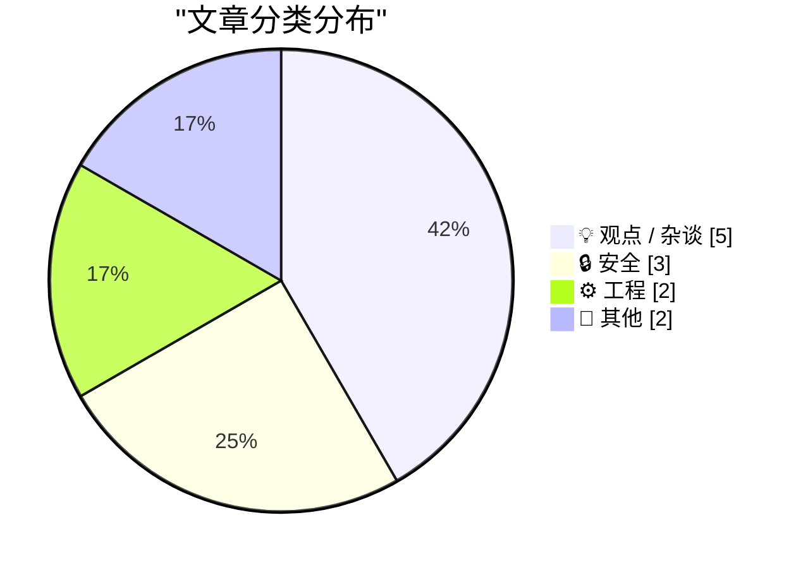
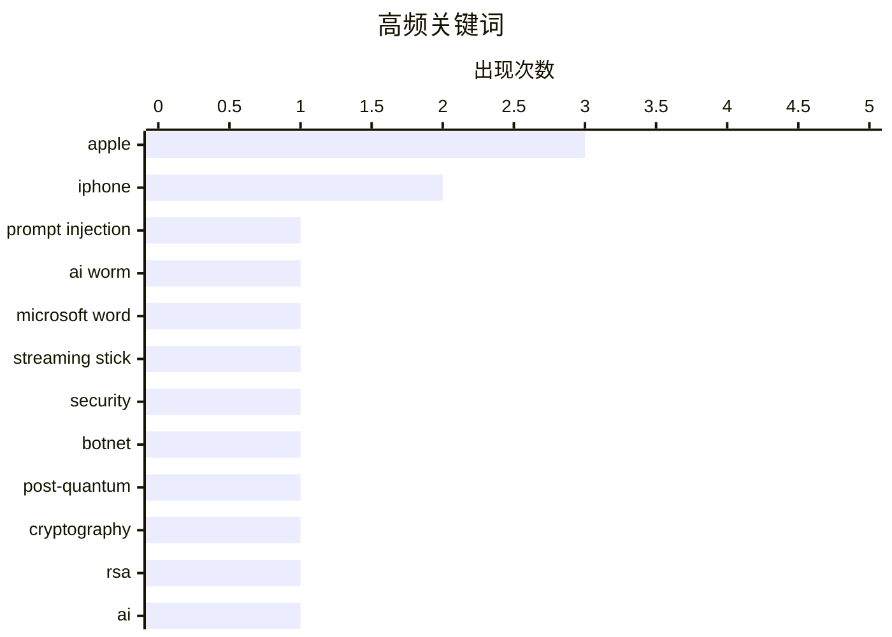

# 📰 AI 博客每日精选 — 2026-07-31

> 来自 Karpathy 推荐的 92 个顶级技术博客，AI 精选 Top 12

## 📝 今日看点

今日技术圈聚焦于AI安全威胁的升级与底层技术范式的演进。一方面，AI技术正催生新型攻击向量，如通过Word传播的自我复制蠕虫，同时密码学界正加速向后量子算法过渡以应对未来挑战。另一方面，苹果新推出的硬件租赁计划引发了对消费者权益与设备受限模式的广泛争议。此外，从固态电池的产业竞逐到AI时代设计美学的孕育，底层硬件与交互范式的变革正持续重塑科技生态。

---

## 🏆 今日必读

🥇 **通过 Word 传播的 AI 蠕虫**

[AI Worming through Word](https://simonwillison.net/2026/Jul/29/ai-worming-through-word/#atom-everything) — simonwillison.net · 23 小时前 · 🔒 安全

> Håkon Måløy 发现了一种针对 Microsoft Word 的新型提示词注入变体，能够将攻击升级为自我复制的蠕虫。攻击者在文档中植入隐藏指令，当 Copilot for Word 处理该文档作为素材时，会将这些指令解释为用户的请求并执行。这表明 AI 集成办公软件面临严重的供应链式安全风险。

💡 **为什么值得读**: 揭示了 AI 办公助手如何被利用实现蠕虫式传播，对关注 AI 安全的读者有重要警示作用。

🏷️ prompt injection, AI worm, Microsoft Word

🥈 **购买电视流媒体棒前必读**

[Read This Before You Buy That TV Streaming Stick](https://krebsonsecurity.com/2026/07/read-this-before-you-buy-that-tv-streaming-stick/) — krebsonsecurity.com · 58 分钟前 · 🔒 安全

> 安全专家多年来一直警告廉价电视流媒体设备存在将用户网络出租给陌生人的风险。最新分析发现，这些设备还会伪装成手机在 AI 生成的网站上点击广告，参与大规模欺诈在线商家和广告网络的活动。这表明此类设备不仅威胁用户隐私，还可能使其在不知情的情况下成为网络犯罪同谋。

💡 **为什么值得读**: 揭露了廉价流媒体设备背后隐藏的复杂广告欺诈网络，对消费者选购硬件有直接指导意义。

🏷️ streaming stick, security, botnet

🥉 **引用 Matthew Green 的话**

[Quoting Matthew Green](https://simonwillison.net/2026/Jul/29/matthew-green/#atom-everything) — simonwillison.net · 23 小时前 · 🔒 安全

> 密码学家 Matthew Green 指出，当前正处于从基于 EC 和 RSA 的传统公钥算法向基于新问题的后量子算法过渡的历史性时期。这也是为什么目前有如此多像 HAWK 这样的标准正在被考虑。作者认为，如果有一个完美的时机来上线大规模的公共密码分析能力，那就是现在。

💡 **为什么值得读**: 点明了密码学向抗量子计算过渡的关键历史节点，对理解当前密码学标准演进极具参考价值。

🏷️ post-quantum, cryptography, RSA

---

## 📊 数据概览

| 扫描源 | 抓取文章 | 时间范围 | 精选 |
|:---:|:---:|:---:|:---:|
| 80/92 | 2459 篇 → 12 篇 | 24h | **12 篇** |

### 分类分布



### 高频关键词



<details>
<summary>📈 纯文本关键词图（终端友好）</summary>

```
apple            │ ████████████████████ 3
iphone           │ █████████████░░░░░░░ 2
prompt injection │ ███████░░░░░░░░░░░░░ 1
ai worm          │ ███████░░░░░░░░░░░░░ 1
microsoft word   │ ███████░░░░░░░░░░░░░ 1
streaming stick  │ ███████░░░░░░░░░░░░░ 1
security         │ ███████░░░░░░░░░░░░░ 1
botnet           │ ███████░░░░░░░░░░░░░ 1
post-quantum     │ ███████░░░░░░░░░░░░░ 1
cryptography     │ ███████░░░░░░░░░░░░░ 1
```

</details>

### 🏷️ 话题标签

**apple**(3) · **iphone**(2) · **prompt injection**(1) · ai worm(1) · microsoft word(1) · streaming stick(1) · security(1) · botnet(1) · post-quantum(1) · cryptography(1) · rsa(1) · ai(1) · design(1) · aesthetic(1) · ui(1) · ios 27(1) · restricted mode(1) · upgrade program(1) · surveillance(1) · pricing(1)

---

## 💡 观点 / 杂谈

### 1. AI 美学

[The AI Aesthetic](https://blog.jim-nielsen.com/2026/ai-aesthetic/) — **blog.jim-nielsen.com** · 22 小时前 · ⭐ 21/30

> 每个时代精神都会带来应对其挑战的独特设计习语，有些随潮流消失，有些则融入更深层的软件交互范式中。例如，汉堡菜单（≡）因移动设备屏幕尺寸限制而普及，现已扩展到软件设计的各个领域。AI 时代同样正在孕育属于其挑战的全新设计美学和交互模式。

🏷️ AI, design, aesthetic, UI

---

### 2. 苹果表示 iOS 27“受限模式”并非针对新 Apple Upgrade 计划中逾期付款的用户

[Apple Says iOS 27 ‘Restricted Mode’ Isn’t for Users Who Miss Payments in New Apple Upgrade Program](https://9to5mac.com/2026/07/28/apple-says-ios-27-restricted-mode-isnt-for-new-upgrade-program-leases/) — **daringfireball.net** · 20 小时前 · ⭐ 20/30

> iOS 27 开发者测试版中的代码显示了一种“受限模式”，启用后设备只能使用辅助功能阅读器、App Store、健康、放大镜、电话、时钟、设置、钱包和密码等少数应用。外界合理推测该功能与 Apple Upgrade 计划中用户逾期付款有关，但苹果随后澄清该模式并非用于此目的。

🏷️ iOS 27, Apple, restricted mode

---

### 3. 新“Apple Upgrade”与旧“iPhone Upgrade Program”的区别

[The Differences Between the New ‘Apple Upgrade’ and the Old ‘iPhone Upgrade Program’](https://9to5mac.com/2026/07/30/apple-upgrade-vs-iphone-upgrade-program-here-are-the-key-differences/) — **daringfireball.net** · 1 小时前 · ⭐ 19/30

> 苹果本周推出了 Apple Upgrade 计划并停止了原有的 iPhone Upgrade Program，两者虽有相似之处但存在关键差异。除了 9to5Mac 指出的区别外，新计划还有一个隐藏条件：通过 Apple Upgrade 租赁 iPhone 时，用户必须在美国三大运营商之一拥有蜂窝网络账户。

🏷️ Apple, iPhone, upgrade program

---

### 4. Pluralistic：监控定价最愚蠢的借口（2026年7月30日）

[Pluralistic: The stupidest imaginable excuses for surveillance pricing (30 Jul 2026)](https://pluralistic.net/2026/07/30/pay-for-privacy/) — **pluralistic.net** · 4 小时前 · ⭐ 19/30

> 作者严厉批评了企业为“监控定价”（即根据用户隐私数据定制价格）寻找的荒谬借口。文章回顾了自 1850 年以来旧金山商会的种种行径，并提及了防篡改投票机、RFID 汽车盗窃以及如何对抗平台“屎化”（enshittification）等相关话题，呼吁警惕以隐私为代价的商业模式。

🏷️ surveillance, pricing, privacy

---

### 5. 寻找 Apple Upgrade 计划中的陷阱

[Looking for the Catch in Apple Upgrade](https://www.theatlantic.com/technology/2026/07/apple-lease-upgrade-program/688106/) — **daringfireball.net** · 47 分钟前 · ⭐ 18/30

> The Atlantic 的文章指出，取代 iPhone Upgrade Program 的新计划“Apple Upgrade”在法律上属于真正的租赁，而非 Klarna 通常提供的先买后付贷款。这种模式容易让人混淆，因为用户在 Shein 或 Sephora 使用 Klarna 时是在偿还贷款，而租赁 iPhone 则意味着设备所有权并未转移，形成了一种“iPhone 底层阶级”的陷阱。

🏷️ Apple, iPhone, lease

---

## 🔒 安全

### 6. 通过 Word 传播的 AI 蠕虫

[AI Worming through Word](https://simonwillison.net/2026/Jul/29/ai-worming-through-word/#atom-everything) — **simonwillison.net** · 23 小时前 · ⭐ 25/30

> Håkon Måløy 发现了一种针对 Microsoft Word 的新型提示词注入变体，能够将攻击升级为自我复制的蠕虫。攻击者在文档中植入隐藏指令，当 Copilot for Word 处理该文档作为素材时，会将这些指令解释为用户的请求并执行。这表明 AI 集成办公软件面临严重的供应链式安全风险。

🏷️ prompt injection, AI worm, Microsoft Word

---

### 7. 购买电视流媒体棒前必读

[Read This Before You Buy That TV Streaming Stick](https://krebsonsecurity.com/2026/07/read-this-before-you-buy-that-tv-streaming-stick/) — **krebsonsecurity.com** · 58 分钟前 · ⭐ 23/30

> 安全专家多年来一直警告廉价电视流媒体设备存在将用户网络出租给陌生人的风险。最新分析发现，这些设备还会伪装成手机在 AI 生成的网站上点击广告，参与大规模欺诈在线商家和广告网络的活动。这表明此类设备不仅威胁用户隐私，还可能使其在不知情的情况下成为网络犯罪同谋。

🏷️ streaming stick, security, botnet

---

### 8. 引用 Matthew Green 的话

[Quoting Matthew Green](https://simonwillison.net/2026/Jul/29/matthew-green/#atom-everything) — **simonwillison.net** · 23 小时前 · ⭐ 21/30

> 密码学家 Matthew Green 指出，当前正处于从基于 EC 和 RSA 的传统公钥算法向基于新问题的后量子算法过渡的历史性时期。这也是为什么目前有如此多像 HAWK 这样的标准正在被考虑。作者认为，如果有一个完美的时机来上线大规模的公共密码分析能力，那就是现在。

🏷️ post-quantum, cryptography, RSA

---

## ⚙️ 工程

### 9. 引用 D. Richard Hipp 的话

[Quoting D. Richard Hipp](https://simonwillison.net/2026/Jul/29/d-richard-hipp/#atom-everything) — **simonwillison.net** · 20 小时前 · ⭐ 17/30

> SQLite 作者 D. Richard Hipp 回顾了 SQL 的历史意义。在 SQL 出现前，查询大型数据集需要昂贵的 COBOL 程序员编写专门软件；SQL 的出现简化了这一过程，用户只需通过非常简单的规范声明，就能自动生成过去需要高薪专业人员编写的所有代码。

🏷️ SQL, COBOL, database

---

### 10. 轮子、瓶子和镜像

[Wheels, Bottles and Images](https://nesbitt.io/2026/07/30/wheels-bottles-images.html) — **nesbitt.io** · 7 小时前 · ⭐ 16/30

> 探讨了高级包管理器与容器镜像仓库在概念上的趋同现象。通过分析Python Wheels、Homebrew Bottles以及容器镜像等打包格式，揭示了它们在软件分发和依赖管理上的高度相似性。随着包管理器功能的不断演进，其复杂度和能力已经达到了与容器镜像仓库难以区分的程度。作者引用“任何足够先进的包管理器都与容器镜像仓库无异”这一观点，总结了现代软件分发机制的演化趋势。

🏷️ package manager, container registry

---

## 📝 其他

### 11. 为什么大家都在尝试制造固态电池？

[Why Is Everyone Trying to Build a Solid-State Battery?](https://www.construction-physics.com/p/why-is-everyone-trying-to-build-a) — **construction-physics.com** · 5 小时前 · ⭐ 17/30

> 固态电池正成为备受瞩目的电池技术，它是一种用固体材料替代传统液态电解质的锂离子电池。这种转变有望解决现有液态锂电池在能量密度、安全性和稳定性方面的瓶颈，因此吸引了众多厂商投入研发，试图抢占下一代电池技术的制高点。

🏷️ solid-state battery, lithium-ion, technology

---

### 12. 当任天堂起诉百视达时

[When Nintendo sued Blockbuster](https://dfarq.homeip.net/when-nintendo-sued-blockbuster/?utm_source=rss&#038;utm_medium=rss&#038;utm_campaign=when-nintendo-sued-blockbuster) — **dfarq.homeip.net** · 6 小时前 · ⭐ 10/30

> 回顾了80年代末任天堂起诉百视达（Blockbuster）的历史事件。当时玩家在百视达租借游戏卡带时无法获得说明书，百视达因此复印说明书提供给租客。任天堂认为此举侵犯了版权并提起诉讼。文章揭示了早期游戏租赁市场的版权争议，以及游戏厂商对分发渠道和知识产权的严格控制。

🏷️ Nintendo, Blockbuster, history, lawsuit

---

*生成于 2026-07-31 01:47 (Asia/Shanghai) | 扫描 80 源 → 获取 2459 篇 → 精选 12 篇*
*基于 [Hacker News Popularity Contest 2025](https://refactoringenglish.com/tools/hn-popularity/) RSS 源列表，由 [Andrej Karpathy](https://x.com/karpathy) 推荐*
*由「懂点儿AI」制作，欢迎关注同名微信公众号获取更多 AI 实用技巧 💡*
