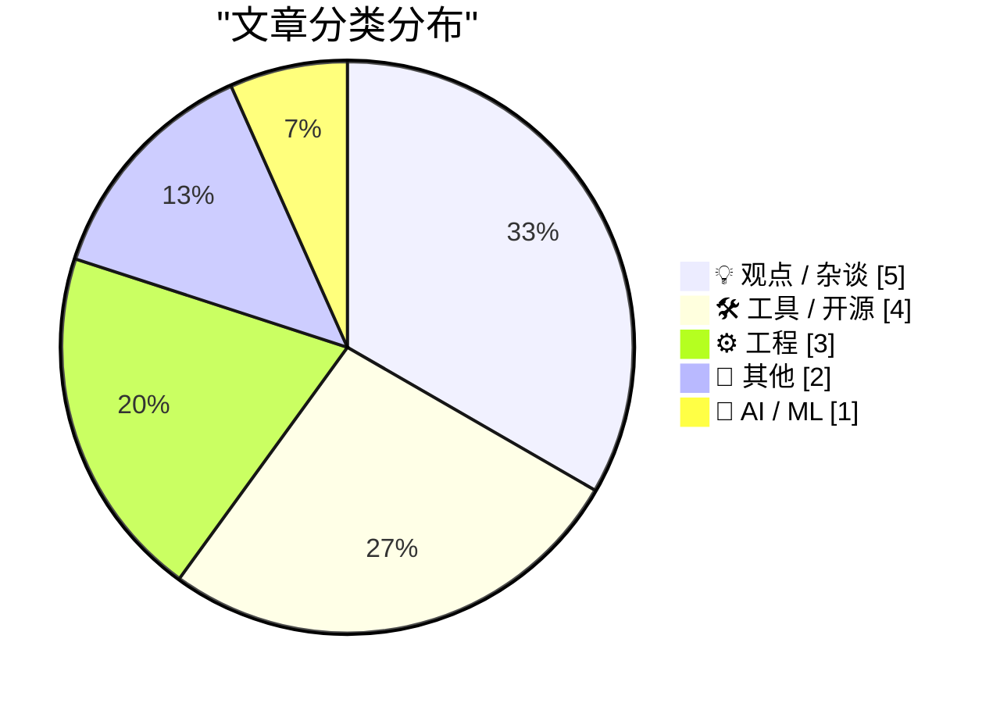
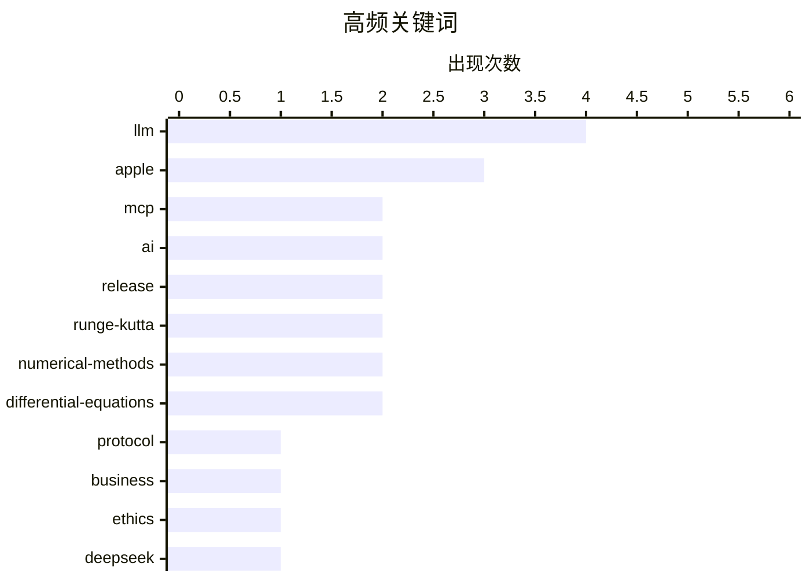

# 📰 AI 博客每日精选 — 2026-08-02

> 来自 Karpathy 推荐的 92 个顶级技术博客，AI 精选 Top 15

## 📝 今日看点

今日技术圈焦点集中在AI工具链的深化与开源模型的持续演进。无状态MCP协议引发开发者新一轮关注，相关客户端与探索工具不断涌现，推动AI集成走向轻量化。同时，以DeepSeek为代表的开源权重模型及配套评估工具展现出强劲活力，引发业界对AI商业化宣传与实际落地应用的深度反思。

---

## 🏆 今日必读

🥇 **Stateless MCP has recaptured my interest (and inspired mcp-explorer and datasette-mcp)**

[Stateless MCP has recaptured my interest (and inspired mcp-explorer and datasette-mcp)](https://simonwillison.net/2026/Jul/31/stateless-mcp/#atom-everything) — simonwillison.net · 18 小时前 · 🛠 工具 / 开源

> Stateless MCP has recaptured my interest (and inspired mcp-explorer and datasette-mcp)

🏷️ MCP, LLM, protocol

🥈 **Pluralistic: Why businesses lie about AI (01 Aug 2026)**

[Pluralistic: Why businesses lie about AI (01 Aug 2026)](https://pluralistic.net/2026/08/01/dare-snot/) — pluralistic.net · 4 小时前 · 💡 观点 / 杂谈

> Pluralistic: Why businesses lie about AI (01 Aug 2026)

🏷️ AI, business, ethics

🥉 **deepseek-ai/DeepSeek-V4-Flash-0731**

[deepseek-ai/DeepSeek-V4-Flash-0731](https://simonwillison.net/2026/Jul/31/deepseek-v4-flash-0731/#atom-everything) — simonwillison.net · 17 小时前 · 🤖 AI / ML

> deepseek-ai/DeepSeek-V4-Flash-0731

🏷️ DeepSeek, LLM, release

---

## 📊 数据概览

| 扫描源 | 抓取文章 | 时间范围 | 精选 |
|:---:|:---:|:---:|:---:|
| 83/92 | 2526 篇 → 17 篇 | 24h | **15 篇** |

### 分类分布



### 高频关键词



<details>
<summary>📈 纯文本关键词图（终端友好）</summary>

```
llm                    │ ████████████████████ 4
apple                  │ ███████████████░░░░░ 3
mcp                    │ ██████████░░░░░░░░░░ 2
ai                     │ ██████████░░░░░░░░░░ 2
release                │ ██████████░░░░░░░░░░ 2
runge-kutta            │ ██████████░░░░░░░░░░ 2
numerical-methods      │ ██████████░░░░░░░░░░ 2
differential-equations │ ██████████░░░░░░░░░░ 2
protocol               │ █████░░░░░░░░░░░░░░░ 1
business               │ █████░░░░░░░░░░░░░░░ 1
```

</details>

### 🏷️ 话题标签

**llm**(4) · **apple**(3) · **mcp**(2) · ai(2) · release(2) · runge-kutta(2) · numerical-methods(2) · differential-equations(2) · protocol(1) · business(1) · ethics(1) · deepseek(1) · package-management(1) · releases(1) · advisories(1) · evals(1) · testing(1) · open weights(1) · podcast(1) · client(1)

---

## 💡 观点 / 杂谈

### 1. Pluralistic: Why businesses lie about AI (01 Aug 2026)

[Pluralistic: Why businesses lie about AI (01 Aug 2026)](https://pluralistic.net/2026/08/01/dare-snot/) — **pluralistic.net** · 4 小时前 · ⭐ 24/30

> Pluralistic: Why businesses lie about AI (01 Aug 2026)

🏷️ AI, business, ethics

---

### 2. Oxide and Friends: The Open Weight Revolution with Simon Willison

[Oxide and Friends: The Open Weight Revolution with Simon Willison](https://simonwillison.net/2026/Jul/31/oxide-and-friends/#atom-everything) — **simonwillison.net** · 19 小时前 · ⭐ 21/30

> Oxide and Friends: The Open Weight Revolution with Simon Willison

🏷️ open weights, LLM, podcast

---

### 3. How I use AI on this blog

[How I use AI on this blog](https://www.gilesthomas.com/2026/07/ai-use) — **gilesthomas.com** · 22 小时前 · ⭐ 20/30

> How I use AI on this blog

🏷️ AI, blogging, workflow

---

### 4. The Talk Show：“Louie 的钱包里有什么”

[The Talk Show: ‘What’s in Louie’s Wallet’](https://daringfireball.net/thetalkshow/2026/07/31/ep-453) — **daringfireball.net** · 18 小时前 · ⭐ 17/30

> Louie Mantia 做客 The Talk Show 节目，探讨了苹果平台当前的 UI 和图标设计现状。节目还对苹果起诉 OpenAI 窃取商业机密一案进行了推测与分析。本期节目由 Notion、Even Realities 和 Squarespace 赞助播出。听众可以从中了解苹果设计生态的最新动态及科技巨头的法律博弈。

🏷️ Apple, UI, OpenAI

---

### 5. 苹果的升级计划现状

[The Apple Upgrade Situation](https://randsinrepose.com/archives/the-apple-upgrade-situation/) — **daringfireball.net** · 44 分钟前 · ⭐ 13/30

> 苹果的 iPhone 升级计划不仅是一项划算的交易，更是一次“捡漏”。用户可以申请 0% 利率的全额 iPhone 贷款，并将付款分摊至 24 个月。该计划的真正优势在于每年都能以极低的成本更换新手机，因为苹果会免除旧手机剩余的贷款。这种低门槛的年度换机机制为用户提供了极大的便利与经济价值。

🏷️ Apple, iPhone, upgrade

---

## 🛠 工具 / 开源

### 6. Stateless MCP has recaptured my interest (and inspired mcp-explorer and datasette-mcp)

[Stateless MCP has recaptured my interest (and inspired mcp-explorer and datasette-mcp)](https://simonwillison.net/2026/Jul/31/stateless-mcp/#atom-everything) — **simonwillison.net** · 18 小时前 · ⭐ 25/30

> Stateless MCP has recaptured my interest (and inspired mcp-explorer and datasette-mcp)

🏷️ MCP, LLM, protocol

---

### 7. This Week in Package Management: 1 August 2026

[This Week in Package Management: 1 August 2026](https://nesbitt.io/2026/08/01/this-week-in-package-management.html) — **nesbitt.io** · 7 小时前 · ⭐ 23/30

> This Week in Package Management: 1 August 2026

🏷️ package-management, releases, advisories

---

### 8. smevals - a small eval suite for evaluating models, prompts, and harnesses

[smevals - a small eval suite for evaluating models, prompts, and harnesses](https://simonwillison.net/2026/Jul/31/smevals/#atom-everything) — **simonwillison.net** · 19 小时前 · ⭐ 22/30

> smevals - a small eval suite for evaluating models, prompts, and harnesses

🏷️ evals, LLM, testing

---

### 9. llm-mcp-client 0.1a0

[llm-mcp-client 0.1a0](https://simonwillison.net/2026/Jul/31/llm-mcp-client/#atom-everything) — **simonwillison.net** · 18 小时前 · ⭐ 20/30

> llm-mcp-client 0.1a0

🏷️ MCP, client, release

---

## ⚙️ 工程

### 10. 计算有根树

[Counting rooted trees](https://www.johndcook.com/blog/2026/08/01/counting-rooted-trees/) — **johndcook.com** · 59 分钟前 · ⭐ 14/30

> 计算具有 n 个节点的无标记有根树数量原本是一个纯数学组合问题。然而，当这类组合问题与组合数学之外的领域产生联系时，会变得更加有趣且出人意料。该问题实际上与设计求解微分方程的数值方法存在意想不到的关联。这种跨学科的联系为纯数学问题赋予了更丰富的应用价值。

🏷️ rooted-trees, combinatorics, algorithms

---

### 11. Runge-Kutta 方法的阶数与阶段数

[Runge-Kutta order versus stages](https://www.johndcook.com/blog/2026/08/01/butcher-barrier/) — **johndcook.com** · 1 小时前 · ⭐ 14/30

> 求解微分方程的教科书版 Runge-Kutta 方法包含 4 个阶段，且具有 4 阶误差。对于较低阶的 RK 方法，阶段数 s 与误差阶数 p 相等。然而，为了实现 p ≥ 5 阶的误差精度，所需阶段数将超过 p。这一现象被称为 Butcher 障碍，限制了高阶 RK 方法的效率。

🏷️ runge-kutta, numerical-methods, differential-equations

---

### 12. 求解 RK4 设计方程

[Solving the RK4 design equations](https://www.johndcook.com/blog/2026/07/31/runge-kutta-design/) — **johndcook.com** · 22 小时前 · ⭐ 14/30

> 四阶 Runge-Kutta 方法的参数必须满足一组包含八个约束条件的设计方程。这些繁琐的计算并未出现在 Kutta 的原始论文中，而是记录在 1900 年的 Huen 论文里。深入推导这些方程有助于理解 RK4 方法参数背后的数学原理与设计逻辑。这组约束条件确保了该方法能够达到四阶误差精度。

🏷️ runge-kutta, numerical-methods, differential-equations

---

## 📝 其他

### 13. Apple Q3 2026 Results

[Apple Q3 2026 Results](https://sixcolors.com/post/2026/07/apple-announces-record-q3-results/) — **daringfireball.net** · 1 小时前 · ⭐ 18/30

> Apple Q3 2026 Results

🏷️ Apple, earnings, Q3

---

### 14. Reading List 08/01/26

[Reading List 08/01/26](https://www.construction-physics.com/p/reading-list-080126) — **construction-physics.com** · 5 小时前 · ⭐ 18/30

> Reading List 08/01/26

🏷️ chips, fusion, drones, infrastructure

---

## 🤖 AI / ML

### 15. deepseek-ai/DeepSeek-V4-Flash-0731

[deepseek-ai/DeepSeek-V4-Flash-0731](https://simonwillison.net/2026/Jul/31/deepseek-v4-flash-0731/#atom-everything) — **simonwillison.net** · 17 小时前 · ⭐ 23/30

> deepseek-ai/DeepSeek-V4-Flash-0731

🏷️ DeepSeek, LLM, release

---

*生成于 2026-08-02 01:15 (Asia/Shanghai) | 扫描 83 源 → 获取 2526 篇 → 精选 15 篇*
*基于 [Hacker News Popularity Contest 2025](https://refactoringenglish.com/tools/hn-popularity/) RSS 源列表，由 [Andrej Karpathy](https://x.com/karpathy) 推荐*
*由「懂点儿AI」制作，欢迎关注同名微信公众号获取更多 AI 实用技巧 💡*
