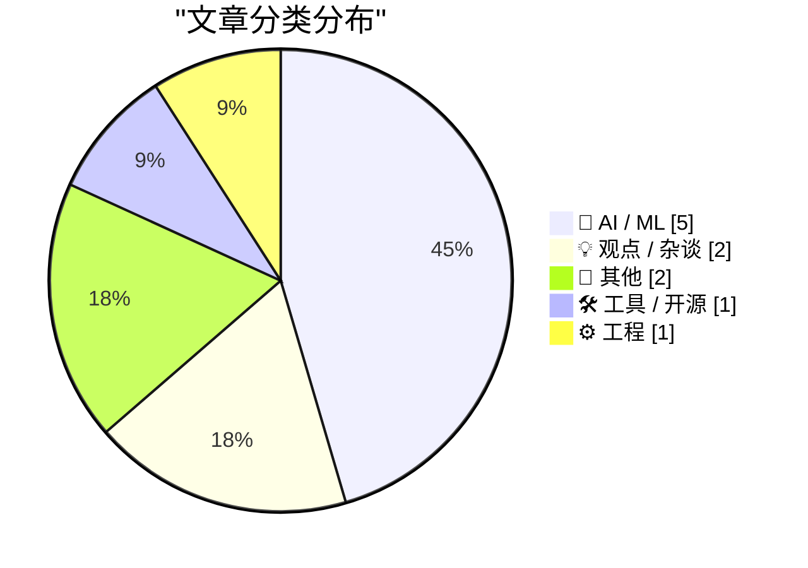
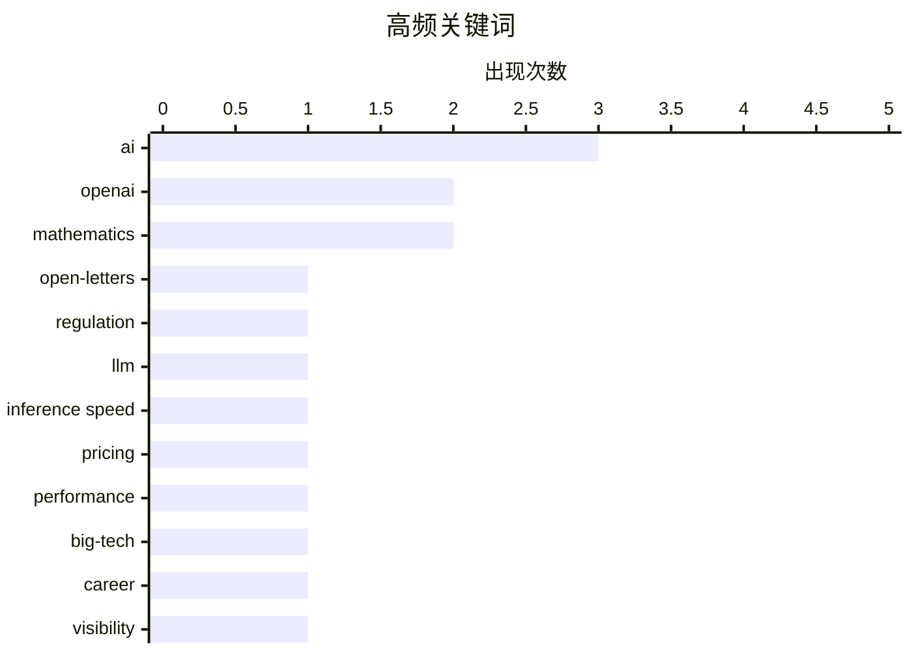

# 📰 AI 博客每日精选 — 2026-08-03

> 来自 Karpathy 推荐的 92 个顶级技术博客，AI 精选 Top 11

## 📝 今日看点

今日技术圈焦点集中在AI发展路径的转向与底层科学的融合。业界正逐渐从单纯的智力比拼转向更看重模型的推理速度与实际应用，同时AI在数学等理论科学领域的突破引发了关于“无数学家数学”的广泛讨论。此外，大型科技公司内部的职场文化与功劳分配问题成为热议话题，折射出行业对组织生态的关注。在工程与历史维度，开发者工具的迭代与对早期计算历史的回顾，也展现了技术圈对基础建设与传承的持续探索。

---

## 🏆 今日必读

🥇 **Open letters about AI development**

[Open letters about AI development](https://simonwillison.net/2026/Aug/2/open-letters/#atom-everything) — simonwillison.net · 12 小时前 · 🤖 AI / ML

> Open letters about AI development

🏷️ AI, open-letters, regulation

🥈 **I'm (mostly) picking models on speed now, not intelligence**

[I'm (mostly) picking models on speed now, not intelligence](https://martinalderson.com/posts/speed-vs-intelligence/?utm_source=rss&amp;utm_medium=rss&amp;utm_campaign=feed) — martinalderson.com · 17 小时前 · 🤖 AI / ML

> I'm (mostly) picking models on speed now, not intelligence

🏷️ LLM, inference speed, pricing, performance

🥉 **Ten advances in mathematics and theoretical computer science**

[Ten advances in mathematics and theoretical computer science](https://simonwillison.net/2026/Aug/1/ten-advances-in-mathematics/#atom-everything) — simonwillison.net · 20 小时前 · 🤖 AI / ML

> Ten advances in mathematics and theoretical computer science

🏷️ OpenAI, mathematics, AI

---

## 📊 数据概览

| 扫描源 | 抓取文章 | 时间范围 | 精选 |
|:---:|:---:|:---:|:---:|
| 82/92 | 2506 篇 → 11 篇 | 24h | **11 篇** |

### 分类分布



### 高频关键词



<details>
<summary>📈 纯文本关键词图（终端友好）</summary>

```
ai              │ ████████████████████ 3
openai          │ █████████████░░░░░░░ 2
mathematics     │ █████████████░░░░░░░ 2
open-letters    │ ███████░░░░░░░░░░░░░ 1
regulation      │ ███████░░░░░░░░░░░░░ 1
llm             │ ███████░░░░░░░░░░░░░ 1
inference speed │ ███████░░░░░░░░░░░░░ 1
pricing         │ ███████░░░░░░░░░░░░░ 1
performance     │ ███████░░░░░░░░░░░░░ 1
big-tech        │ ███████░░░░░░░░░░░░░ 1
```

</details>

### 🏷️ 话题标签

**ai**(3) · **openai**(2) · **mathematics**(2) · open-letters(1) · regulation(1) · llm(1) · inference speed(1) · pricing(1) · performance(1) · big-tech(1) · career(1) · visibility(1) · formal-proof(1) · newsletter(1) · summary(1) · tech(1) · chatgpt(1) · slack(1) · datasette(1) · release(1)

---

## 🤖 AI / ML

### 1. Open letters about AI development

[Open letters about AI development](https://simonwillison.net/2026/Aug/2/open-letters/#atom-everything) — **simonwillison.net** · 12 小时前 · ⭐ 24/30

> Open letters about AI development

🏷️ AI, open-letters, regulation

---

### 2. I'm (mostly) picking models on speed now, not intelligence

[I'm (mostly) picking models on speed now, not intelligence](https://martinalderson.com/posts/speed-vs-intelligence/?utm_source=rss&amp;utm_medium=rss&amp;utm_campaign=feed) — **martinalderson.com** · 17 小时前 · ⭐ 24/30

> I'm (mostly) picking models on speed now, not intelligence

🏷️ LLM, inference speed, pricing, performance

---

### 3. Ten advances in mathematics and theoretical computer science

[Ten advances in mathematics and theoretical computer science](https://simonwillison.net/2026/Aug/1/ten-advances-in-mathematics/#atom-everything) — **simonwillison.net** · 20 小时前 · ⭐ 22/30

> Ten advances in mathematics and theoretical computer science

🏷️ OpenAI, mathematics, AI

---

### 4. Mathematics Without Mathematicians

[Mathematics Without Mathematicians](https://borretti.me/article/mathematics-without-mathematicians) — **borretti.me** · 17 小时前 · ⭐ 22/30

> Mathematics Without Mathematicians

🏷️ mathematics, AI, formal-proof

---

### 5. Quoting Greg Brockman

[Quoting Greg Brockman](https://simonwillison.net/2026/Aug/1/greg-brockman/#atom-everything) — **simonwillison.net** · 18 小时前 · ⭐ 19/30

> Quoting Greg Brockman

🏷️ ChatGPT, Slack, OpenAI

---

## 💡 观点 / 杂谈

### 6. Giving and taking credit in big tech companies

[Giving and taking credit in big tech companies](https://seangoedecke.com/giving-and-taking-credit/) — **seangoedecke.com** · 17 小时前 · ⭐ 22/30

> Giving and taking credit in big tech companies

🏷️ big-tech, career, visibility

---

### 7. July 2026 newsletter

[July 2026 newsletter](https://simonwillison.net/2026/Aug/2/july-newsletter/#atom-everything) — **simonwillison.net** · 12 小时前 · ⭐ 20/30

> July 2026 newsletter

🏷️ newsletter, summary, tech

---

## 📝 其他

### 8. MkLinux and the pimped-out Apple Workgroup Server 9150

[MkLinux and the pimped-out Apple Workgroup Server 9150](https://oldvcr.blogspot.com/feeds/6941630207678889821/comments/default) — **oldvcr.blogspot.com** · 14 小时前 · ⭐ 14/30

> MkLinux and the pimped-out Apple Workgroup Server 9150

🏷️ MkLinux, Apple, retro-computing

---

### 9. 贴上标签：定价枪与条形码的历史博弈

[Put A Tag On It](https://feed.tedium.co/link/15204/17399769/pricing-guns-vs-barcodes-history) — **tedium.co** · 20 小时前 · ⭐ 13/30

> 定价枪本应在条形码普及前就被淘汰，但各州的法律将其作为抵御条形码这一“可怕技术”的保护伞而人为保留。条形码技术在早期面临着法律层面的阻力和消费者对透明定价的担忧。州立法者通过强制要求商品明码标价，使得定价枪在零售业中得以苟延残喘。随着零售业的全面现代化和条形码系统的成熟，定价枪最终才彻底退出历史舞台。这段历史揭示了技术更替背后鲜为人知的政策与法律博弈。

🏷️ barcode, pricing-gun, history

---

## 🛠 工具 / 开源

### 10. datasette-apps 0.2a0

[datasette-apps 0.2a0](https://simonwillison.net/2026/Aug/1/datasette-apps/#atom-everything) — **simonwillison.net** · 19 小时前 · ⭐ 19/30

> datasette-apps 0.2a0

🏷️ datasette, release, agent

---

## ⚙️ 工程

### 11. Why polynomial coefficients?

[Why polynomial coefficients?](https://www.johndcook.com/blog/2026/08/01/why-polynomial-coefficients/) — **johndcook.com** · 20 小时前 · ⭐ 16/30

> Why polynomial coefficients?

🏷️ math, differential-equations, polynomial

---

*生成于 2026-08-03 01:12 (Asia/Shanghai) | 扫描 82 源 → 获取 2506 篇 → 精选 11 篇*
*基于 [Hacker News Popularity Contest 2025](https://refactoringenglish.com/tools/hn-popularity/) RSS 源列表，由 [Andrej Karpathy](https://x.com/karpathy) 推荐*
*由「懂点儿AI」制作，欢迎关注同名微信公众号获取更多 AI 实用技巧 💡*
