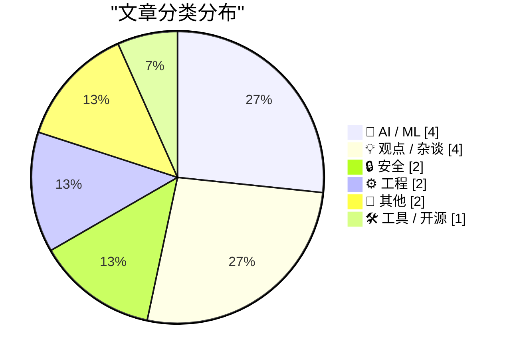
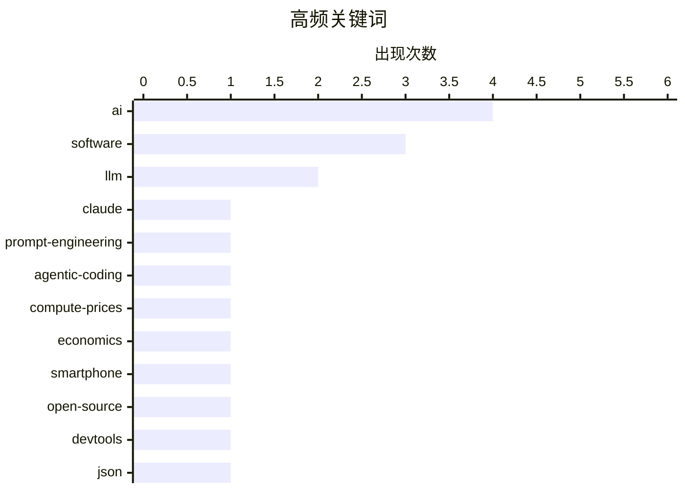

# 📰 AI 博客每日精选 — 2026-08-04

> 来自 Karpathy 推荐的 92 个顶级技术博客，AI 精选 Top 15

## 📝 今日看点

今日技术圈聚焦于AI智能体编程的演进与底层算力成本的重塑。随着AI编程从提示词工程转向智能体实践，开发者更强调对代码的深度审查与实际应用价值，而模型智能化的提升正预示着廉价计算时代的终结与算力价格的飙升。此外，开源开发工具的不可替代性成为热议焦点，业界呼吁通过开源赋予用户自由，并在工程实践中以系统思维取代对人为错误的简单归咎。

---

## 🏆 今日必读

🥇 **Boris Cherny 谈如何让 Claude Code 重写 Claude 应用**

[Boris Cherny on Trying to Get Claude Code to Rewrite the Claude App](https://www.ycrootaccess.com/p/boris-cherny-building-claude-code) — daringfireball.net · 21 小时前 · 🤖 AI / ML

> Anthropic 的 Claude Code 负责人 Boris Cherny 在 Y Combinator 的创业学校活动中分享了关于 AI 编程的见解。他认为当前的技能重点不再是提示词工程，而是如何给 Claude 分配看似过于困难的任务。关键在于让 Claude 在执行过程中能够自我验证工作成果。这种验证机制是完成复杂编程任务的核心。

💡 **为什么值得读**: 了解 Anthropic 内部如何指导 AI 完成复杂编程任务的第一手经验。

🏷️ claude, llm, prompt-engineering

🥈 **智能体编程技术**

[Agentic coding techniques](https://micahflee.com/agentic-coding-techniques/) — micahflee.com · 2 小时前 · 🤖 AI / ML

> 作者分享了使用大语言模型（LLM）进行智能体编程的实践经验。与将 AI 强行塞入各种应用或生成垃圾内容不同，智能体编程在实际应用中具有真正的价值。然而，要发挥其作用，使用者必须理解代码并严格审查 AI 的输出。正确的使用方式和人类的监督是确保智能体编程有效性的关键。

💡 **为什么值得读**: 提供了关于如何正确且负责任地使用 AI 智能体进行编程的实用视角。

🏷️ agentic-coding, LLM, AI

🥉 **为什么更智能的 AI 模型可能使算力价格上涨 10 倍**

[Why smarter AI models could drive up compute prices 10x](https://www.dwarkesh.com/p/why-compute-might-get-10x-more-expensive-video) — dwarkesh.com · 37 分钟前 · 🤖 AI / ML

> 随着人工智能模型变得越来越智能，对计算资源的需求可能会急剧增加。文章探讨了更高级的 AI 模型如何可能导致算力价格飙升高达 10 倍。这一趋势可能标志着廉价计算时代的终结。作者深入分析了模型智能提升与算力成本之间的经济学关系。

💡 **为什么值得读**: 揭示了 AI 发展背后被忽视的算力经济学趋势及其对未来技术普及的影响。

🏷️ AI, compute-prices, economics

---

## 📊 数据概览

| 扫描源 | 抓取文章 | 时间范围 | 精选 |
|:---:|:---:|:---:|:---:|
| 84/92 | 2537 篇 → 18 篇 | 24h | **15 篇** |

### 分类分布



### 高频关键词



<details>
<summary>📈 纯文本关键词图（终端友好）</summary>

```
ai                 │ ████████████████████ 4
software           │ ███████████████░░░░░ 3
llm                │ ██████████░░░░░░░░░░ 2
claude             │ █████░░░░░░░░░░░░░░░ 1
prompt-engineering │ █████░░░░░░░░░░░░░░░ 1
agentic-coding     │ █████░░░░░░░░░░░░░░░ 1
compute-prices     │ █████░░░░░░░░░░░░░░░ 1
economics          │ █████░░░░░░░░░░░░░░░ 1
smartphone         │ █████░░░░░░░░░░░░░░░ 1
open-source        │ █████░░░░░░░░░░░░░░░ 1
```

</details>

### 🏷️ 话题标签

**ai**(4) · **software**(3) · **llm**(2) · claude(1) · prompt-engineering(1) · agentic-coding(1) · compute-prices(1) · economics(1) · smartphone(1) · open-source(1) · devtools(1) · json(1) · library(1) · release(1) · drm(1) · hacking(1) · privacy(1) · firewall(1) · cron(1) · rebase(1)

---

## 🤖 AI / ML

### 1. Boris Cherny 谈如何让 Claude Code 重写 Claude 应用

[Boris Cherny on Trying to Get Claude Code to Rewrite the Claude App](https://www.ycrootaccess.com/p/boris-cherny-building-claude-code) — **daringfireball.net** · 21 小时前 · ⭐ 23/30

> Anthropic 的 Claude Code 负责人 Boris Cherny 在 Y Combinator 的创业学校活动中分享了关于 AI 编程的见解。他认为当前的技能重点不再是提示词工程，而是如何给 Claude 分配看似过于困难的任务。关键在于让 Claude 在执行过程中能够自我验证工作成果。这种验证机制是完成复杂编程任务的核心。

🏷️ claude, llm, prompt-engineering

---

### 2. 智能体编程技术

[Agentic coding techniques](https://micahflee.com/agentic-coding-techniques/) — **micahflee.com** · 2 小时前 · ⭐ 23/30

> 作者分享了使用大语言模型（LLM）进行智能体编程的实践经验。与将 AI 强行塞入各种应用或生成垃圾内容不同，智能体编程在实际应用中具有真正的价值。然而，要发挥其作用，使用者必须理解代码并严格审查 AI 的输出。正确的使用方式和人类的监督是确保智能体编程有效性的关键。

🏷️ agentic-coding, LLM, AI

---

### 3. 为什么更智能的 AI 模型可能使算力价格上涨 10 倍

[Why smarter AI models could drive up compute prices 10x](https://www.dwarkesh.com/p/why-compute-might-get-10x-more-expensive-video) — **dwarkesh.com** · 37 分钟前 · ⭐ 23/30

> 随着人工智能模型变得越来越智能，对计算资源的需求可能会急剧增加。文章探讨了更高级的 AI 模型如何可能导致算力价格飙升高达 10 倍。这一趋势可能标志着廉价计算时代的终结。作者深入分析了模型智能提升与算力成本之间的经济学关系。

🏷️ AI, compute-prices, economics

---

### 4. Agent Fone：内置 AI 智能体的智能手机

[Agent Fone](https://fail.xyz/phone/) — **daringfireball.net** · 21 小时前 · ⭐ 21/30

> Agent Fone 是一款极具野心的全新智能手机，其核心理念不仅是内置 AI 助手，而是让用户直接在手机上创建定制软件。用户只需描述应用想法并回答几个问题，手机就能自动构建应用或小组件并添加到主屏幕。这一设计旨在实现那些存在于笔记中多年、只有自己想要的奇思妙想。它将 AI 编程能力直接整合到了移动设备的日常使用中。

🏷️ ai, smartphone, software

---

## 💡 观点 / 杂谈

### 5. 开发工具必须开源

[Devtools must be open source (exe.dev)](https://simonwillison.net/2026/Aug/3/devtools-must-be-open-source-exedev/#atom-everything) — **simonwillison.net** · 2 小时前 · ⭐ 19/30

> Simon Willison 在 Hacker News 上探讨了为什么面向终端用户的开发工具必须开源。开源软件的核心优势在于赋予用户检查和修改软件工作原理的自由。然而现实中，即使是专家程序员也往往依赖他人来进行这些审查工作。这反映了开源软件在透明度和社区协作方面的实际价值。

🏷️ open-source, devtools, software

---

### 6. 隐形问题

[Invisible Problems](https://idiallo.com/blog/invisible-problems) — **idiallo.com** · 11 小时前 · ⭐ 18/30

> 作者通过疫情期间团队在线玩密室逃脱游戏的经历，引出了关于“隐形问题”的讨论。在游戏中，每个人需要在各自的牢房中寻找线索，找到解决谜题的物件并组合起来才能逃脱。这隐喻了团队协作中那些不易察觉但需要共同发现和解决的问题。文章强调了识别和解决这些隐形问题对于团队成功的重要性。

🏷️ problem-solving, team, software

---

### 7. 书评：Sidney Dekker 的《理解“人为错误”实地指南》

[Book Review: The Field Guide to Understanding 'Human Error' by Sidney Dekker ★★★★☆](https://shkspr.mobi/blog/2026/08/book-review-the-field-guide-to-understanding-human-error-by-sidney-dekker/) — **shkspr.mobi** · 6 小时前 · ⭐ 18/30

> 这篇书评介绍了 Sidney Dekker 的著作，该书认为所谓的“人为错误”实际上并不存在。大多数灾难是由系统问题、激励错位和不切实际的流程引起的，而不是人类自身的不可靠。读者并非安全系统的守护者，不需要保护系统免受不稳定人类的影响。虽然内容略显重复，但它为学生和从业者提供了重新审视事故归因的有用视角。

🏷️ human-error, system-design, book-review

---

### 8. Review: Job-Less Utopia

[Review: Job-Less Utopia](https://borretti.me/article/review-job-less-utopia) — **borretti.me** · 18 小时前 · ⭐ 18/30

> Review: Job-Less Utopia

🏷️ AI, utopia, future-of-work

---

## 🔒 安全

### 9. Pluralistic：二元论（2026年8月3日）

[Pluralistic: Dualism (03 Aug 2026)](https://pluralistic.net/2026/08/03/andor/) — **pluralistic.net** · 9 小时前 · ⭐ 19/30

> Cory Doctorow 在其每日链接专栏中探讨了“二元论：为什么不能两者兼得”的主题。文章汇集了多条科技与文化新闻，包括英国防火墙的倒塌、铸造硬币、虚拟宠物与 DRM 的冲突等。还涉及 Getty 侵犯版权、美墨非法移民净流量为零以及远程黑客攻击大型卡车等话题。这些内容反映了当前数字权利、科技政策与社会现象的交织。

🏷️ drm, hacking, privacy, firewall

---

### 10. Welcoming the Nepalese Government to Have I Been Pwned

[Welcoming the Nepalese Government to Have I Been Pwned](https://www.troyhunt.com/welcoming-the-nepalese-government-to-have-i-been-pwned/) — **troyhunt.com** · 11 小时前 · ⭐ 18/30

> Welcoming the Nepalese Government to Have I Been Pwned

🏷️ HIBP, security, data-breach

---

## ⚙️ 工程

### 11. 引用 David Crawshaw 的提示词

[Quoting David Crawshaw's prompt](https://simonwillison.net/2026/Aug/3/david-crawshaw/#atom-everything) — **simonwillison.net** · 1 小时前 · ⭐ 18/30

> Simon Willison 引用了 David Crawshaw 关于开源开发工具的一段提示词。该提示词旨在设置一个每晚执行的 cron 任务，用于获取上游更改并将所有本地更改 rebase 到上游之上。随后，它会检查软件是否按预期工作并替换当前版本。这展示了如何利用 AI 自动化处理复杂的版本控制和软件更新流程。

🏷️ cron, rebase, automation

---

### 12. Holonomic functions

[Holonomic functions](https://www.johndcook.com/blog/2026/08/02/holonomic-functions/) — **johndcook.com** · 21 小时前 · ⭐ 15/30

> Holonomic functions

🏷️ holonomic-functions, math, differential-equations

---

## 📝 其他

### 13. ★ Why Apple Requires a Cellular Account Through a Big Three Carrier to Lease an iPhone

[★ Why Apple Requires a Cellular Account Through a Big Three Carrier to Lease an iPhone](https://daringfireball.net/2026/08/followup_big_three_carrier_requirement) — **daringfireball.net** · 49 分钟前 · ⭐ 14/30

> ★ Why Apple Requires a Cellular Account Through a Big Three Carrier to Lease an iPhone

🏷️ apple, iphone, carrier

---

### 14. Truth Social Launches Paid Early Access to Trump Posts

[Truth Social Launches Paid Early Access to Trump Posts](https://www.npr.org/2026/08/01/nx-s1-5912219/trump-truth-social-access-insider-trading) — **daringfireball.net** · 2 小时前 · ⭐ 14/30

> Truth Social Launches Paid Early Access to Trump Posts

🏷️ social-media, business, politics

---

## 🛠 工具 / 开源

### 15. condense-json 1.0 发布

[condense-json 1.0](https://simonwillison.net/2026/Aug/2/condense-json/#atom-everything) — **simonwillison.net** · 19 小时前 · ⭐ 19/30

> Simon Willison 发布了 condense-json 1.0 版本，这是一个用于压缩和优化 JSON 数据的小型库。该库已经开发了一年半，经过一系列合理的非破坏性修复后正式推出 1.0 版本。作者表示自己正在尝试变得更勇敢，以发布更多 1.0 版本的软件。该工具能够有效处理和精简复杂的 JSON 结构。

🏷️ json, library, release

---

*生成于 2026-08-04 02:09 (Asia/Shanghai) | 扫描 84 源 → 获取 2537 篇 → 精选 15 篇*
*基于 [Hacker News Popularity Contest 2025](https://refactoringenglish.com/tools/hn-popularity/) RSS 源列表，由 [Andrej Karpathy](https://x.com/karpathy) 推荐*
*由「懂点儿AI」制作，欢迎关注同名微信公众号获取更多 AI 实用技巧 💡*
