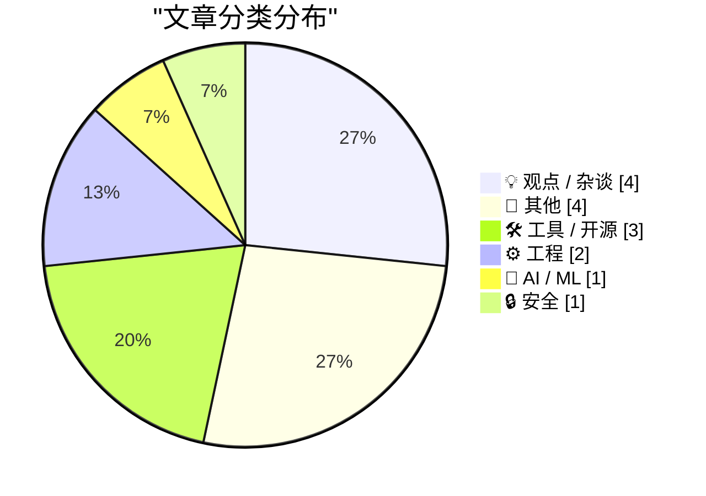
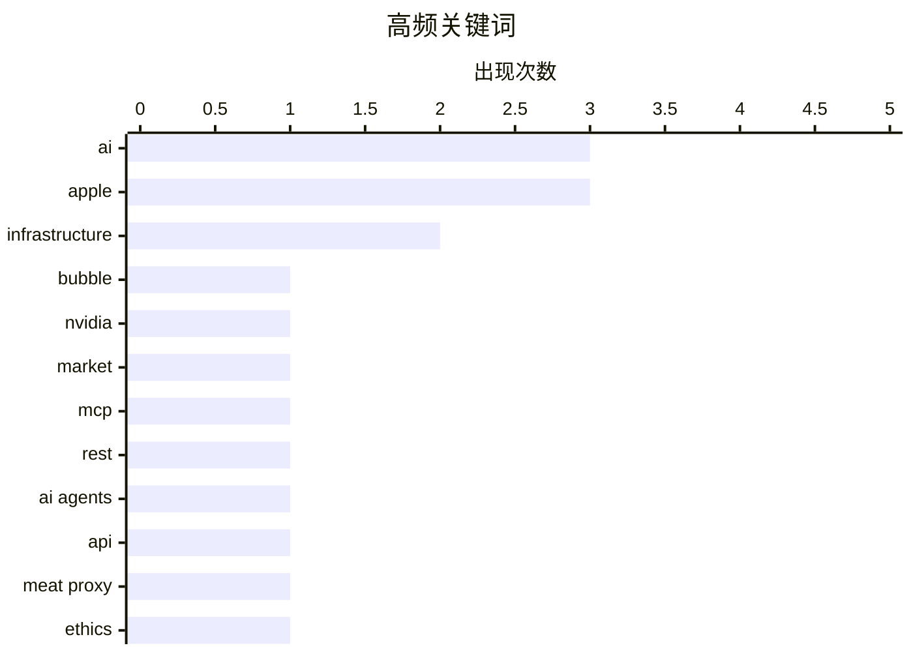

# 📰 AI 博客每日精选 — 2026-08-05

> 来自 Karpathy 推荐的 92 个顶级技术博客，AI 精选 Top 15

## 📝 今日看点

今日技术圈焦点集中在AI产业的现实博弈与底层工具演进。一方面，关于AI需求泡沫的反思与人类沦为“肉身代理”的担忧引发热议，同时苹果与OpenAI的商业机密诉讼凸显了巨头间激烈的AI竞争。另一方面，Bending Spoons斥资13亿美元收购Airtable标志着SaaS领域的重大整合。此外，MCP与REST的连接方案之争以及多款终端与CI工具的发布，表明开发者正积极重塑AI时代的底层工作流。

---

## 🏆 今日必读

🥇 **The AI Demand Bubble**

[The AI Demand Bubble](https://www.wheresyoured.at/the-ai-demand-bubble/) — wheresyoured.at · 2 小时前 · 💡 观点 / 杂谈

> The AI Demand Bubble

🏷️ AI, bubble, NVIDIA, market

🥈 **[Sponsor] MCP vs. REST: The Right Way to Connect Agents to Your API**

[[Sponsor] MCP vs. REST: The Right Way to Connect Agents to Your API](https://workos.com/blog/mcp-vs-rest?utm_source=daringfireball&amp;utm_medium=newsletter&amp;utm_campaign=q32026) — daringfireball.net · 19 小时前 · 🤖 AI / ML

> [Sponsor] MCP vs. REST: The Right Way to Connect Agents to Your API

🏷️ MCP, REST, AI agents, API

🥉 **Don't be a meat proxy**

[Don't be a meat proxy](https://simonwillison.net/2026/Aug/3/dont-be-a-meat-proxy/#atom-everything) — simonwillison.net · 18 小时前 · 💡 观点 / 杂谈

> Don't be a meat proxy

🏷️ AI, meat proxy, ethics

---

## 📊 数据概览

| 扫描源 | 抓取文章 | 时间范围 | 精选 |
|:---:|:---:|:---:|:---:|
| 80/92 | 2466 篇 → 17 篇 | 24h | **15 篇** |

### 分类分布



### 高频关键词



<details>
<summary>📈 纯文本关键词图（终端友好）</summary>

```
ai             │ ████████████████████ 3
apple          │ ████████████████████ 3
infrastructure │ █████████████░░░░░░░ 2
bubble         │ ███████░░░░░░░░░░░░░ 1
nvidia         │ ███████░░░░░░░░░░░░░ 1
market         │ ███████░░░░░░░░░░░░░ 1
mcp            │ ███████░░░░░░░░░░░░░ 1
rest           │ ███████░░░░░░░░░░░░░ 1
ai agents      │ ███████░░░░░░░░░░░░░ 1
api            │ ███████░░░░░░░░░░░░░ 1
```

</details>

### 🏷️ 话题标签

**ai**(3) · **apple**(3) · **infrastructure**(2) · bubble(1) · nvidia(1) · market(1) · mcp(1) · rest(1) · ai agents(1) · api(1) · meat proxy(1) · ethics(1) · openai(1) · trade secrets(1) · lawsuit(1) · compute(1) · human rights(1) · internet(1) · airtable(1) · acquisition(1)

---

## 💡 观点 / 杂谈

### 1. The AI Demand Bubble

[The AI Demand Bubble](https://www.wheresyoured.at/the-ai-demand-bubble/) — **wheresyoured.at** · 2 小时前 · ⭐ 26/30

> The AI Demand Bubble

🏷️ AI, bubble, NVIDIA, market

---

### 2. Don't be a meat proxy

[Don't be a meat proxy](https://simonwillison.net/2026/Aug/3/dont-be-a-meat-proxy/#atom-everything) — **simonwillison.net** · 18 小时前 · ⭐ 23/30

> Don't be a meat proxy

🏷️ AI, meat proxy, ethics

---

### 3. Pluralistic: Post-American compute for a post-American Internet (04 Aug 2026)

[Pluralistic: Post-American compute for a post-American Internet (04 Aug 2026)](https://pluralistic.net/2026/08/04/technology-freedom-cooperative/) — **pluralistic.net** · 6 小时前 · ⭐ 23/30

> Pluralistic: Post-American compute for a post-American Internet (04 Aug 2026)

🏷️ compute, infrastructure, human rights, internet

---

### 4. Om Malik 的最后一篇文章：《神话、神话体系与那个人》

[Om Malik’s Final Essay: ‘The Myth, the Mythos and the Man’](https://om.co/2026/06/07/the-myth-the-mythos-and-the-man/) — **daringfireball.net** · 21 小时前 · ⭐ 18/30

> Om Malik 在 WWDC 主题演讲当天（6月7日）发表了他生前最后一篇文章，并将其称为自己的“最后一击”。他在文中探讨了神话与神话体系的构建，将历史上的奥古斯都与现代的 Dario 进行了类比。作者 John Gruber 评价这篇文章极具洞察力，是 Malik 留下的珍贵思想遗产。

🏷️ Om Malik, essay, tech journalism

---

## 📝 其他

### 5. Apple Seeks Preliminary Injunction Against OpenAI in Trade Secrets Case

[Apple Seeks Preliminary Injunction Against OpenAI in Trade Secrets Case](https://www.reuters.com/legal/litigation/apple-seeks-preliminary-injunction-against-openai-trade-secrets-case-2026-08-04/) — **daringfireball.net** · 2 小时前 · ⭐ 23/30

> Apple Seeks Preliminary Injunction Against OpenAI in Trade Secrets Case

🏷️ Apple, OpenAI, trade secrets, lawsuit

---

### 6. Bending Spoons to Buy Airtable for $1.3 Billion

[Bending Spoons to Buy Airtable for $1.3 Billion](https://techcrunch.com/2026/08/04/bending-spoons-to-buy-airtable-for-1-28b/) — **daringfireball.net** · 2 小时前 · ⭐ 22/30

> Bending Spoons to Buy Airtable for $1.3 Billion

🏷️ Airtable, acquisition, Bending Spoons

---

### 7. John Ternus 重新聘用前硬件副总裁 Laura Legros

[John Ternus Has Rehired Former Hardware VP Laura Legros](https://www.macrumors.com/2026/08/03/apple-john-ternus-hiring-retired-vp/) — **daringfireball.net** · 20 小时前 · ⭐ 17/30

> 即将上任的苹果 CEO John Ternus 正在重新聘用于 2022 年退休的前硬件工程副总裁 Laura Legros。Legros 此前负责产品交付、开发进度和跨工程团队协调，是 Ternus 最信任的副手之一。回归后，她将直接向 Ternus 汇报，并负责跨公司不同部门的协调工作。

🏷️ Apple, management, hardware

---

### 8. Radio Shack 的 TRS-80：1977年8月3日发布

[Radio Shack’s TRS-80: Introduced Aug 3, 1977](https://dfarq.homeip.net/radio-shacks-trs-80-introduced-aug-3-1977/?utm_source=rss&#038;utm_medium=rss&#038;utm_campaign=radio-shacks-trs-80-introduced-aug-3-1977) — **dfarq.homeip.net** · 7 小时前 · ⭐ 16/30

> Radio Shack 于 1977 年 8 月 3 日发布了 TRS-80 Model 1，设计师 Steve Leininger 当时预计能卖出 5 万台，但 Tandy 高管对此表示怀疑。然而市场反响远超预期，最终有 25 万人直接付款预订。这一事件标志着早期个人电脑市场的巨大潜力和消费者热情。

🏷️ TRS-80, history, computer

---

## 🛠 工具 / 开源

### 9. TerminalWidget 1.0

[TerminalWidget 1.0](https://terminalwidget.app/) — **daringfireball.net** · 15 小时前 · ⭐ 21/30

> TerminalWidget 1.0

🏷️ TerminalWidget, macOS, widgets, scripts

---

### 10. brew install actions/checkout

[brew install actions/checkout](https://nesbitt.io/2026/08/04/brew-install-actions-checkout.html) — **nesbitt.io** · 8 小时前 · ⭐ 20/30

> brew install actions/checkout

🏷️ Homebrew, GitHub Actions, CI/CD

---

### 11. Quoting Steve Yegge

[Quoting Steve Yegge](https://simonwillison.net/2026/Aug/4/steve-yegge/#atom-everything) — **simonwillison.net** · 17 小时前 · ⭐ 18/30

> Quoting Steve Yegge

🏷️ AI, Opus, tools

---

## ⚙️ 工程

### 12. 相对速度与接近速度

[Relative velocity and closing speed](https://eli.thegreenplace.net/2026/relative-velocity-and-closing-speed/) — **eli.thegreenplace.net** · 15 小时前 · ⭐ 16/30

> 在物理模拟或游戏引擎中，计算两个物体相互接近的速度是一个常见需求。文章详细讨论了“接近速度”的概念，即两个物体相对速度的法向分量。通过分解相对速度的各个分量，开发者可以准确判断物体在运动轨迹上的碰撞或接近状态。

🏷️ physics, game engine, velocity

---

### 13. 金属炼金术

[Metallic alchemy](https://www.johndcook.com/blog/2026/08/04/metallic-alchemy/) — **johndcook.com** · 4 小时前 · ⭐ 13/30

> 作者在探讨金属比例的基础上，将其类比为炼金术中将贱金属转化为贵金属的过程。文章探讨了能否由一种金属比例推导出另一种，例如能否从“铅比例”中制造出“黄金比例”。这涉及数学比例之间的代数关系与转换法则，为理解金属比例提供了有趣的数学视角。

🏷️ math, metallic ratios, alchemy

---

## 🤖 AI / ML

### 14. [Sponsor] MCP vs. REST: The Right Way to Connect Agents to Your API

[[Sponsor] MCP vs. REST: The Right Way to Connect Agents to Your API](https://workos.com/blog/mcp-vs-rest?utm_source=daringfireball&amp;utm_medium=newsletter&amp;utm_campaign=q32026) — **daringfireball.net** · 19 小时前 · ⭐ 25/30

> [Sponsor] MCP vs. REST: The Right Way to Connect Agents to Your API

🏷️ MCP, REST, AI agents, API

---

## 🔒 安全

### 15. The Information on Apple’s Unusual Use of iCloud for Confidential Work

[The Information on Apple’s Unusual Use of iCloud for Confidential Work](https://www.theinformation.com/articles/apple-icloud-policy-fueled-employee-leaks-ahead-openai-suit?rc=jfy0lk) — **daringfireball.net** · 20 小时前 · ⭐ 18/30

> The Information on Apple’s Unusual Use of iCloud for Confidential Work

🏷️ Apple, iCloud, security, infrastructure

---

*生成于 2026-08-05 02:07 (Asia/Shanghai) | 扫描 80 源 → 获取 2466 篇 → 精选 15 篇*
*基于 [Hacker News Popularity Contest 2025](https://refactoringenglish.com/tools/hn-popularity/) RSS 源列表，由 [Andrej Karpathy](https://x.com/karpathy) 推荐*
*由「懂点儿AI」制作，欢迎关注同名微信公众号获取更多 AI 实用技巧 💡*
