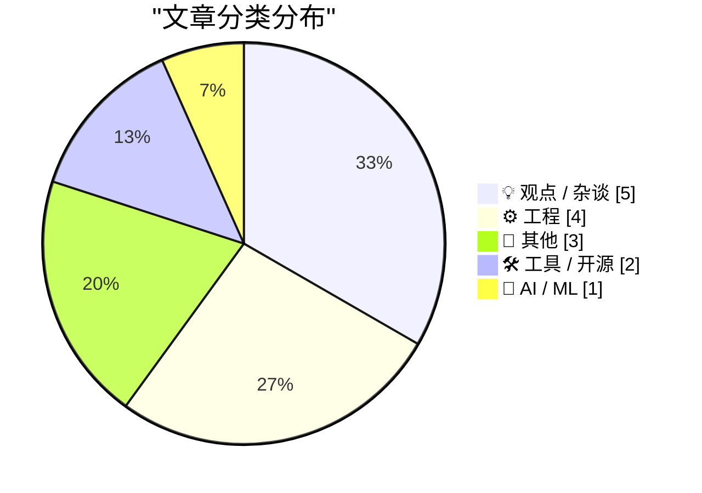
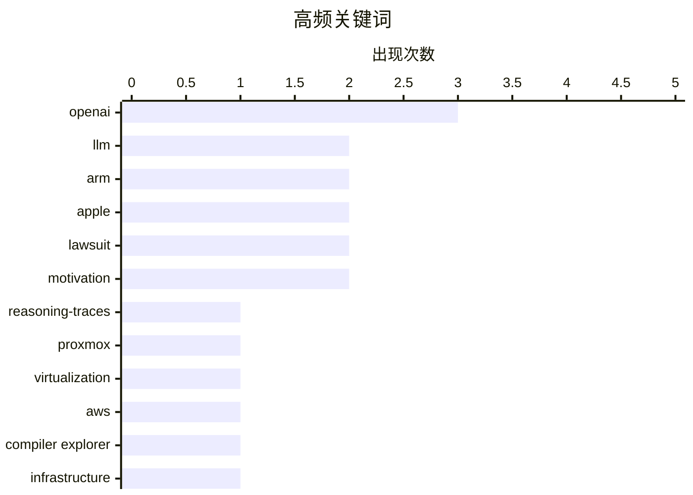

# 📰 AI 博客每日精选 — 2026-08-06

> 来自 Karpathy 推荐的 92 个顶级技术博客，AI 精选 Top 15

## 📝 今日看点

今日技术圈聚焦于AI工具链的深度演进与ARM架构的全面扩张。一方面，LLM及相关插件迎来重大版本更新，不仅强化了推理轨迹与多模态能力，还推动了全模态模型在本地Apple Silicon上的落地。另一方面，ARM生态持续繁荣，从Proxmox正式支持ARM服务器架构到骁龙X2赋能近乎完美的Windows on Arm笔记本，底层算力格局正在重塑。此外，科技巨头的法律与监管争议引发广泛关注，OpenAI以罕见博客形式回应苹果诉讼，而Google则因平台监管缺位被批为“骗子的天堂”。

---

## 🏆 今日必读

🥇 **LLM 新版本发布：支持推理轨迹、OpenAI Responses、服务端工具及更智能的日志**

[New release of LLM adds support for reasoning traces, OpenAI Responses, server-side tools, and smarter logging](https://simonwillison.net/2026/Aug/4/new-release-of-llm/#atom-everything) — simonwillison.net · 18 小时前 · 🛠 工具 / 开源

> LLM 0.32 是该项目自发布以来最重大的更新。新版本引入了可见的推理轨迹支持、服务端提供商工具、重新设计的基于内容寻址的 SQLite 日志，以及由 OpenAI Responses API 启用的新功能和新模型。同时，llm-anthropic 插件也发布了新版本。此次更新大幅提升了大语言模型命令行工具的交互与日志追踪能力。

💡 **为什么值得读**: 了解 LLM 命令行工具最新重大版本更新的核心特性与改进点。

🏷️ LLM, OpenAI, reasoning-traces

🥈 **Proxmox 官方支持 ARM 架构，但附带一些限制**

[Proxmox officially supports Arm, with some caveats](https://www.jeffgeerling.com/blog/2026/proxmox-ve-arm-official/) — jeffgeerling.com · 1 小时前 · ⚙️ 工程

> Proxmox 宣布其虚拟环境（VE）现已支持 64 位 ARM 架构。开发者在 Ampere Altra 开发平台上进行了测试，验证了其可用性。尽管官方支持 ARM，但仍存在一些使用上的限制和注意事项。这标志着主流虚拟化平台向 ARM 生态迈出了重要一步。

💡 **为什么值得读**: 了解 Proxmox VE 对 ARM 架构的官方支持现状及实际测试表现。

🏷️ Proxmox, ARM, virtualization

🥉 **Compiler Explorer 在 2026 年如何运行于 AWS 之上**

[How Compiler Explorer Runs on AWS in 2026](http://xania.org/202608/how-compiler-explorer-runs-on-aws?utm_source=feed&amp;utm_medium=rss) — xania.org · 2 小时前 · ⚙️ 工程

> 文章详细介绍了 Compiler Explorer 在 2026 年使用的 AWS 服务架构。它带领读者浏览了支撑每一次代码编译背后的 AWS 基础设施。通过这一巡览，读者可以了解该在线编译工具如何利用云服务实现高效、可扩展的编译任务。

💡 **为什么值得读**: 深入了解高流量在线编译工具的云原生架构设计与 AWS 服务实践。

🏷️ AWS, Compiler Explorer, infrastructure, cloud

---

## 📊 数据概览

| 扫描源 | 抓取文章 | 时间范围 | 精选 |
|:---:|:---:|:---:|:---:|
| 84/92 | 2537 篇 → 16 篇 | 24h | **15 篇** |

### 分类分布



### 高频关键词



<details>
<summary>📈 纯文本关键词图（终端友好）</summary>

```
openai           │ ████████████████████ 3
llm              │ █████████████░░░░░░░ 2
arm              │ █████████████░░░░░░░ 2
apple            │ █████████████░░░░░░░ 2
lawsuit          │ █████████████░░░░░░░ 2
motivation       │ █████████████░░░░░░░ 2
reasoning-traces │ ███████░░░░░░░░░░░░░ 1
proxmox          │ ███████░░░░░░░░░░░░░ 1
virtualization   │ ███████░░░░░░░░░░░░░ 1
aws              │ ███████░░░░░░░░░░░░░ 1
```

</details>

### 🏷️ 话题标签

**openai**(3) · **llm**(2) · **arm**(2) · apple(2) · lawsuit(2) · motivation(2) · reasoning-traces(1) · proxmox(1) · virtualization(1) · aws(1) · compiler explorer(1) · infrastructure(1) · cloud(1) · anthropic(1) · claude(1) · google(1) · scam(1) · ads(1) · minimax(1) · mlx(1)

---

## 💡 观点 / 杂谈

### 1. Pluralistic：Google 是骗子的天堂

[Pluralistic: Google is a scammer's paradise (05 Aug 2026)](https://pluralistic.net/2026/08/05/absentee-landlord/) — **pluralistic.net** · 7 小时前 · ⭐ 22/30

> 作者将 Google 比作互联网的“缺席房东”，指出其平台已成为骗子的天堂。文章批评了 Google 在管理其生态系统时的不作为，导致欺诈行为泛滥。核心观点是 Google 缺乏对平台环境的有效监管，损害了互联网用户的利益。

🏷️ Google, scam, ads

---

### 2. Hacker News 讨论 OpenAI 的“苹果搞错了”一文

[Hacker News Thread on OpenAI’s ‘Apple Is Getting This Wrong’ Post](https://news.ycombinator.com/item?id=49164649) — **daringfireball.net** · 3 小时前 · ⭐ 19/30

> Hacker News 上的讨论指出，OpenAI 对苹果诉讼的公开回应缺乏必要的上下文背景。讨论认为 OpenAI 的回应显得过于温和，甚至没有解释他们究竟在回应什么。这反映了 OpenAI 在应对高风险法律纠纷时的公关策略存在明显缺陷。

🏷️ OpenAI, Apple, lawsuit

---

### 3. OpenAI 回应苹果诉讼及初步禁令动议：“苹果搞错了”

[★ OpenAI Responds to Apple’s Lawsuit and Motion for Preliminary Injunction: ‘Apple Is Getting This Wrong’](https://daringfireball.net/2026/08/openai_apple_is_getting_this_wrong) — **daringfireball.net** · 19 小时前 · ⭐ 19/30

> OpenAI 采用发布博客文章这种不寻常的方式，回应了苹果的高风险诉讼及初步禁令动议。文章摘录了 OpenAI 回应中的部分内容，并附带了相关评论。作者认为，尽管用博客回应诉讼很罕见，但这符合 OpenAI 作为一家非传统公司的行事风格。

🏷️ OpenAI, Apple, lawsuit

---

### 4. 激励是给失败者的

[Incentives are for losers](https://www.experimental-history.com/p/incentives-are-for-losers) — **experimental-history.com** · 3 小时前 · ⭐ 17/30

> 传统观点认为激励机制能驱动人们更好地完成任务，但作者对此提出了截然相反的论断。文章通过一个荒诞的隐喻（盯着一条鱼直到发疯）暗示，过度依赖外部激励反而会破坏内在动机。作者认为，真正的创造力和长期成就往往源于内在驱动，而非外在的奖惩系统。结论是，盲目追求激励制度的人最终可能成为这套系统的牺牲品。

🏷️ incentives, psychology, motivation, behavior

---

### 5. 致力于创造力

[Committing to creativity](https://herman.bearblog.dev/creativity/) — **herman.bearblog.dev** · 5 小时前 · ⭐ 15/30

> 创造力不仅依赖于瞬间的灵感或动机，更需要长期的承诺与坚持。文章探讨了承诺与动机之间的微妙界限，指出动机往往是短暂且易受情绪影响的，而承诺则是维持持续创作的基石。作者认为，将创意转化为实际成果需要跨越这一界限，建立稳定的创作习惯。结论是，只有通过坚定的承诺，才能在缺乏动机时依然保持创造力。

🏷️ creativity, motivation, commitment, productivity

---

## ⚙️ 工程

### 6. Proxmox 官方支持 ARM 架构，但附带一些限制

[Proxmox officially supports Arm, with some caveats](https://www.jeffgeerling.com/blog/2026/proxmox-ve-arm-official/) — **jeffgeerling.com** · 1 小时前 · ⭐ 23/30

> Proxmox 宣布其虚拟环境（VE）现已支持 64 位 ARM 架构。开发者在 Ampere Altra 开发平台上进行了测试，验证了其可用性。尽管官方支持 ARM，但仍存在一些使用上的限制和注意事项。这标志着主流虚拟化平台向 ARM 生态迈出了重要一步。

🏷️ Proxmox, ARM, virtualization

---

### 7. Compiler Explorer 在 2026 年如何运行于 AWS 之上

[How Compiler Explorer Runs on AWS in 2026](http://xania.org/202608/how-compiler-explorer-runs-on-aws?utm_source=feed&amp;utm_medium=rss) — **xania.org** · 2 小时前 · ⭐ 23/30

> 文章详细介绍了 Compiler Explorer 在 2026 年使用的 AWS 服务架构。它带领读者浏览了支撑每一次代码编译背后的 AWS 基础设施。通过这一巡览，读者可以了解该在线编译工具如何利用云服务实现高效、可扩展的编译任务。

🏷️ AWS, Compiler Explorer, infrastructure, cloud

---

### 8. 纯函数式数字电路模拟器（SICP 3.3）

[Purely functional digital circuit simulator (SICP 3.3)](https://entropicthoughts.com/sicp-3-3-pure-digital-circuit-simulator) — **entropicthoughts.com** · 20 小时前 · ⭐ 18/30

> 文章探讨了 SICP（计算机程序的构造和解释）3.3 节中的数字电路模拟器实现。原书方案使用隐藏的可变状态和消息传递来实现面向对象编程，甚至依赖可变全局变量。作者尝试将其重构为纯函数式的实现方式，以避免可变状态带来的复杂性。

🏷️ functional programming, SICP, simulator, circuits

---

### 9. 枚举树与圆

[Enumerating trees and circles](https://www.johndcook.com/blog/2026/08/05/enumerating-trees-and-circles/) — **johndcook.com** · 3 小时前 · ⭐ 17/30

> 计算有根树的数量涉及序列 c(n)，其中 n 代表节点数，且仅根节点被区分。文章进一步探讨了如何枚举树和圆的组合结构，指出根节点下方的子节点在计数时不区分顺序。作者通过数学序列揭示了这些离散结构的内在规律。结论是，这类组合数学问题在图论和算法设计中具有基础性意义。

🏷️ math, combinatorics, trees, algorithms

---

## 📝 其他

### 10. Paul Thurrott 评测搭载高通骁龙 X2 的 HP OmniBook Ultra 14

[Paul Thurrott Reviews the HP OmniBook Ultra 14, With Qualcomm’s Snapdragon X2](https://www.thurrott.com/mobile/copilot-pc/340107/hp-omnibook-ultra-14-snapdragon-x2-review) — **daringfireball.net** · 2 小时前 · ⭐ 18/30

> Paul Thurrott 对搭载高通骁龙 X2 的 HP OmniBook Ultra 14 给予高度评价，称其为近乎完美的 Windows 11 on Arm 笔记本。该设备在性能、电池续航和静音表现上均十分出色，进一步证明了骁龙 X2 计算平台优于 x86 架构。这标志着 Arm 架构在 Windows 笔记本领域的体验已达到理想状态。

🏷️ Snapdragon, ARM, laptop

---

### 11. 设备评测：T2 Max 插入式热像仪 ★★★⯪☆

[Gadget Review: T2 Max plug-in Thermal Camera ★★★⯪☆](https://shkspr.mobi/blog/2026/08/gadget-review-t2-max-plug-in-thermal-camera/) — **shkspr.mobi** · 6 小时前 · ⭐ 14/30

> Thermal Master 推出的 T2 Max 是一款专为手机设计的 USB-C 插入式热像仪，体积小巧且重量适中。与上一代带大触摸屏的笨重设备不同，T2 Max 的加长 USB-C 接头使其能够兼容佩戴手机壳的设备。这款相机主打便携性和即插即用，降低了热成像技术的使用门槛。评测者给出了三星半的评价，认为它在便携性与功能性之间取得了良好平衡。

🏷️ thermal-camera, gadget, review

---

### 12. eBay 的 1995 年首秀

[Ebay’s 1995 debut](https://dfarq.homeip.net/ebays-1995-debut/?utm_source=rss&#038;utm_medium=rss&#038;utm_campaign=ebays-1995-debut) — **dfarq.homeip.net** · 6 小时前 · ⭐ 12/30

> eBay 的域名于 1995 年 8 月 4 日注册，但网站直到同年 9 月 3 日才正式上线。该平台最初并不叫 eBay，而是以 Auctionweb 的名字首次亮相。文章回顾了这家电商巨头在 31 年前的早期发展历程，揭示了其品牌演变的历史细节。结论是，许多互联网巨头在初创时期都经历过名称和定位的调整。

🏷️ eBay, history, internet, domain

---

## 🛠 工具 / 开源

### 13. LLM 新版本发布：支持推理轨迹、OpenAI Responses、服务端工具及更智能的日志

[New release of LLM adds support for reasoning traces, OpenAI Responses, server-side tools, and smarter logging](https://simonwillison.net/2026/Aug/4/new-release-of-llm/#atom-everything) — **simonwillison.net** · 18 小时前 · ⭐ 24/30

> LLM 0.32 是该项目自发布以来最重大的更新。新版本引入了可见的推理轨迹支持、服务端提供商工具、重新设计的基于内容寻址的 SQLite 日志，以及由 OpenAI Responses API 启用的新功能和新模型。同时，llm-anthropic 插件也发布了新版本。此次更新大幅提升了大语言模型命令行工具的交互与日志追踪能力。

🏷️ LLM, OpenAI, reasoning-traces

---

### 14. llm-anthropic 0.26 版本发布

[llm-anthropic 0.26](https://simonwillison.net/2026/Aug/4/llm-anthropic/#atom-everything) — **simonwillison.net** · 19 小时前 · ⭐ 22/30

> llm-anthropic 0.26 版本正式发布，集成了由 LLM 0.32 启用的新功能。此次更新新增了三个模型：claude-fable-5、claude-sonnet-5 和 claude-opus-5。这些更新进一步丰富了 Anthropic 模型在 LLM 工具中的可用性。

🏷️ LLM, Anthropic, Claude

---

## 🤖 AI / ML

### 15. PipeNetwork/minimax-h3-mlx：在 Apple Silicon 上运行 MiniMax-H3

[PipeNetwork/minimax-h3-mlx](https://simonwillison.net/2026/Aug/4/minimax-h3-mlx/#atom-everything) — **simonwillison.net** · 22 小时前 · ⭐ 21/30

> MiniMax-H3 是一个支持文本、图像、音频和视频输入的全模态生成系统，可生成最长 15 秒带音频的视频片段。PipeNetwork/minimax-h3-mlx 这一 Python 包将其移植到 MLX 框架，使其能够在 Apple Silicon 上本地运行。这为 Mac 用户提供了一种在本地体验多模态视频生成模型的途径。

🏷️ MiniMax, MLX, multimodal

---

*生成于 2026-08-06 02:00 (Asia/Shanghai) | 扫描 84 源 → 获取 2537 篇 → 精选 15 篇*
*基于 [Hacker News Popularity Contest 2025](https://refactoringenglish.com/tools/hn-popularity/) RSS 源列表，由 [Andrej Karpathy](https://x.com/karpathy) 推荐*
*由「懂点儿AI」制作，欢迎关注同名微信公众号获取更多 AI 实用技巧 💡*
