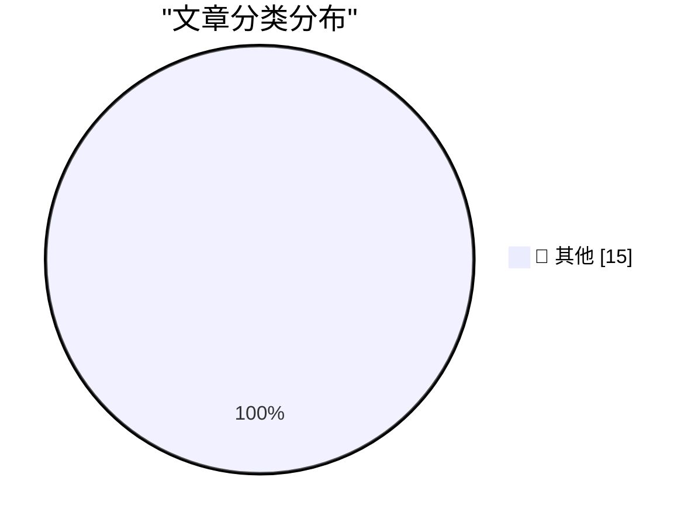

# 📰 AI 博客每日精选 — 2026-08-09

> 来自 Karpathy 推荐的 92 个顶级技术博客，AI 精选 Top 15

## 🏆 今日必读

🥇 **Now we have a timeline of the OpenAI accidental attack against Hugging Face**

[Now we have a timeline of the OpenAI accidental attack against Hugging Face](https://simonwillison.net/2026/Aug/8/now-we-have-a-timeline-of-the-openai-accidental-attack-against-h/#atom-everything) — simonwillison.net · 2 小时前 · 📝 其他

> Now we have a timeline of the OpenAI accidental attack against Hugging Face

🥈 **Quoting John Gruber**

[Quoting John Gruber](https://simonwillison.net/2026/Aug/8/john-gruber/#atom-everything) — simonwillison.net · 16 小时前 · 📝 其他

> Quoting John Gruber

🥉 **Now we have a timeline of the OpenAI accidental attack against Hugging Face**

[Now we have a timeline of the OpenAI accidental attack against Hugging Face](https://simonwillison.net/2026/Aug/7/openai-timeline/#atom-everything) — simonwillison.net · 16 小时前 · 📝 其他

> Now we have a timeline of the OpenAI accidental attack against Hugging Face

---

## 📊 数据概览

| 扫描源 | 抓取文章 | 时间范围 | 精选 |
|:---:|:---:|:---:|:---:|
| 82/92 | 2498 篇 → 19 篇 | 24h | **15 篇** |

### 分类分布

---

## 📝 其他

### 1. Now we have a timeline of the OpenAI accidental attack against Hugging Face

[Now we have a timeline of the OpenAI accidental attack against Hugging Face](https://simonwillison.net/2026/Aug/8/now-we-have-a-timeline-of-the-openai-accidental-attack-against-h/#atom-everything) — **simonwillison.net** · 2 小时前 · ⭐ 15/30

> Now we have a timeline of the OpenAI accidental attack against Hugging Face

---

### 2. Quoting John Gruber

[Quoting John Gruber](https://simonwillison.net/2026/Aug/8/john-gruber/#atom-everything) — **simonwillison.net** · 16 小时前 · ⭐ 15/30

> Quoting John Gruber

---

### 3. Now we have a timeline of the OpenAI accidental attack against Hugging Face

[Now we have a timeline of the OpenAI accidental attack against Hugging Face](https://simonwillison.net/2026/Aug/7/openai-timeline/#atom-everything) — **simonwillison.net** · 16 小时前 · ⭐ 15/30

> Now we have a timeline of the OpenAI accidental attack against Hugging Face

---

### 4. Moonlight & Mayhem (Raccoon Heist by Codex + GPT-5.6 Sol Ultra)

[Moonlight & Mayhem (Raccoon Heist by Codex + GPT-5.6 Sol Ultra)](https://simonwillison.net/2026/Aug/7/moonlight-mayhem/#atom-everything) — **simonwillison.net** · 21 小时前 · ⭐ 15/30

> Moonlight & Mayhem (Raccoon Heist by Codex + GPT-5.6 Sol Ultra)

---

### 5. Simon Willison on Blogging

[Simon Willison on Blogging](https://writethatblog.substack.com/p/simon-willison-on-technical-blogging) — **daringfireball.net** · 20 小时前 · ⭐ 15/30

> Simon Willison on Blogging

---

### 6. Google Earth Retracts AI Tool for Making Fake Satellite Images After It Was Immediately Abused Upon Release

[Google Earth Retracts AI Tool for Making Fake Satellite Images After It Was Immediately Abused Upon Release](https://arstechnica.com/ai/2026/07/google-earth-releases-swiftly-retracts-ai-feature-to-make-fake-satellite-images/) — **daringfireball.net** · 20 小时前 · ⭐ 15/30

> Google Earth Retracts AI Tool for Making Fake Satellite Images After It Was Immediately Abused Upon Release

---

### 7. Some New Data Centers Are Necessary

[Some New Data Centers Are Necessary](https://www.newyorker.com/cartoon/a62045) — **daringfireball.net** · 21 小时前 · ⭐ 15/30

> Some New Data Centers Are Necessary

---

### 8. An AI Model From Meta Also Hacked Another Company During Testing

[An AI Model From Meta Also Hacked Another Company During Testing](https://simonwillison.net/2026/Aug/6/an-ai-model-from-meta/) — **daringfireball.net** · 22 小时前 · ⭐ 15/30

> An AI Model From Meta Also Hacked Another Company During Testing

---

### 9. Meta: Introducing Muse Code and Muse Spark 1.2

[Meta: Introducing Muse Code and Muse Spark 1.2](https://research.meta.ai/blog/introducing-muse-code-and-muse-spark-1-2) — **daringfireball.net** · 22 小时前 · ⭐ 15/30

> Meta: Introducing Muse Code and Muse Spark 1.2

---

### 10. App Store Review Times Are Failing to Meet the AI-Driven Influx of Submissions

[App Store Review Times Are Failing to Meet the AI-Driven Influx of Submissions](https://macaw.social/@mergesort/117055390966724799) — **daringfireball.net** · 22 小时前 · ⭐ 15/30

> App Store Review Times Are Failing to Meet the AI-Driven Influx of Submissions

---

### 11. Leadership Shake-Up at Google DeepMind

[Leadership Shake-Up at Google DeepMind](https://blog.google/company-news/inside-google/message-ceo/next-chapter-ai-momentum/) — **daringfireball.net** · 23 小时前 · ⭐ 15/30

> Leadership Shake-Up at Google DeepMind

---

### 12. ‘Google’s Top AI Brains Are Leaving to Launch Discovery Loop’

[‘Google’s Top AI Brains Are Leaving to Launch Discovery Loop’](https://www.wired.com/story/jeff-dean-google-discovery-loop-startup/?ref=spyglass.org) — **daringfireball.net** · 23 小时前 · ⭐ 15/30

> ‘Google’s Top AI Brains Are Leaving to Launch Discovery Loop’

---

### 13. Pluralistic: Digital sewer socialism (08 Aug 2026)

[Pluralistic: Digital sewer socialism (08 Aug 2026)](https://pluralistic.net/2026/08/08/find-yourself-a-city/) — **pluralistic.net** · 7 小时前 · ⭐ 15/30

> Pluralistic: Digital sewer socialism (08 Aug 2026)

---

### 14. Corrupted apostrophes

[Corrupted apostrophes](https://www.johndcook.com/blog/2026/08/07/corrupted-apostrophes/) — **johndcook.com** · 15 小时前 · ⭐ 15/30

> Corrupted apostrophes

---

### 15. A quick(ish) Chinchilla check

[A quick(ish) Chinchilla check](https://www.gilesthomas.com/2026/08/chinchilla-check) — **gilesthomas.com** · 21 小时前 · ⭐ 15/30

> A quick(ish) Chinchilla check

---

*生成于 2026-08-09 00:43 (Asia/Shanghai) | 扫描 82 源 → 获取 2498 篇 → 精选 15 篇*
*基于 [Hacker News Popularity Contest 2025](https://refactoringenglish.com/tools/hn-popularity/) RSS 源列表，由 [Andrej Karpathy](https://x.com/karpathy) 推荐*
*由「懂点儿AI」制作，欢迎关注同名微信公众号获取更多 AI 实用技巧 💡*
