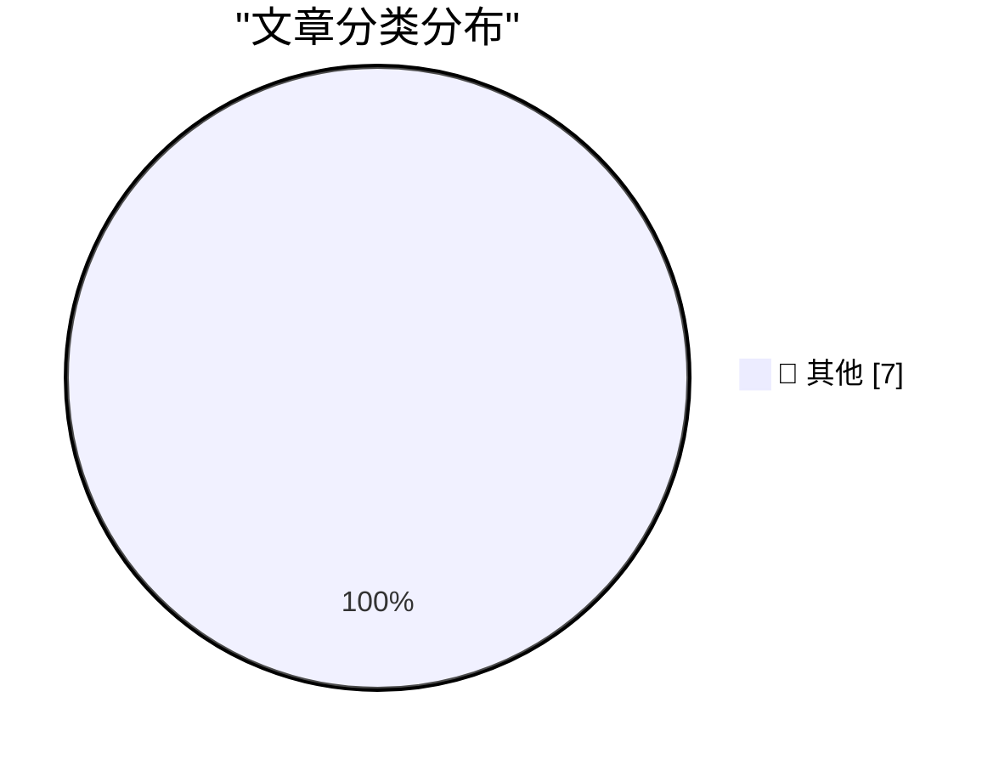

# 📰 AI 博客每日精选 — 2026-08-10

> 来自 Karpathy 推荐的 92 个顶级技术博客，AI 精选 Top 7

## 🏆 今日必读

🥇 **Auto mode is now the default in Claude Code for Pro, Max, and Team plans**

[Auto mode is now the default in Claude Code for Pro, Max, and Team plans](https://simonwillison.net/2026/Aug/8/auto-mode/#atom-everything) — simonwillison.net · 18 小时前 · 📝 其他

> Auto mode is now the default in Claude Code for Pro, Max, and Team plans

🥈 **★ Retraction: The App Store Rejection of the Week That Was, in Fact, a Correct Rejection**

[★ Retraction: The App Store Rejection of the Week That Was, in Fact, a Correct Rejection](https://daringfireball.net/2026/08/retraction_app_store_rejection_of_the_week) — daringfireball.net · 13 小时前 · 📝 其他

> ★ Retraction: The App Store Rejection of the Week That Was, in Fact, a Correct Rejection

🥉 **Corrupt Minds Think Alike**

[Corrupt Minds Think Alike](https://www.nytimes.com/2026/08/06/business/fifa-world-cup-privatization.html?unlocked_article_code=1.3VA.4zqH.Pul7X9bQ2kv0&amp;smid=bs-share) — daringfireball.net · 20 小时前 · 📝 其他

> Corrupt Minds Think Alike

---

## 📊 数据概览

| 扫描源 | 抓取文章 | 时间范围 | 精选 |
|:---:|:---:|:---:|:---:|
| 80/92 | 2452 篇 → 7 篇 | 24h | **7 篇** |

### 分类分布

---

## 📝 其他

### 1. Auto mode is now the default in Claude Code for Pro, Max, and Team plans

[Auto mode is now the default in Claude Code for Pro, Max, and Team plans](https://simonwillison.net/2026/Aug/8/auto-mode/#atom-everything) — **simonwillison.net** · 18 小时前 · ⭐ 15/30

> Auto mode is now the default in Claude Code for Pro, Max, and Team plans

---

### 2. ★ Retraction: The App Store Rejection of the Week That Was, in Fact, a Correct Rejection

[★ Retraction: The App Store Rejection of the Week That Was, in Fact, a Correct Rejection](https://daringfireball.net/2026/08/retraction_app_store_rejection_of_the_week) — **daringfireball.net** · 13 小时前 · ⭐ 15/30

> ★ Retraction: The App Store Rejection of the Week That Was, in Fact, a Correct Rejection

---

### 3. Corrupt Minds Think Alike

[Corrupt Minds Think Alike](https://www.nytimes.com/2026/08/06/business/fifa-world-cup-privatization.html?unlocked_article_code=1.3VA.4zqH.Pul7X9bQ2kv0&amp;smid=bs-share) — **daringfireball.net** · 20 小时前 · ⭐ 15/30

> Corrupt Minds Think Alike

---

### 4. Maybe ‘Steal Underpants by Blowing a Fortune on AI Tokens’ Is, in Fact, Not a Good Business Plan

[Maybe ‘Steal Underpants by Blowing a Fortune on AI Tokens’ Is, in Fact, Not a Good Business Plan](https://www.404media.co/the-tokenpocalypse-is-here-companies-are-scrambling-to-stop-spending-so-much-on-ai/) — **daringfireball.net** · 21 小时前 · ⭐ 15/30

> Maybe ‘Steal Underpants by Blowing a Fortune on AI Tokens’ Is, in Fact, Not a Good Business Plan

---

### 5. Edinburgh Fringe: 4 Aussies For Aussies - The Raging Bull ★★⯪☆☆

[Edinburgh Fringe: 4 Aussies For Aussies - The Raging Bull ★★⯪☆☆](https://shkspr.mobi/blog/2026/08/edinburgh-fringe-4-aussies-for-aussies-the-raging-bull/) — **shkspr.mobi** · 45 分钟前 · ⭐ 15/30

> Edinburgh Fringe: 4 Aussies For Aussies - The Raging Bull ★★⯪☆☆

---

### 6. Against Doomerism

[Against Doomerism](https://shkspr.mobi/blog/2026/08/against-doomerism/) — **shkspr.mobi** · 5 小时前 · ⭐ 15/30

> Against Doomerism

---

### 7. Tracking down a Zsh history data loss bug 🐞

[Tracking down a Zsh history data loss bug 🐞](https://michael.stapelberg.ch/posts/2026-08-09-zsh-history-truncation-bug/) — **michael.stapelberg.ch** · 8 小时前 · ⭐ 15/30

> Tracking down a Zsh history data loss bug 🐞

---

*生成于 2026-08-10 00:45 (Asia/Shanghai) | 扫描 80 源 → 获取 2452 篇 → 精选 7 篇*
*基于 [Hacker News Popularity Contest 2025](https://refactoringenglish.com/tools/hn-popularity/) RSS 源列表，由 [Andrej Karpathy](https://x.com/karpathy) 推荐*
*由「懂点儿AI」制作，欢迎关注同名微信公众号获取更多 AI 实用技巧 💡*
