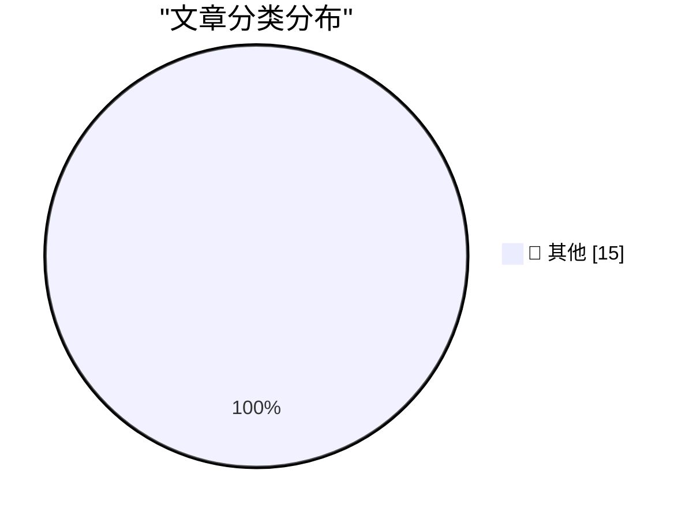

# 📰 AI 博客每日精选 — 2026-08-11

> 来自 Karpathy 推荐的 92 个顶级技术博客，AI 精选 Top 15

## 🏆 今日必读

🥇 **Quoting OpenClaw**

[Quoting OpenClaw](https://simonwillison.net/2026/Aug/10/openclaw/#atom-everything) — simonwillison.net · 14 小时前 · 📝 其他

> Quoting OpenClaw

🥈 **Quoting Claude Opus 5 system prompt**

[Quoting Claude Opus 5 system prompt](https://simonwillison.net/2026/Aug/9/claude-opus-5-system-prompt/#atom-everything) — simonwillison.net · 17 小时前 · 📝 其他

> Quoting Claude Opus 5 system prompt

🥉 **GitHub Models is now retired**

[GitHub Models is now retired](https://simonwillison.net/2026/Aug/9/github-models-is-now-retired/#atom-everything) — simonwillison.net · 18 小时前 · 📝 其他

> GitHub Models is now retired

---

## 📊 数据概览

| 扫描源 | 抓取文章 | 时间范围 | 精选 |
|:---:|:---:|:---:|:---:|
| 81/92 | 2472 篇 → 19 篇 | 24h | **15 篇** |

### 分类分布

---

## 📝 其他

### 1. Quoting OpenClaw

[Quoting OpenClaw](https://simonwillison.net/2026/Aug/10/openclaw/#atom-everything) — **simonwillison.net** · 14 小时前 · ⭐ 15/30

> Quoting OpenClaw

---

### 2. Quoting Claude Opus 5 system prompt

[Quoting Claude Opus 5 system prompt](https://simonwillison.net/2026/Aug/9/claude-opus-5-system-prompt/#atom-everything) — **simonwillison.net** · 17 小时前 · ⭐ 15/30

> Quoting Claude Opus 5 system prompt

---

### 3. GitHub Models is now retired

[GitHub Models is now retired](https://simonwillison.net/2026/Aug/9/github-models-is-now-retired/#atom-everything) — **simonwillison.net** · 18 小时前 · ⭐ 15/30

> GitHub Models is now retired

---

### 4. SQLite compressed text-history prototypes

[SQLite compressed text-history prototypes](https://simonwillison.net/2026/Aug/9/sqlite-text-history-prototype/#atom-everything) — **simonwillison.net** · 18 小时前 · ⭐ 15/30

> SQLite compressed text-history prototypes

---

### 5. ‘The Problem With Vibe-Coded Flattery’

[‘The Problem With Vibe-Coded Flattery’](https://tedium.co/2026/08/09/vibe-coding-insincerity/) — **daringfireball.net** · 19 分钟前 · ⭐ 15/30

> ‘The Problem With Vibe-Coded Flattery’

---

### 6. The NYT and WSJ on Apple, China, and the RAM Crisis

[The NYT and WSJ on Apple, China, and the RAM Crisis](https://www.nytimes.com/2026/08/10/technology/memory-chip-shortage-ai.html?unlocked_article_code=1.4VA.49f7.Qj8S541DkkOz) — **daringfireball.net** · 1 小时前 · ⭐ 15/30

> The NYT and WSJ on Apple, China, and the RAM Crisis

---

### 7. WorkOS: Connect Your Agents to Your API

[WorkOS: Connect Your Agents to Your API](https://workos.com/blog/mcp-vs-rest?utm_source=daringfireball&amp;utm_medium=newsletter&amp;utm_campaign=q32026) — **daringfireball.net** · 17 小时前 · ⭐ 15/30

> WorkOS: Connect Your Agents to Your API

---

### 8. Pluralistic: The bureaucratic AI arms-race is mutually assured destruction (10 Aug 2026)

[Pluralistic: The bureaucratic AI arms-race is mutually assured destruction (10 Aug 2026)](https://pluralistic.net/2026/08/10/deep-state-wopr/) — **pluralistic.net** · 9 小时前 · ⭐ 15/30

> Pluralistic: The bureaucratic AI arms-race is mutually assured destruction (10 Aug 2026)

---

### 9. Edinburgh Fringe - Michael Brunström: William Tell vs the Algorithm ★★★☆☆

[Edinburgh Fringe - Michael Brunström: William Tell vs the Algorithm ★★★☆☆](https://shkspr.mobi/blog/2026/08/edinburgh-fringe-michael-brunstrom-william-tell-vs-the-algorithm/) — **shkspr.mobi** · 1 小时前 · ⭐ 15/30

> Edinburgh Fringe - Michael Brunström: William Tell vs the Algorithm ★★★☆☆

---

### 10. Edinburgh Fringe - Rachel Creeger: Ultimate Jewish Mother 2026 ★★★★★

[Edinburgh Fringe - Rachel Creeger: Ultimate Jewish Mother 2026 ★★★★★](https://shkspr.mobi/blog/2026/08/edinburgh-fringe-rachel-creeger-ultimate-jewish-mother-2026/) — **shkspr.mobi** · 3 小时前 · ⭐ 15/30

> Edinburgh Fringe - Rachel Creeger: Ultimate Jewish Mother 2026 ★★★★★

---

### 11. Edinburgh Fringe: Smut Slam ★★★☆☆

[Edinburgh Fringe: Smut Slam ★★★☆☆](https://shkspr.mobi/blog/2026/08/edinburgh-fringe-smut-slam/) — **shkspr.mobi** · 16 小时前 · ⭐ 15/30

> Edinburgh Fringe: Smut Slam ★★★☆☆

---

### 12. Edinburgh Fringe - Heated Rivalry: The Musical Parody! ★★★★★

[Edinburgh Fringe - Heated Rivalry: The Musical Parody! ★★★★★](https://shkspr.mobi/blog/2026/08/edinburgh-fringe-heated-rivalry-the-musical-parody/) — **shkspr.mobi** · 18 小时前 · ⭐ 15/30

> Edinburgh Fringe - Heated Rivalry: The Musical Parody! ★★★★★

---

### 13. Learning from historical mistakes

[Learning from historical mistakes](https://www.johndcook.com/blog/2026/08/10/learning-from-historical-mistakes/) — **johndcook.com** · 2 小时前 · ⭐ 15/30

> Learning from historical mistakes

---

### 14. Inverse differential equations

[Inverse differential equations](https://www.johndcook.com/blog/2026/08/10/inverse-differential-equations/) — **johndcook.com** · 2 小时前 · ⭐ 15/30

> Inverse differential equations

---

### 15. DNA and Bessel functions

[DNA and Bessel functions](https://www.johndcook.com/blog/2026/08/09/dna-and-bessel-functions/) — **johndcook.com** · 23 小时前 · ⭐ 15/30

> DNA and Bessel functions

---

*生成于 2026-08-11 01:01 (Asia/Shanghai) | 扫描 81 源 → 获取 2472 篇 → 精选 15 篇*
*基于 [Hacker News Popularity Contest 2025](https://refactoringenglish.com/tools/hn-popularity/) RSS 源列表，由 [Andrej Karpathy](https://x.com/karpathy) 推荐*
*由「懂点儿AI」制作，欢迎关注同名微信公众号获取更多 AI 实用技巧 💡*
