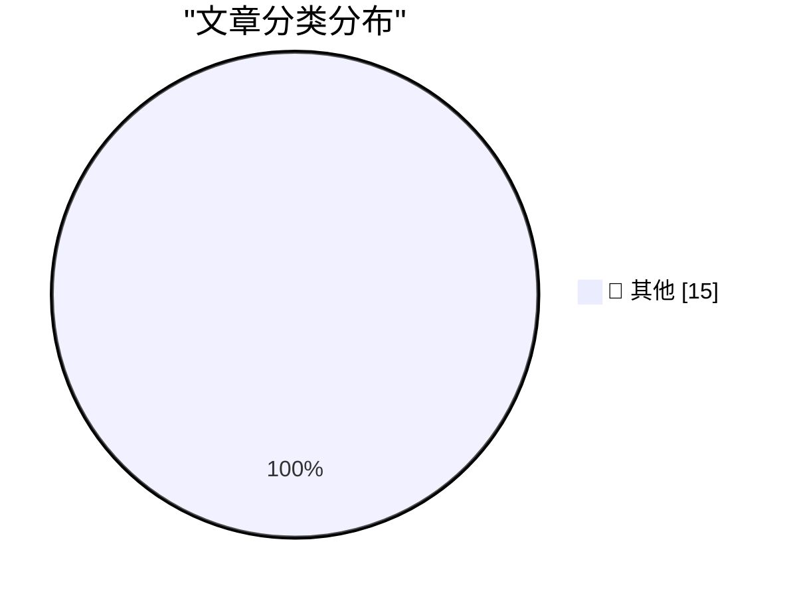

# 📰 AI 博客每日精选 — 2026-08-13

> 来自 Karpathy 推荐的 92 个顶级技术博客，AI 精选 Top 15

## 🏆 今日必读

🥇 **Quoting Florian Herrengt**

[Quoting Florian Herrengt](https://simonwillison.net/2026/Aug/12/florian-herrengt/#atom-everything) — simonwillison.net · 1 小时前 · 📝 其他

> Quoting Florian Herrengt

🥈 **There are no lossless transformations of natural-language text**

[There are no lossless transformations of natural-language text](https://simonwillison.net/2026/Aug/11/there-are-no-lossless-transformations-of-natural-language-text/#atom-everything) — simonwillison.net · 17 小时前 · 📝 其他

> There are no lossless transformations of natural-language text

🥉 **Stealing Reasoning Traces from Proprietary LLM APIs**

[Stealing Reasoning Traces from Proprietary LLM APIs](https://simonwillison.net/2026/Aug/11/stealing-reasoning-traces/#atom-everything) — simonwillison.net · 18 小时前 · 📝 其他

> Stealing Reasoning Traces from Proprietary LLM APIs

---

## 📊 数据概览

| 扫描源 | 抓取文章 | 时间范围 | 精选 |
|:---:|:---:|:---:|:---:|
| 81/92 | 2497 篇 → 27 篇 | 24h | **15 篇** |

### 分类分布

---

## 📝 其他

### 1. Quoting Florian Herrengt

[Quoting Florian Herrengt](https://simonwillison.net/2026/Aug/12/florian-herrengt/#atom-everything) — **simonwillison.net** · 1 小时前 · ⭐ 15/30

> Quoting Florian Herrengt

---

### 2. There are no lossless transformations of natural-language text

[There are no lossless transformations of natural-language text](https://simonwillison.net/2026/Aug/11/there-are-no-lossless-transformations-of-natural-language-text/#atom-everything) — **simonwillison.net** · 17 小时前 · ⭐ 15/30

> There are no lossless transformations of natural-language text

---

### 3. Stealing Reasoning Traces from Proprietary LLM APIs

[Stealing Reasoning Traces from Proprietary LLM APIs](https://simonwillison.net/2026/Aug/11/stealing-reasoning-traces/#atom-everything) — **simonwillison.net** · 18 小时前 · ⭐ 15/30

> Stealing Reasoning Traces from Proprietary LLM APIs

---

### 4. datasette-upload-dbs 0.5a0

[datasette-upload-dbs 0.5a0](https://simonwillison.net/2026/Aug/11/datasette-upload-dbs/#atom-everything) — **simonwillison.net** · 20 小时前 · ⭐ 15/30

> datasette-upload-dbs 0.5a0

---

### 5. Microsoft Plugs Nearly 400 Security Holes

[Microsoft Plugs Nearly 400 Security Holes](https://krebsonsecurity.com/2026/08/microsoft-plugs-nearly-400-security-holes/) — **krebsonsecurity.com** · 19 小时前 · ⭐ 15/30

> Microsoft Plugs Nearly 400 Security Holes

---

### 6. App Store Scam of the Week: ‘TabControl Extension’ for Safari

[App Store Scam of the Week: ‘TabControl Extension’ for Safari](https://lapcatsoftware.com/articles/2026/8/4.html) — **daringfireball.net** · 1 小时前 · ⭐ 15/30

> App Store Scam of the Week: ‘TabControl Extension’ for Safari

---

### 7. Reed Jobs Tells a Neuroscience Story

[Reed Jobs Tells a Neuroscience Story](https://x.com/sabrinahalper/status/2086964813788258588?s=46) — **daringfireball.net** · 2 小时前 · ⭐ 15/30

> Reed Jobs Tells a Neuroscience Story

---

### 8. Nature Is Healing

[Nature Is Healing](https://mastodon.social/@BasicAppleGuy/117073366339407186) — **daringfireball.net** · 2 小时前 · ⭐ 15/30

> Nature Is Healing

---

### 9. The Economist: ‘How to Spot AI Writing’

[The Economist: ‘How to Spot AI Writing’](https://www.economist.com/culture/2026/07/30/how-to-spot-ai-writing?giftId=NzBlNTc2OGItMDgxNS00N2EzLWE4NmUtZDgzZmE4Y2FkM2Mw) — **daringfireball.net** · 19 小时前 · ⭐ 15/30

> The Economist: ‘How to Spot AI Writing’

---

### 10. Alex Micek on BMW’s iDrive ‘Special Surprises’

[Alex Micek on BMW’s iDrive ‘Special Surprises’](https://tumbledry.org/2026/08/07/idrive_ads) — **daringfireball.net** · 21 小时前 · ⭐ 15/30

> Alex Micek on BMW’s iDrive ‘Special Surprises’

---

### 11. BMW Probably Paid Sony for the Spider-Man Dashboard Ads, Not the Other Way Around

[BMW Probably Paid Sony for the Spider-Man Dashboard Ads, Not the Other Way Around](https://www.press.bmwgroup.com/global/article/detail/T0459622EN/bmw-brings-modern-mobility-to-the-sony-pictures-film-%E2%80%9Cspider-man%E2%84%A2:-brand-new-day%E2%80%9D?language=en) — **daringfireball.net** · 21 小时前 · ⭐ 15/30

> BMW Probably Paid Sony for the Spider-Man Dashboard Ads, Not the Other Way Around

---

### 12. Mark Zuckerberg Posts 6,500-Word AI Essay

[Mark Zuckerberg Posts 6,500-Word AI Essay](https://www.meta.com/thefutureisforeveryone/) — **daringfireball.net** · 21 小时前 · ⭐ 15/30

> Mark Zuckerberg Posts 6,500-Word AI Essay

---

### 13. The Talk Show: ‘Getting the Snack Right’

[The Talk Show: ‘Getting the Snack Right’](https://daringfireball.net/thetalkshow/2026/08/10/ep-454) — **daringfireball.net** · 22 小时前 · ⭐ 15/30

> The Talk Show: ‘Getting the Snack Right’

---

### 14. Netflix Has Peaked

[Netflix Has Peaked](https://sharptext.net/2026/is-netflix-washed-now/) — **daringfireball.net** · 22 小时前 · ⭐ 15/30

> Netflix Has Peaked

---

### 15. Anthropic Posts ‘How Claude Marks AI-Generated Content’ Without Explaining How Claude Marks AI-Generated Content

[Anthropic Posts ‘How Claude Marks AI-Generated Content’ Without Explaining How Claude Marks AI-Generated Content](https://support.claude.com/en/articles/16266773-how-claude-marks-ai-generated-content) — **daringfireball.net** · 23 小时前 · ⭐ 15/30

> Anthropic Posts ‘How Claude Marks AI-Generated Content’ Without Explaining How Claude Marks AI-Generated Content

---

*生成于 2026-08-13 01:05 (Asia/Shanghai) | 扫描 81 源 → 获取 2497 篇 → 精选 15 篇*
*基于 [Hacker News Popularity Contest 2025](https://refactoringenglish.com/tools/hn-popularity/) RSS 源列表，由 [Andrej Karpathy](https://x.com/karpathy) 推荐*
*由「懂点儿AI」制作，欢迎关注同名微信公众号获取更多 AI 实用技巧 💡*
