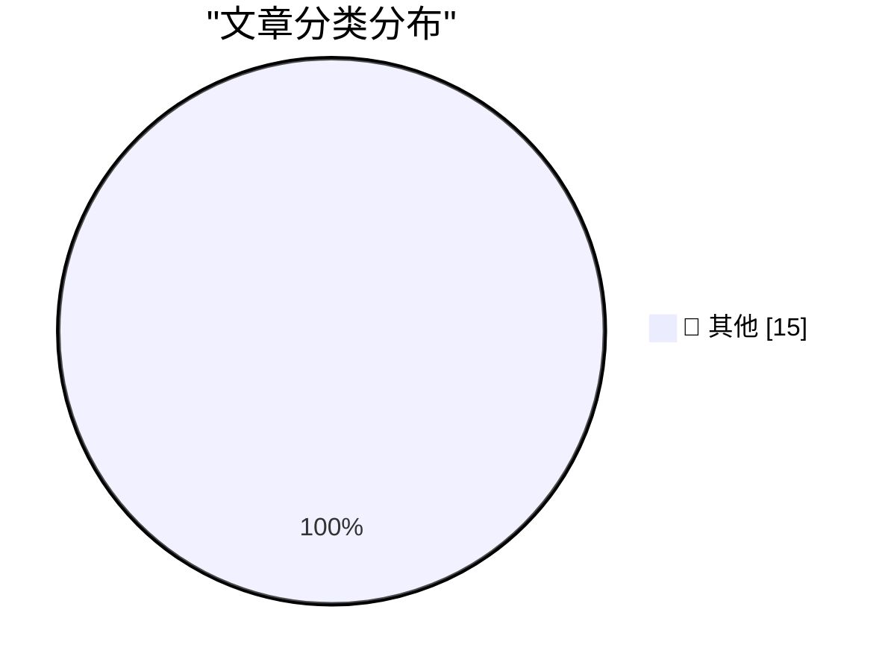

# 📰 AI 博客每日精选 — 2026-08-15

> 来自 Karpathy 推荐的 92 个顶级技术博客，AI 精选 Top 15

## 🏆 今日必读

🥇 **sqlite-utils 4.2.1**

[sqlite-utils 4.2.1](https://simonwillison.net/2026/Aug/13/sqlite-utils-2/) — simonwillison.net · 17 小时前 · 📝 其他

> sqlite-utils 4.2.1

🥈 **sqlite-utils 4.2**

[sqlite-utils 4.2](https://simonwillison.net/2026/Aug/13/sqlite-utils/) — simonwillison.net · 20 小时前 · 📝 其他

> sqlite-utils 4.2

🥉 **llm-gemini 0.33**

[llm-gemini 0.33](https://simonwillison.net/2026/Aug/13/llm-gemini/) — simonwillison.net · 21 小时前 · 📝 其他

> llm-gemini 0.33

---

## 📊 数据概览

| 扫描源 | 抓取文章 | 时间范围 | 精选 |
|:---:|:---:|:---:|:---:|
| 84/92 | 2537 篇 → 20 篇 | 24h | **15 篇** |

### 分类分布

---

## 📝 其他

### 1. sqlite-utils 4.2.1

[sqlite-utils 4.2.1](https://simonwillison.net/2026/Aug/13/sqlite-utils-2/) — **simonwillison.net** · 17 小时前 · ⭐ 15/30

> sqlite-utils 4.2.1

---

### 2. sqlite-utils 4.2

[sqlite-utils 4.2](https://simonwillison.net/2026/Aug/13/sqlite-utils/) — **simonwillison.net** · 20 小时前 · ⭐ 15/30

> sqlite-utils 4.2

---

### 3. llm-gemini 0.33

[llm-gemini 0.33](https://simonwillison.net/2026/Aug/13/llm-gemini/) — **simonwillison.net** · 21 小时前 · ⭐ 15/30

> llm-gemini 0.33

---

### 4. Who’s Tracking You? Use This New Service to Find Out

[Who’s Tracking You? Use This New Service to Find Out](https://krebsonsecurity.com/2026/08/whos-tracking-you-use-this-new-service-to-find-out/) — **krebsonsecurity.com** · 5 小时前 · ⭐ 15/30

> Who’s Tracking You? Use This New Service to Find Out

---

### 5. Google’s ‘Material 3’ Design Write-Up Is 93.3 Percent Embarrassing

[Google’s ‘Material 3’ Design Write-Up Is 93.3 Percent Embarrassing](https://design.google/library/expressive-material-design-google-research) — **daringfireball.net** · 27 分钟前 · ⭐ 15/30

> Google’s ‘Material 3’ Design Write-Up Is 93.3 Percent Embarrassing

---

### 6. Pluralistic: Capital formation (14 Aug 2026)

[Pluralistic: Capital formation (14 Aug 2026)](https://pluralistic.net/2026/08/14/one-chokable-throat/) — **pluralistic.net** · 5 小时前 · ⭐ 15/30

> Pluralistic: Capital formation (14 Aug 2026)

---

### 7. Edinburgh Fringe: Stand-up Philosophy ★★★⯪☆

[Edinburgh Fringe: Stand-up Philosophy ★★★⯪☆](https://shkspr.mobi/blog/2026/08/edinburgh-fringe-stand-up-philosophy/) — **shkspr.mobi** · 1 小时前 · ⭐ 15/30

> Edinburgh Fringe: Stand-up Philosophy ★★★⯪☆

---

### 8. Edinburgh Fringe: Waiting for Wonka ★★★⯪☆

[Edinburgh Fringe: Waiting for Wonka ★★★⯪☆](https://shkspr.mobi/blog/2026/08/edinburgh-fringe-waiting-for-wonka/) — **shkspr.mobi** · 4 小时前 · ⭐ 15/30

> Edinburgh Fringe: Waiting for Wonka ★★★⯪☆

---

### 9. Edinburgh Fringe: Doris, Dolly and the Dressing Room Divas ★★★★⯪

[Edinburgh Fringe: Doris, Dolly and the Dressing Room Divas ★★★★⯪](https://shkspr.mobi/blog/2026/08/edinburgh-fringe-doris-dolly-and-the-dressing-room-divas/) — **shkspr.mobi** · 18 小时前 · ⭐ 15/30

> Edinburgh Fringe: Doris, Dolly and the Dressing Room Divas ★★★★⯪

---

### 10. Edinburgh Fringe: The Musical Mystery Caller ★★★★★

[Edinburgh Fringe: The Musical Mystery Caller ★★★★★](https://shkspr.mobi/blog/2026/08/edinburgh-fringe-the-musical-mystery-caller/) — **shkspr.mobi** · 20 小时前 · ⭐ 15/30

> Edinburgh Fringe: The Musical Mystery Caller ★★★★★

---

### 11. Edinburgh Fringe: Miscast Sondheim ★★☆☆☆

[Edinburgh Fringe: Miscast Sondheim ★★☆☆☆](https://shkspr.mobi/blog/2026/08/edinburgh-fringe-miscast-sondheim/) — **shkspr.mobi** · 22 小时前 · ⭐ 15/30

> Edinburgh Fringe: Miscast Sondheim ★★☆☆☆

---

### 12. Hadamard Codes and Sphere Packing

[Hadamard Codes and Sphere Packing](https://www.johndcook.com/blog/2026/08/13/hadamard-sphere-packing/) — **johndcook.com** · 15 小时前 · ⭐ 15/30

> Hadamard Codes and Sphere Packing

---

### 13. How NASA’s Mariner 9 probe encoded images

[How NASA’s Mariner 9 probe encoded images](https://www.johndcook.com/blog/2026/08/13/mariner-hadamard/) — **johndcook.com** · 17 小时前 · ⭐ 15/30

> How NASA’s Mariner 9 probe encoded images

---

### 14. Printing Lists

[Printing Lists](https://matklad.github.io/2026/08/14/printing-lists.html) — **matklad.github.io** · 17 小时前 · ⭐ 15/30

> Printing Lists

---

### 15. How This Blog Is Built

[How This Blog Is Built](https://nesbitt.io/2026/08/14/how-this-blog-is-built.html) — **nesbitt.io** · 7 小时前 · ⭐ 15/30

> How This Blog Is Built

---

*生成于 2026-08-15 01:01 (Asia/Shanghai) | 扫描 84 源 → 获取 2537 篇 → 精选 15 篇*
*基于 [Hacker News Popularity Contest 2025](https://refactoringenglish.com/tools/hn-popularity/) RSS 源列表，由 [Andrej Karpathy](https://x.com/karpathy) 推荐*
*由「懂点儿AI」制作，欢迎关注同名微信公众号获取更多 AI 实用技巧 💡*
