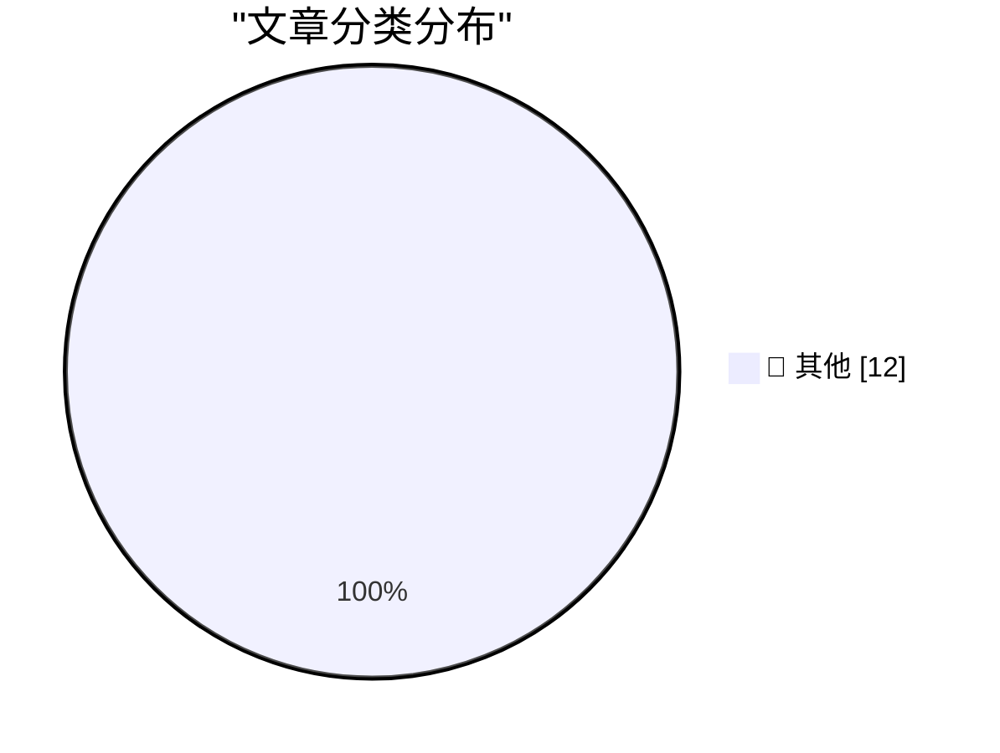

# 📰 AI 博客每日精选 — 2026-08-18

> 来自 Karpathy 推荐的 92 个顶级技术博客，AI 精选 Top 12

## 🏆 今日必读

🥇 **We Tracked a Shipment of Rare Books. It Ended at an Amazon AI Training Facility**

[We Tracked a Shipment of Rare Books. It Ended at an Amazon AI Training Facility](https://simonwillison.net/2026/Aug/17/we-tracked-a-shipment-of-rare-books-it-ended-at-an-amazon-ai-tra/) — simonwillison.net · 1 小时前 · 📝 其他

> We Tracked a Shipment of Rare Books. It Ended at an Amazon AI Training Facility

🥈 **Markdown SVG upgrades**

[Markdown SVG upgrades](https://simonwillison.net/2026/Aug/16/markdown-svg-upgrades/) — simonwillison.net · 16 小时前 · 📝 其他

> Markdown SVG upgrades

🥉 **Qwen 3.8 27B is excellent, but it defaults to wildly overthinking things**

[Qwen 3.8 27B is excellent, but it defaults to wildly overthinking things](https://simonwillison.net/2026/Aug/16/qwen-38-27b/) — simonwillison.net · 18 小时前 · 📝 其他

> Qwen 3.8 27B is excellent, but it defaults to wildly overthinking things

---

## 📊 数据概览

| 扫描源 | 抓取文章 | 时间范围 | 精选 |
|:---:|:---:|:---:|:---:|
| 83/92 | 2521 篇 → 12 篇 | 24h | **12 篇** |

### 分类分布

---

## 📝 其他

### 1. We Tracked a Shipment of Rare Books. It Ended at an Amazon AI Training Facility

[We Tracked a Shipment of Rare Books. It Ended at an Amazon AI Training Facility](https://simonwillison.net/2026/Aug/17/we-tracked-a-shipment-of-rare-books-it-ended-at-an-amazon-ai-tra/) — **simonwillison.net** · 1 小时前 · ⭐ 15/30

> We Tracked a Shipment of Rare Books. It Ended at an Amazon AI Training Facility

---

### 2. Markdown SVG upgrades

[Markdown SVG upgrades](https://simonwillison.net/2026/Aug/16/markdown-svg-upgrades/) — **simonwillison.net** · 16 小时前 · ⭐ 15/30

> Markdown SVG upgrades

---

### 3. Qwen 3.8 27B is excellent, but it defaults to wildly overthinking things

[Qwen 3.8 27B is excellent, but it defaults to wildly overthinking things](https://simonwillison.net/2026/Aug/16/qwen-38-27b/) — **simonwillison.net** · 18 小时前 · ⭐ 15/30

> Qwen 3.8 27B is excellent, but it defaults to wildly overthinking things

---

### 4. The Information Profiles Cami Clark — Dario Amodei’s Wife, Ivanka Trump’s Friend, One-Time Would-Be Pornographer, and Anthropic’s ‘First Lady’

[The Information Profiles Cami Clark — Dario Amodei’s Wife, Ivanka Trump’s Friend, One-Time Would-Be Pornographer, and Anthropic’s ‘First Lady’](https://www.theinformation.com/articles/anthropics-first-lady-took-winding-road-top?rc=jfy0lk) — **daringfireball.net** · 21 小时前 · ⭐ 15/30

> The Information Profiles Cami Clark — Dario Amodei’s Wife, Ivanka Trump’s Friend, One-Time Would-Be Pornographer, and Anthropic’s ‘First Lady’

---

### 5. ★ Anthropic’s ‘Watermark’ Text Adulteration in Claude Is a Perversion of Writing

[★ Anthropic’s ‘Watermark’ Text Adulteration in Claude Is a Perversion of Writing](https://daringfireball.net/2026/08/anthropics_watermark_text_adulteration_in_claude_is_a_perversion_of_writing) — **daringfireball.net** · 21 小时前 · ⭐ 15/30

> ★ Anthropic’s ‘Watermark’ Text Adulteration in Claude Is a Perversion of Writing

---

### 6. ‘Anthropic’s Weak Watermarks Appease a Weak Law’

[‘Anthropic’s Weak Watermarks Appease a Weak Law’](https://blog.j11y.io/2026-08-12_Anthropics-weak-watermarks-appease-a-weak-law/) — **daringfireball.net** · 23 小时前 · ⭐ 15/30

> ‘Anthropic’s Weak Watermarks Appease a Weak Law’

---

### 7. Pluralistic: Jennifer Jenkins' 'Music Copyright, Creativity, and Culture' (17 Aug 2026)

[Pluralistic: Jennifer Jenkins' 'Music Copyright, Creativity, and Culture' (17 Aug 2026)](https://pluralistic.net/2026/08/17/great-sousas-ghost/) — **pluralistic.net** · 9 小时前 · ⭐ 15/30

> Pluralistic: Jennifer Jenkins' 'Music Copyright, Creativity, and Culture' (17 Aug 2026)

---

### 8. And then the men with guns tell you to do it anyway

[And then the men with guns tell you to do it anyway](https://shkspr.mobi/blog/2026/08/and-then-the-men-with-guns-tell-you-to-do-it-anyway/) — **shkspr.mobi** · 5 小时前 · ⭐ 15/30

> And then the men with guns tell you to do it anyway

---

### 9. How do functions like alloca allocate memory from the stack?

[How do functions like alloca allocate memory from the stack?](https://devblogs.microsoft.com/oldnewthing/20260817-40/?p=112617) — **devblogs.microsoft.com/oldnewthing** · 42 分钟前 · ⭐ 15/30

> How do functions like alloca allocate memory from the stack?

---

### 10. Proportion of 1s in a Hadamard matrix

[Proportion of 1s in a Hadamard matrix](https://www.johndcook.com/blog/2026/08/16/proportion-of-1s-in-a-hadamard-matrix/) — **johndcook.com** · 15 小时前 · ⭐ 15/30

> Proportion of 1s in a Hadamard matrix

---

### 11. Oops, Should’ve Thought of That

[Oops, Should’ve Thought of That](https://blog.jim-nielsen.com/2026/oops-shouldve-thought-of-that/) — **blog.jim-nielsen.com** · 21 小时前 · ⭐ 15/30

> Oops, Should’ve Thought of That

---

### 12. When the Internet reached half of US households

[When the Internet reached half of US households](https://dfarq.homeip.net/when-the-internet-reached-half-of-us-households/?utm_source=rss&#038;utm_medium=rss&#038;utm_campaign=when-the-internet-reached-half-of-us-households) — **dfarq.homeip.net** · 5 小时前 · ⭐ 15/30

> When the Internet reached half of US households

---

*生成于 2026-08-18 00:37 (Asia/Shanghai) | 扫描 83 源 → 获取 2521 篇 → 精选 12 篇*
*基于 [Hacker News Popularity Contest 2025](https://refactoringenglish.com/tools/hn-popularity/) RSS 源列表，由 [Andrej Karpathy](https://x.com/karpathy) 推荐*
*由「懂点儿AI」制作，欢迎关注同名微信公众号获取更多 AI 实用技巧 💡*
