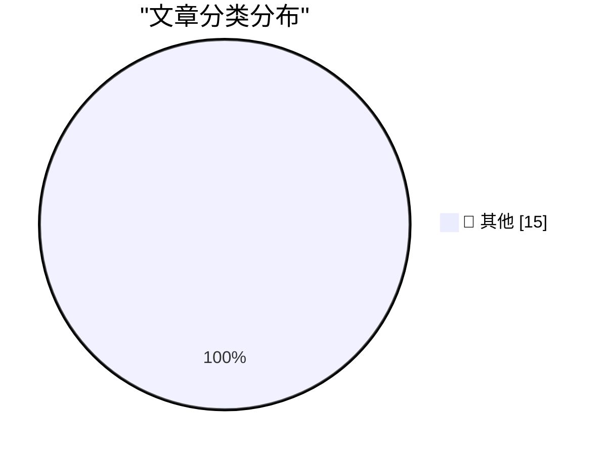

# 📰 AI 博客每日精选 — 2026-08-19

> 来自 Karpathy 推荐的 92 个顶级技术博客，AI 精选 Top 15

## 🏆 今日必读

🥇 **Qwen 3.8 27B scores 52 on the Artificial Analysis Intelligence Index**

[Qwen 3.8 27B scores 52 on the Artificial Analysis Intelligence Index](https://simonwillison.net/2026/Aug/17/qwen-38-27b-scores-52/) — simonwillison.net · 16 小时前 · 📝 其他

> Qwen 3.8 27B scores 52 on the Artificial Analysis Intelligence Index

🥈 **Help peer**

[Help peer](https://seangoedecke.com/help-peer/) — seangoedecke.com · 16 小时前 · 📝 其他

> Help peer

🥉 **‘Dickover’ Makes It Into The Guardian**

[‘Dickover’ Makes It Into The Guardian](https://www.theguardian.com/technology/2026/aug/18/dickovers-baggravation-botiquette-18-new-words-tech-hellscape) — daringfireball.net · 36 分钟前 · 📝 其他

> ‘Dickover’ Makes It Into The Guardian

---

## 📊 数据概览

| 扫描源 | 抓取文章 | 时间范围 | 精选 |
|:---:|:---:|:---:|:---:|
| 84/92 | 2540 篇 → 19 篇 | 24h | **15 篇** |

### 分类分布

---

## 📝 其他

### 1. Qwen 3.8 27B scores 52 on the Artificial Analysis Intelligence Index

[Qwen 3.8 27B scores 52 on the Artificial Analysis Intelligence Index](https://simonwillison.net/2026/Aug/17/qwen-38-27b-scores-52/) — **simonwillison.net** · 16 小时前 · ⭐ 15/30

> Qwen 3.8 27B scores 52 on the Artificial Analysis Intelligence Index

---

### 2. Help peer

[Help peer](https://seangoedecke.com/help-peer/) — **seangoedecke.com** · 16 小时前 · ⭐ 15/30

> Help peer

---

### 3. ‘Dickover’ Makes It Into The Guardian

[‘Dickover’ Makes It Into The Guardian](https://www.theguardian.com/technology/2026/aug/18/dickovers-baggravation-botiquette-18-new-words-tech-hellscape) — **daringfireball.net** · 36 分钟前 · ⭐ 15/30

> ‘Dickover’ Makes It Into The Guardian

---

### 4. OpenAI Pot Complains That Google Kettle Is Black

[OpenAI Pot Complains That Google Kettle Is Black](https://x.com/thsottiaux/status/2083373529081291076?s=12) — **daringfireball.net** · 1 小时前 · ⭐ 15/30

> OpenAI Pot Complains That Google Kettle Is Black

---

### 5. Nature Is Healing: MacOS 27 Golden Gate Beta 6 Adds Redesigned Traffic Light Window Controls

[Nature Is Healing: MacOS 27 Golden Gate Beta 6 Adds Redesigned Traffic Light Window Controls](https://9to5mac.com/2026/08/17/macos-27-golden-gate-beta-6-features-redesigned-traffic-light-window-controls/) — **daringfireball.net** · 4 小时前 · ⭐ 15/30

> Nature Is Healing: MacOS 27 Golden Gate Beta 6 Adds Redesigned Traffic Light Window Controls

---

### 6. MacOS 26.7 Tahoe Release Candidate Contains a Video Demonstrating Camera-Equipped AirPods in Action

[MacOS 26.7 Tahoe Release Candidate Contains a Video Demonstrating Camera-Equipped AirPods in Action](https://www.macrumors.com/2026/08/17/camera-equipped-airpods-macos-26-7/) — **daringfireball.net** · 13 小时前 · ⭐ 15/30

> MacOS 26.7 Tahoe Release Candidate Contains a Video Demonstrating Camera-Equipped AirPods in Action

---

### 7. ★ Follow-Up Thoughts on Watermarking Schemes for AI-Generated Text

[★ Follow-Up Thoughts on Watermarking Schemes for AI-Generated Text](https://daringfireball.net/2026/08/follow-up_thoughts_on_watermarking) — **daringfireball.net** · 15 小时前 · ⭐ 15/30

> ★ Follow-Up Thoughts on Watermarking Schemes for AI-Generated Text

---

### 8. Apple TV Still Has No Start Date for ‘The Savant’

[Apple TV Still Has No Start Date for ‘The Savant’](https://daringfireball.net/linked/2026/04/19/chastain-says-the-savant-will-be-released) — **daringfireball.net** · 18 小时前 · ⭐ 15/30

> Apple TV Still Has No Start Date for ‘The Savant’

---

### 9. No Update Since Early July Regarding Siri AI Coming to the EU, Ever

[No Update Since Early July Regarding Siri AI Coming to the EU, Ever](https://www.ft.com/content/807d25c3-f4ac-4402-b815-3aa91018237d) — **daringfireball.net** · 18 小时前 · ⭐ 15/30

> No Update Since Early July Regarding Siri AI Coming to the EU, Ever

---

### 10. Pluralistic: IP can't save you from AI (18 Aug 2026)

[Pluralistic: IP can't save you from AI (18 Aug 2026)](https://pluralistic.net/2026/08/18/enron-corpus/) — **pluralistic.net** · 1 小时前 · ⭐ 15/30

> Pluralistic: IP can't save you from AI (18 Aug 2026)

---

### 11. The imbalance theorem

[The imbalance theorem](https://www.johndcook.com/blog/2026/08/18/the-imbalance-theorem/) — **johndcook.com** · 45 分钟前 · ⭐ 15/30

> The imbalance theorem

---

### 12. Mean distance to the sun

[Mean distance to the sun](https://www.johndcook.com/blog/2026/08/18/mean-distance-to-the-sun/) — **johndcook.com** · 2 小时前 · ⭐ 15/30

> Mean distance to the sun

---

### 13. Two-Factor Authentication Across Package Registries

[Two-Factor Authentication Across Package Registries](https://nesbitt.io/2026/08/18/two-factor-authentication-across-package-registries.html) — **nesbitt.io** · 6 小时前 · ⭐ 15/30

> Two-Factor Authentication Across Package Registries

---

### 14. Snakes and Ladders

[Snakes and Ladders](https://entropicthoughts.com/snakes-and-ladders) — **entropicthoughts.com** · 18 小时前 · ⭐ 15/30

> Snakes and Ladders

---

### 15. AI Alignment as a Thought-Terminating Cliche

[AI Alignment as a Thought-Terminating Cliche](https://borretti.me/article/ai-alignment-as-thought-terminating-cliche) — **borretti.me** · 16 小时前 · ⭐ 15/30

> AI Alignment as a Thought-Terminating Cliche

---

*生成于 2026-08-19 00:40 (Asia/Shanghai) | 扫描 84 源 → 获取 2540 篇 → 精选 15 篇*
*基于 [Hacker News Popularity Contest 2025](https://refactoringenglish.com/tools/hn-popularity/) RSS 源列表，由 [Andrej Karpathy](https://x.com/karpathy) 推荐*
*由「懂点儿AI」制作，欢迎关注同名微信公众号获取更多 AI 实用技巧 💡*
