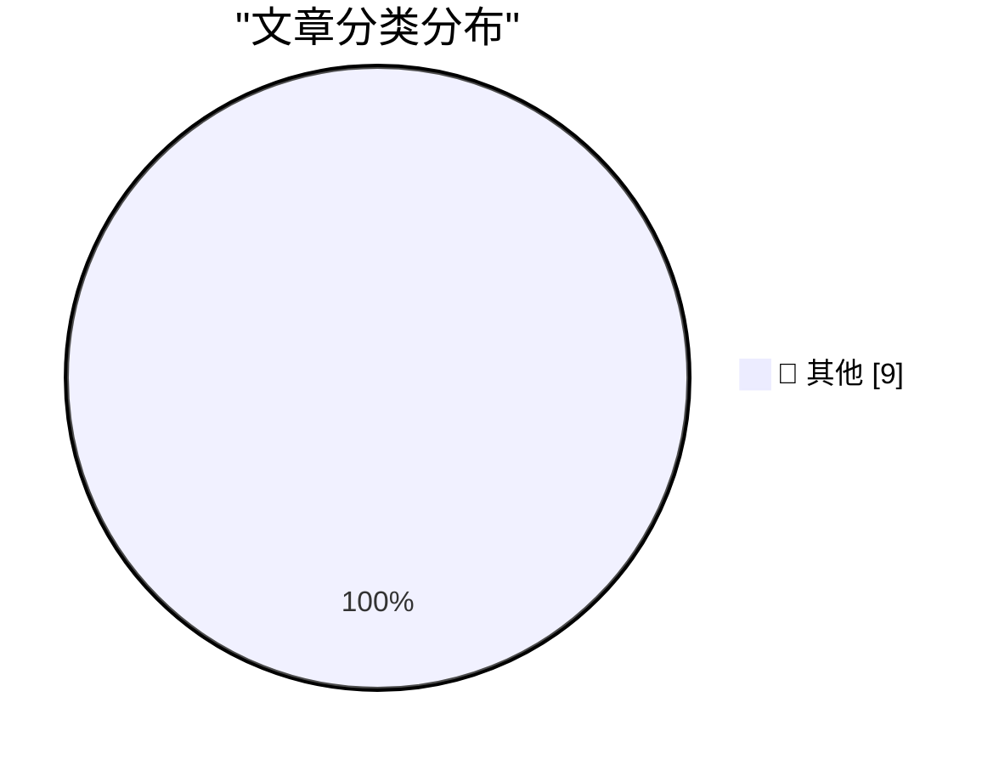

# 📰 AI 博客每日精选 — 2026-08-20

> 来自 Karpathy 推荐的 92 个顶级技术博客，AI 精选 Top 9

## 🏆 今日必读

🥇 **Mojo🔥 is now open source**

[Mojo🔥 is now open source](https://simonwillison.net/2026/Aug/18/mojo-is-now-open-source/) — simonwillison.net · 19 小时前 · 📝 其他

> Mojo🔥 is now open source

🥈 **Hands-on with Raspberry Pi's CM5 Programming Jig**

[Hands-on with Raspberry Pi's CM5 Programming Jig](https://www.jeffgeerling.com/blog/2026/cm5-programming-jig/) — jeffgeerling.com · 9 小时前 · 📝 其他

> Hands-on with Raspberry Pi's CM5 Programming Jig

🥉 **Disney’s ABC Sues Trump’s FCC Over Challenge to Its Broadcast License**

[Disney’s ABC Sues Trump’s FCC Over Challenge to Its Broadcast License](https://www.wsj.com/business/media/disneys-abc-sues-fcc-over-challenge-to-its-broadcast-licenses-64e8f794?st=XTL4tA) — daringfireball.net · 18 小时前 · 📝 其他

> Disney’s ABC Sues Trump’s FCC Over Challenge to Its Broadcast License

---

## 📊 数据概览

| 扫描源 | 抓取文章 | 时间范围 | 精选 |
|:---:|:---:|:---:|:---:|
| 81/92 | 2488 篇 → 9 篇 | 24h | **9 篇** |

### 分类分布

---

## 📝 其他

### 1. Mojo🔥 is now open source

[Mojo🔥 is now open source](https://simonwillison.net/2026/Aug/18/mojo-is-now-open-source/) — **simonwillison.net** · 19 小时前 · ⭐ 15/30

> Mojo🔥 is now open source

---

### 2. Hands-on with Raspberry Pi's CM5 Programming Jig

[Hands-on with Raspberry Pi's CM5 Programming Jig](https://www.jeffgeerling.com/blog/2026/cm5-programming-jig/) — **jeffgeerling.com** · 9 小时前 · ⭐ 15/30

> Hands-on with Raspberry Pi's CM5 Programming Jig

---

### 3. Disney’s ABC Sues Trump’s FCC Over Challenge to Its Broadcast License

[Disney’s ABC Sues Trump’s FCC Over Challenge to Its Broadcast License](https://www.wsj.com/business/media/disneys-abc-sues-fcc-over-challenge-to-its-broadcast-licenses-64e8f794?st=XTL4tA) — **daringfireball.net** · 18 小时前 · ⭐ 15/30

> Disney’s ABC Sues Trump’s FCC Over Challenge to Its Broadcast License

---

### 4. Apple Gives Legal Middle Finger to DOJ Challenge on Apple’s July Discovery Win

[Apple Gives Legal Middle Finger to DOJ Challenge on Apple’s July Discovery Win](https://9to5mac.com/2026/08/17/apple-dojs-latest-challenge-in-antitrust-case-fails-at-every-level/) — **daringfireball.net** · 18 小时前 · ⭐ 15/30

> Apple Gives Legal Middle Finger to DOJ Challenge on Apple’s July Discovery Win

---

### 5. Organized Thieves Are Targeting AI Server Chips With Violent Highway Hijackings

[Organized Thieves Are Targeting AI Server Chips With Violent Highway Hijackings](https://www.wired.com/story/the-worst-ive-ever-seen-cargo-thieves-are-turning-violent-in-pursuit-of-ai-hardware/) — **daringfireball.net** · 21 小时前 · ⭐ 15/30

> Organized Thieves Are Targeting AI Server Chips With Violent Highway Hijackings

---

### 6. Pluralistic: The ordinariness of evil (19 Aug 2026)

[Pluralistic: The ordinariness of evil (19 Aug 2026)](https://pluralistic.net/2026/08/19/banaility/) — **pluralistic.net** · 9 小时前 · ⭐ 15/30

> Pluralistic: The ordinariness of evil (19 Aug 2026)

---

### 7. Asymmetric Agents

[Asymmetric Agents](https://shkspr.mobi/blog/2026/08/asymmetric-agents/) — **shkspr.mobi** · 5 小时前 · ⭐ 15/30

> Asymmetric Agents

---

### 8. Big little hexagon

[Big little hexagon](https://www.johndcook.com/blog/2026/08/18/big-little-hexagon/) — **johndcook.com** · 16 小时前 · ⭐ 15/30

> Big little hexagon

---

### 9. MOS Technology founded August 19, 1974

[MOS Technology founded August 19, 1974](https://dfarq.homeip.net/mos-technology-founded-august-19-1974/?utm_source=rss&#038;utm_medium=rss&#038;utm_campaign=mos-technology-founded-august-19-1974) — **dfarq.homeip.net** · 5 小时前 · ⭐ 15/30

> MOS Technology founded August 19, 1974

---

*生成于 2026-08-20 00:39 (Asia/Shanghai) | 扫描 81 源 → 获取 2488 篇 → 精选 9 篇*
*基于 [Hacker News Popularity Contest 2025](https://refactoringenglish.com/tools/hn-popularity/) RSS 源列表，由 [Andrej Karpathy](https://x.com/karpathy) 推荐*
*由「懂点儿AI」制作，欢迎关注同名微信公众号获取更多 AI 实用技巧 💡*
