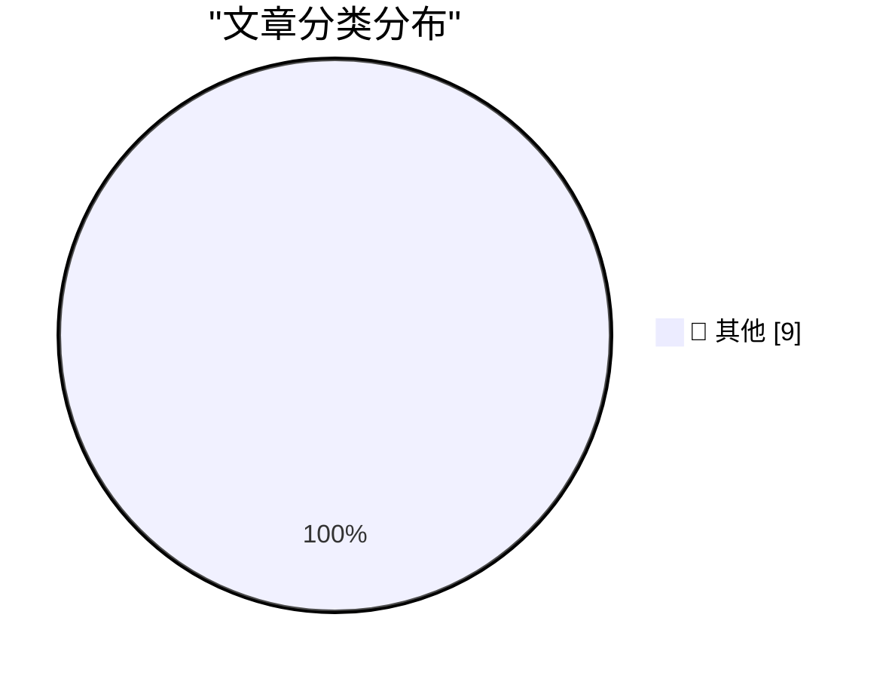

# 📰 AI 博客每日精选 — 2026-08-21

> 来自 Karpathy 推荐的 92 个顶级技术博客，AI 精选 Top 9

## 🏆 今日必读

🥇 **smolmachines / smolvm as a sandbox for untrusted Python & JavaScript**

[smolmachines / smolvm as a sandbox for untrusted Python & JavaScript](https://simonwillison.net/2026/Aug/19/smolmachines-untrusted-sandbox/) — simonwillison.net · 17 小时前 · 📝 其他

> smolmachines / smolvm as a sandbox for untrusted Python & JavaScript

🥈 **Quoting Jeremy Morrell**

[Quoting Jeremy Morrell](https://simonwillison.net/2026/Aug/19/jeremy-morrell/) — simonwillison.net · 17 小时前 · 📝 其他

> Quoting Jeremy Morrell

🥉 **Conceptual integrity and counting lines of code**

[Conceptual integrity and counting lines of code](https://simonwillison.net/2026/Aug/19/conceptual-integrity-and-counting-lines-of-code/) — simonwillison.net · 17 小时前 · 📝 其他

> Conceptual integrity and counting lines of code

---

## 📊 数据概览

| 扫描源 | 抓取文章 | 时间范围 | 精选 |
|:---:|:---:|:---:|:---:|
| 83/92 | 2531 篇 → 9 篇 | 24h | **9 篇** |

### 分类分布

---

## 📝 其他

### 1. smolmachines / smolvm as a sandbox for untrusted Python & JavaScript

[smolmachines / smolvm as a sandbox for untrusted Python & JavaScript](https://simonwillison.net/2026/Aug/19/smolmachines-untrusted-sandbox/) — **simonwillison.net** · 17 小时前 · ⭐ 15/30

> smolmachines / smolvm as a sandbox for untrusted Python & JavaScript

---

### 2. Quoting Jeremy Morrell

[Quoting Jeremy Morrell](https://simonwillison.net/2026/Aug/19/jeremy-morrell/) — **simonwillison.net** · 17 小时前 · ⭐ 15/30

> Quoting Jeremy Morrell

---

### 3. Conceptual integrity and counting lines of code

[Conceptual integrity and counting lines of code](https://simonwillison.net/2026/Aug/19/conceptual-integrity-and-counting-lines-of-code/) — **simonwillison.net** · 17 小时前 · ⭐ 15/30

> Conceptual integrity and counting lines of code

---

### 4. Getting the Steam Deck LCD working on a Raspberry Pi

[Getting the Steam Deck LCD working on a Raspberry Pi](https://www.jeffgeerling.com/blog/2026/steam-deck-lcd-pi-hat/) — **jeffgeerling.com** · 2 小时前 · ⭐ 15/30

> Getting the Steam Deck LCD working on a Raspberry Pi

---

### 5. AI-generated ASCII diagrams

[AI-generated ASCII diagrams](https://www.johndcook.com/blog/2026/08/20/ai-generated-ascii-diagrams/) — **johndcook.com** · 2 小时前 · ⭐ 15/30

> AI-generated ASCII diagrams

---

### 6. Use the built-in GELU, don't roll your own!

[Use the built-in GELU, don't roll your own!](https://www.gilesthomas.com/2026/08/built-in-gelu) — **gilesthomas.com** · 14 小时前 · ⭐ 15/30

> Use the built-in GELU, don't roll your own!

---

### 7. Issues in the Repo

[Issues in the Repo](https://nesbitt.io/2026/08/20/issues-in-the-repo.html) — **nesbitt.io** · 7 小时前 · ⭐ 15/30

> Issues in the Repo

---

### 8. Our Servants Will Do That For Us

[Our Servants Will Do That For Us](https://borretti.me/article/our-servants-will-do-that-for-us) — **borretti.me** · 16 小时前 · ⭐ 15/30

> Our Servants Will Do That For Us

---

### 9. Adobe Systems IPO August 20, 1986

[Adobe Systems IPO August 20, 1986](https://dfarq.homeip.net/adobe-systems-ipo-august-20-1986/?utm_source=rss&#038;utm_medium=rss&#038;utm_campaign=adobe-systems-ipo-august-20-1986) — **dfarq.homeip.net** · 5 小时前 · ⭐ 15/30

> Adobe Systems IPO August 20, 1986

---

*生成于 2026-08-21 00:42 (Asia/Shanghai) | 扫描 83 源 → 获取 2531 篇 → 精选 9 篇*
*基于 [Hacker News Popularity Contest 2025](https://refactoringenglish.com/tools/hn-popularity/) RSS 源列表，由 [Andrej Karpathy](https://x.com/karpathy) 推荐*
*由「懂点儿AI」制作，欢迎关注同名微信公众号获取更多 AI 实用技巧 💡*
