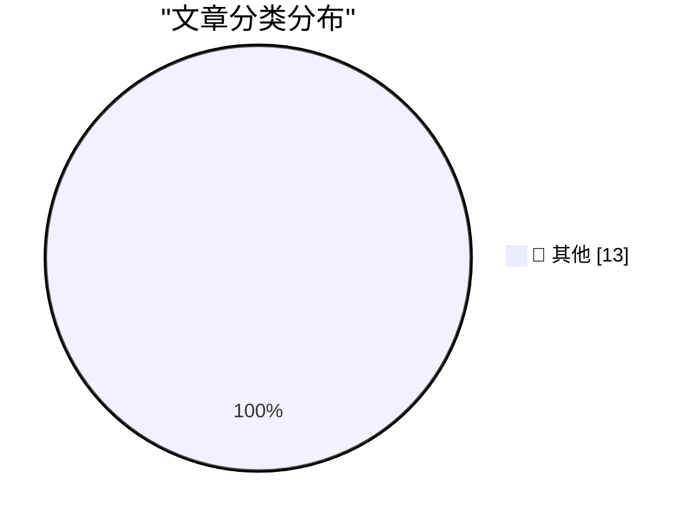

# 📰 AI 博客每日精选 — 2026-08-23

> 来自 Karpathy 推荐的 92 个顶级技术博客，AI 精选 Top 13

## 🏆 今日必读

🥇 **More than just code review**

[More than just code review](https://simonwillison.net/2026/Aug/22/more-than-just-code-review/) — simonwillison.net · 37 分钟前 · 📝 其他

> More than just code review

🥈 **llm 0.32.1**

[llm 0.32.1](https://simonwillison.net/2026/Aug/21/llm/) — simonwillison.net · 23 小时前 · 📝 其他

> llm 0.32.1

🥉 **llm-openrouter 0.7**

[llm-openrouter 0.7](https://simonwillison.net/2026/Aug/21/llm-openrouter/) — simonwillison.net · 23 小时前 · 📝 其他

> llm-openrouter 0.7

---

## 📊 数据概览

| 扫描源 | 抓取文章 | 时间范围 | 精选 |
|:---:|:---:|:---:|:---:|
| 82/92 | 2514 篇 → 13 篇 | 24h | **13 篇** |

### 分类分布

---

## 📝 其他

### 1. More than just code review

[More than just code review](https://simonwillison.net/2026/Aug/22/more-than-just-code-review/) — **simonwillison.net** · 37 分钟前 · ⭐ 15/30

> More than just code review

---

### 2. llm 0.32.1

[llm 0.32.1](https://simonwillison.net/2026/Aug/21/llm/) — **simonwillison.net** · 23 小时前 · ⭐ 15/30

> llm 0.32.1

---

### 3. llm-openrouter 0.7

[llm-openrouter 0.7](https://simonwillison.net/2026/Aug/21/llm-openrouter/) — **simonwillison.net** · 23 小时前 · ⭐ 15/30

> llm-openrouter 0.7

---

### 4. You should never be angry at work

[You should never be angry at work](https://seangoedecke.com/you-should-never-be-angry-at-work/) — **seangoedecke.com** · 16 小时前 · ⭐ 15/30

> You should never be angry at work

---

### 5. WorkOS: Agents Can Now Sign Up for Your App

[WorkOS: Agents Can Now Sign Up for Your App](https://workos.com/auth-md?utm_source=daringfireball&amp;utm_medium=newsletter&amp;utm_campaign=q32026) — **daringfireball.net** · 2 小时前 · ⭐ 15/30

> WorkOS: Agents Can Now Sign Up for Your App

---

### 6. Dutch Regulator Fines Uber $1 Billion for Suspending Dishonest Drivers

[Dutch Regulator Fines Uber $1 Billion for Suspending Dishonest Drivers](https://www.reuters.com/world/dutch-regulator-fines-uber-966-million-automating-driver-suspensions-document-2026-08-21/) — **daringfireball.net** · 2 小时前 · ⭐ 15/30

> Dutch Regulator Fines Uber $1 Billion for Suspending Dishonest Drivers

---

### 7. The Fourth Horseman of the File-Format-Hegemony Apocalypse

[The Fourth Horseman of the File-Format-Hegemony Apocalypse](https://techcommunity.microsoft.com/blog/onedriveblog/introducing-markdown-support-in-sharepoint-and-onedrive/4512174) — **daringfireball.net** · 17 小时前 · ⭐ 15/30

> The Fourth Horseman of the File-Format-Hegemony Apocalypse

---

### 8. Walmart Finally Caves, Will Soon Support Apple Pay

[Walmart Finally Caves, Will Soon Support Apple Pay](https://corporate.walmart.com/news/2026/08/21/more-ways-to-pay-tap-to-pay-is-coming-to-walmart-and-sams-club) — **daringfireball.net** · 20 小时前 · ⭐ 15/30

> Walmart Finally Caves, Will Soon Support Apple Pay

---

### 9. Pluralistic: Born on technology's third base (21 Aug 2026)

[Pluralistic: Born on technology's third base (21 Aug 2026)](https://pluralistic.net/2026/08/21/world-historic-forces/) — **pluralistic.net** · 15 小时前 · ⭐ 15/30

> Pluralistic: Born on technology's third base (21 Aug 2026)

---

### 10. Coming soon

[Coming soon](https://www.johndcook.com/blog/2026/08/22/coming-soon/) — **johndcook.com** · 1 小时前 · ⭐ 15/30

> Coming soon

---

### 11. This Week in Package Management: 22 August 2026

[This Week in Package Management: 22 August 2026](https://nesbitt.io/2026/08/22/this-week-in-package-management.html) — **nesbitt.io** · 6 小时前 · ⭐ 15/30

> This Week in Package Management: 22 August 2026

---

### 12. Reading List 08/22/26

[Reading List 08/22/26](https://www.construction-physics.com/p/reading-list-082226) — **construction-physics.com** · 4 小时前 · ⭐ 15/30

> Reading List 08/22/26

---

### 13. Concurrent Servers: Part 8 - Go

[Concurrent Servers: Part 8 - Go](https://eli.thegreenplace.net/2026/concurrent-servers-part-8-go/) — **eli.thegreenplace.net** · 1 小时前 · ⭐ 15/30

> Concurrent Servers: Part 8 - Go

---

*生成于 2026-08-23 00:34 (Asia/Shanghai) | 扫描 82 源 → 获取 2514 篇 → 精选 13 篇*
*基于 [Hacker News Popularity Contest 2025](https://refactoringenglish.com/tools/hn-popularity/) RSS 源列表，由 [Andrej Karpathy](https://x.com/karpathy) 推荐*
*由「懂点儿AI」制作，欢迎关注同名微信公众号获取更多 AI 实用技巧 💡*
