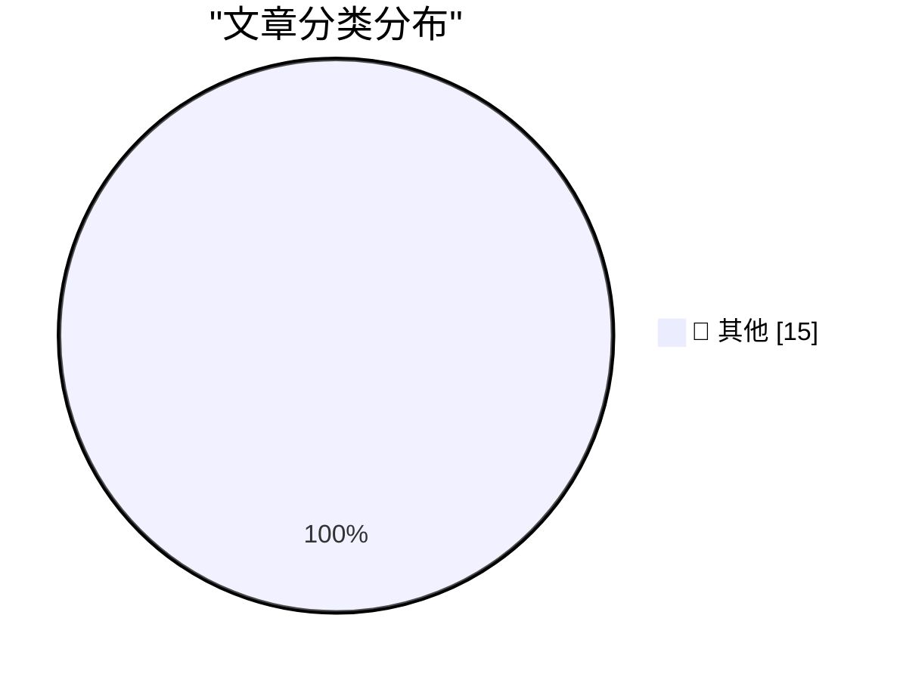

# 📰 AI 博客每日精选 — 2026-08-26

> 来自 Karpathy 推荐的 92 个顶级技术博客，AI 精选 Top 15

## 🏆 今日必读

🥇 **Footnote Regarding the GDPR and Cookie Permission Prompts**

[Footnote Regarding the GDPR and Cookie Permission Prompts](https://daringfireball.net/2026/08/what_is_the_point_of_the_dma#fn1-2026-08-24) — daringfireball.net · 1 小时前 · 📝 其他

> Footnote Regarding the GDPR and Cookie Permission Prompts

🥈 **★ Memory and Storage Configurations and Pricing for the New Mac Minis (M6/M5 Pro) and Mac Studios (M5 Max/M5 Ultra)**

[★ Memory and Storage Configurations and Pricing for the New Mac Minis (M6/M5 Pro) and Mac Studios (M5 Max/M5 Ultra)](https://daringfireball.net/2026/08/configurations_and_pricing_for_new_mac_minis_and_mac_studios) — daringfireball.net · 2 小时前 · 📝 其他

> ★ Memory and Storage Configurations and Pricing for the New Mac Minis (M6/M5 Pro) and Mac Studios (M5 Max/M5 Ultra)

🥉 **Apple Introduces M6 and M5 Ultra Chips, in New Mac Mini and Mac Studio**

[Apple Introduces M6 and M5 Ultra Chips, in New Mac Mini and Mac Studio](https://www.apple.com/newsroom/2026/08/apple-introduces-m6-and-m5-ultra-for-a-big-leap-in-performance-and-ai-compute/) — daringfireball.net · 3 小时前 · 📝 其他

> Apple Introduces M6 and M5 Ultra Chips, in New Mac Mini and Mac Studio

---

## 📊 数据概览

| 扫描源 | 抓取文章 | 时间范围 | 精选 |
|:---:|:---:|:---:|:---:|
| 80/92 | 2452 篇 → 18 篇 | 24h | **15 篇** |

### 分类分布

---

## 📝 其他

### 1. Footnote Regarding the GDPR and Cookie Permission Prompts

[Footnote Regarding the GDPR and Cookie Permission Prompts](https://daringfireball.net/2026/08/what_is_the_point_of_the_dma#fn1-2026-08-24) — **daringfireball.net** · 1 小时前 · ⭐ 15/30

> Footnote Regarding the GDPR and Cookie Permission Prompts

---

### 2. ★ Memory and Storage Configurations and Pricing for the New Mac Minis (M6/M5 Pro) and Mac Studios (M5 Max/M5 Ultra)

[★ Memory and Storage Configurations and Pricing for the New Mac Minis (M6/M5 Pro) and Mac Studios (M5 Max/M5 Ultra)](https://daringfireball.net/2026/08/configurations_and_pricing_for_new_mac_minis_and_mac_studios) — **daringfireball.net** · 2 小时前 · ⭐ 15/30

> ★ Memory and Storage Configurations and Pricing for the New Mac Minis (M6/M5 Pro) and Mac Studios (M5 Max/M5 Ultra)

---

### 3. Apple Introduces M6 and M5 Ultra Chips, in New Mac Mini and Mac Studio

[Apple Introduces M6 and M5 Ultra Chips, in New Mac Mini and Mac Studio](https://www.apple.com/newsroom/2026/08/apple-introduces-m6-and-m5-ultra-for-a-big-leap-in-performance-and-ai-compute/) — **daringfireball.net** · 3 小时前 · ⭐ 15/30

> Apple Introduces M6 and M5 Ultra Chips, in New Mac Mini and Mac Studio

---

### 4. [Sponsor] Finalist 4: Inspired by Paper Day Planners

[[Sponsor] Finalist 4: Inspired by Paper Day Planners](https://www.finalist.works/?utm_source=df-aug-2026) — **daringfireball.net** · 16 小时前 · ⭐ 15/30

> [Sponsor] Finalist 4: Inspired by Paper Day Planners

---

### 5. Apple Rethinks Plan to Merge ‘Hide My Email’ Domain Name With ‘Sign In With Apple’

[Apple Rethinks Plan to Merge ‘Hide My Email’ Domain Name With ‘Sign In With Apple’](https://developer.apple.com/news/?id=1ptvdtcm) — **daringfireball.net** · 17 小时前 · ⭐ 15/30

> Apple Rethinks Plan to Merge ‘Hide My Email’ Domain Name With ‘Sign In With Apple’

---

### 6. ★ What Is the Point of the DMA?

[★ What Is the Point of the DMA?](https://daringfireball.net/2026/08/what_is_the_point_of_the_dma) — **daringfireball.net** · 18 小时前 · ⭐ 15/30

> ★ What Is the Point of the DMA?

---

### 7. Foot Guns for Sale

[Foot Guns for Sale](https://idiallo.com/blog/foot-gun-for-sale) — **idiallo.com** · 9 小时前 · ⭐ 15/30

> Foot Guns for Sale

---

### 8. Pluralistic: How Canada can help Americans and defeat America (23 Aug 2026)

[Pluralistic: How Canada can help Americans and defeat America (23 Aug 2026)](https://pluralistic.net/2026/08/24/elbows-really-up/) — **pluralistic.net** · 19 小时前 · ⭐ 15/30

> Pluralistic: How Canada can help Americans and defeat America (23 Aug 2026)

---

### 9. Numerical (in)stability of recurrence relations

[Numerical (in)stability of recurrence relations](https://www.johndcook.com/blog/2026/08/24/numerical-instability-recurrece/) — **johndcook.com** · 14 小时前 · ⭐ 15/30

> Numerical (in)stability of recurrence relations

---

### 10. Hardening the Override Flag

[Hardening the Override Flag](https://nesbitt.io/2026/08/25/hardening-the-override-flag.html) — **nesbitt.io** · 6 小时前 · ⭐ 15/30

> Hardening the Override Flag

---

### 11. The Negative Option

[The Negative Option](https://feed.tedium.co/link/15204/17427939/columbia-house-history-retrospective) — **tedium.co** · 14 小时前 · ⭐ 15/30

> The Negative Option

---

### 12. A curmudgeon tries a language server

[A curmudgeon tries a language server](https://entropicthoughts.com/curmudgeon-tries-language-server) — **entropicthoughts.com** · 18 小时前 · ⭐ 15/30

> A curmudgeon tries a language server

---

### 13. Dylan Patel – Anthropic & OpenAI will have most of the world’s compute by 2028

[Dylan Patel – Anthropic & OpenAI will have most of the world’s compute by 2028](https://www.dwarkesh.com/p/dylan-patel-3) — **dwarkesh.com** · 1 小时前 · ⭐ 15/30

> Dylan Patel – Anthropic & OpenAI will have most of the world’s compute by 2028

---

### 14. Have You Heard the Good News About Microlighter?

[Have You Heard the Good News About Microlighter?](https://blog.jim-nielsen.com/2026/shipping-microlighter/) — **blog.jim-nielsen.com** · -133 分钟前 · ⭐ 15/30

> Have You Heard the Good News About Microlighter?

---

### 15. Linux first announced August 25, 1991

[Linux first announced August 25, 1991](https://dfarq.homeip.net/linux-kernel-announced-august-25-1991/?utm_source=rss&#038;utm_medium=rss&#038;utm_campaign=linux-kernel-announced-august-25-1991) — **dfarq.homeip.net** · 5 小时前 · ⭐ 15/30

> Linux first announced August 25, 1991

---

*生成于 2026-08-26 00:47 (Asia/Shanghai) | 扫描 80 源 → 获取 2452 篇 → 精选 15 篇*
*基于 [Hacker News Popularity Contest 2025](https://refactoringenglish.com/tools/hn-popularity/) RSS 源列表，由 [Andrej Karpathy](https://x.com/karpathy) 推荐*
*由「懂点儿AI」制作，欢迎关注同名微信公众号获取更多 AI 实用技巧 💡*
