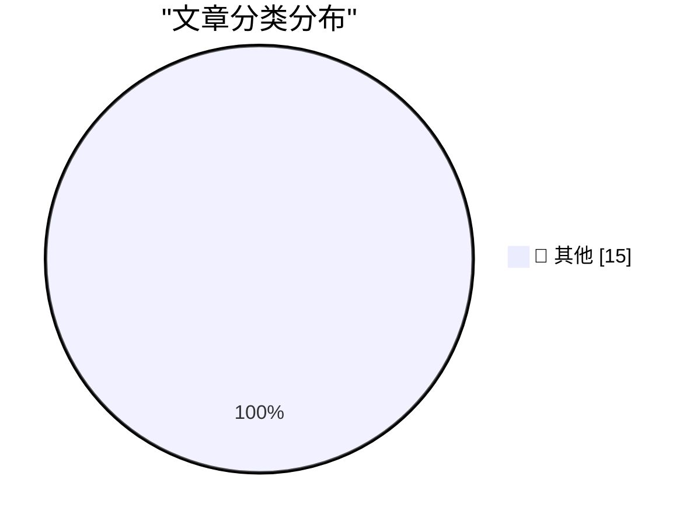

# 📰 AI 博客每日精选 — 2026-08-27

> 来自 Karpathy 推荐的 92 个顶级技术博客，AI 精选 Top 15

## 🏆 今日必读

🥇 **Quoting Paul Dix**

[Quoting Paul Dix](https://simonwillison.net/2026/Aug/26/paul-dix/) — simonwillison.net · 8 小时前 · 📝 其他

> Quoting Paul Dix

🥈 **EVE Online: The Move to Python 3 Begins!**

[EVE Online: The Move to Python 3 Begins!](https://simonwillison.net/2026/Aug/25/eve-online-move-to-python-3/) — simonwillison.net · 17 小时前 · 📝 其他

> EVE Online: The Move to Python 3 Begins!

🥉 **Debugging Ubiquiti's 5G Backup on AT&T**

[Debugging Ubiquiti's 5G Backup on AT&T](https://www.jeffgeerling.com/blog/2026/unifi-u5g-backup-debugging/) — jeffgeerling.com · 21 小时前 · 📝 其他

> Debugging Ubiquiti's 5G Backup on AT&T

---

## 📊 数据概览

| 扫描源 | 抓取文章 | 时间范围 | 精选 |
|:---:|:---:|:---:|:---:|
| 80/92 | 2450 篇 → 16 篇 | 24h | **15 篇** |

### 分类分布

---

## 📝 其他

### 1. Quoting Paul Dix

[Quoting Paul Dix](https://simonwillison.net/2026/Aug/26/paul-dix/) — **simonwillison.net** · 8 小时前 · ⭐ 15/30

> Quoting Paul Dix

---

### 2. EVE Online: The Move to Python 3 Begins!

[EVE Online: The Move to Python 3 Begins!](https://simonwillison.net/2026/Aug/25/eve-online-move-to-python-3/) — **simonwillison.net** · 17 小时前 · ⭐ 15/30

> EVE Online: The Move to Python 3 Begins!

---

### 3. Debugging Ubiquiti's 5G Backup on AT&T

[Debugging Ubiquiti's 5G Backup on AT&T](https://www.jeffgeerling.com/blog/2026/unifi-u5g-backup-debugging/) — **jeffgeerling.com** · 21 小时前 · ⭐ 15/30

> Debugging Ubiquiti's 5G Backup on AT&T

---

### 4. XCancel, the Twitter/X Mirror, Shuts Down After Cease and Desist From the Fine Folks at X Corp

[XCancel, the Twitter/X Mirror, Shuts Down After Cease and Desist From the Fine Folks at X Corp](https://xcancel.com/) — **daringfireball.net** · 18 小时前 · ⭐ 15/30

> XCancel, the Twitter/X Mirror, Shuts Down After Cease and Desist From the Fine Folks at X Corp

---

### 5. Dolly Parton Dies at 80

[Dolly Parton Dies at 80](https://www.nytimes.com/2026/08/25/arts/music/dolly-parton-dead.html) — **daringfireball.net** · 18 小时前 · ⭐ 15/30

> Dolly Parton Dies at 80

---

### 6. Update Regarding the Base Prices of the M5 Max Mac Studio

[Update Regarding the Base Prices of the M5 Max Mac Studio](https://daringfireball.net/2026/08/configurations_and_pricing_for_new_mac_minis_and_mac_studios) — **daringfireball.net** · 18 小时前 · ⭐ 15/30

> Update Regarding the Base Prices of the M5 Max Mac Studio

---

### 7. Pluralistic: The age of disinvention (25 Aug 2026)

[Pluralistic: The age of disinvention (25 Aug 2026)](https://pluralistic.net/2026/08/25/gammamax/) — **pluralistic.net** · 13 小时前 · ⭐ 15/30

> Pluralistic: The age of disinvention (25 Aug 2026)

---

### 8. Gadget Review: Thermal Master P3 Macro Lens ★★★★⯪

[Gadget Review: Thermal Master P3 Macro Lens ★★★★⯪](https://shkspr.mobi/blog/2026/08/gadget-review-thermal-master-p3-macro-lens/) — **shkspr.mobi** · 5 小时前 · ⭐ 15/30

> Gadget Review: Thermal Master P3 Macro Lens ★★★★⯪

---

### 9. If your VS Code remotes stopped working, downgrade to v1.124.x

[If your VS Code remotes stopped working, downgrade to v1.124.x](https://xeiaso.net/notes/2026/vscode-remotes-not-working-downgrade/) — **xeiaso.net** · 16 小时前 · ⭐ 15/30

> If your VS Code remotes stopped working, downgrade to v1.124.x

---

### 10. Junk solutions

[Junk solutions](https://www.johndcook.com/blog/2026/08/26/junk-solutions/) — **johndcook.com** · 4 小时前 · ⭐ 15/30

> Junk solutions

---

### 11. Ultraspherical

[Ultraspherical](https://www.johndcook.com/blog/2026/08/26/ultraspherical/) — **johndcook.com** · 6 小时前 · ⭐ 15/30

> Ultraspherical

---

### 12. Adding diagrams to my static site generator with D2

[Adding diagrams to my static site generator with D2](https://www.gilesthomas.com/2026/08/adding-d2) — **gilesthomas.com** · 17 小时前 · ⭐ 15/30

> Adding diagrams to my static site generator with D2

---

### 13. The AI Hater's Manifesto

[The AI Hater's Manifesto](https://www.wheresyoured.at/the-ai-haters-manifesto/) — **wheresyoured.at** · 23 小时前 · ⭐ 15/30

> The AI Hater's Manifesto

---

### 14. Have You Heard the Good News About Microlighter?

[Have You Heard the Good News About Microlighter?](https://blog.jim-nielsen.com/2026/shipping-microlighter/) — **blog.jim-nielsen.com** · 21 小时前 · ⭐ 15/30

> Have You Heard the Good News About Microlighter?

---

### 15. Digg v4 and lessons not learned

[Digg v4 and lessons not learned](https://dfarq.homeip.net/digg-v4-and-lessons-not-learned/?utm_source=rss&#038;utm_medium=rss&#038;utm_campaign=digg-v4-and-lessons-not-learned) — **dfarq.homeip.net** · 5 小时前 · ⭐ 15/30

> Digg v4 and lessons not learned

---

*生成于 2026-08-27 00:54 (Asia/Shanghai) | 扫描 80 源 → 获取 2450 篇 → 精选 15 篇*
*基于 [Hacker News Popularity Contest 2025](https://refactoringenglish.com/tools/hn-popularity/) RSS 源列表，由 [Andrej Karpathy](https://x.com/karpathy) 推荐*
*由「懂点儿AI」制作，欢迎关注同名微信公众号获取更多 AI 实用技巧 💡*
