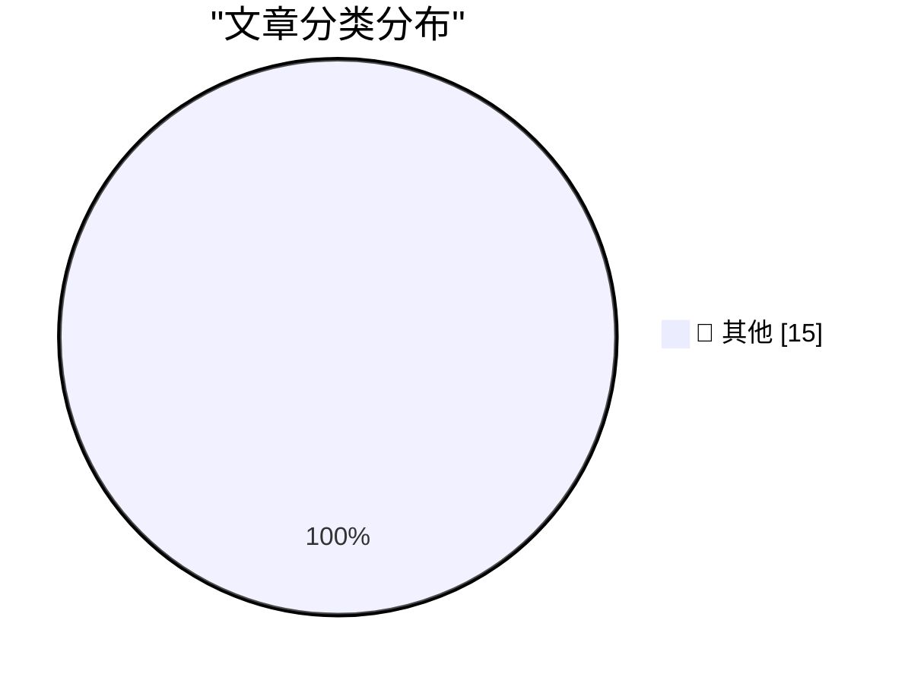

# 📰 AI 博客每日精选 — 2026-08-28

> 来自 Karpathy 推荐的 92 个顶级技术博客，AI 精选 Top 15

## 🏆 今日必读

🥇 **Breaking Claude Code Opus 5 Auto Mode**

[Breaking Claude Code Opus 5 Auto Mode](https://simonwillison.net/2026/Aug/27/breaking-claude-code-opus-5-auto-mode/) — simonwillison.net · 2 小时前 · 📝 其他

> Breaking Claude Code Opus 5 Auto Mode

🥈 **Two Alleged ‘TeamPCP’ Hackers Arrested in Australia**

[Two Alleged ‘TeamPCP’ Hackers Arrested in Australia](https://krebsonsecurity.com/2026/08/two-alleged-teampcp-hackers-arrested-in-australia/) — krebsonsecurity.com · 13 小时前 · 📝 其他

> Two Alleged ‘TeamPCP’ Hackers Arrested in Australia

🥉 **Afterglow — Classic After Dark Screen Savers on Today’s MacOS**

[Afterglow — Classic After Dark Screen Savers on Today’s MacOS](https://morphing.cloud/afterglow/) — daringfireball.net · 3 小时前 · 📝 其他

> Afterglow — Classic After Dark Screen Savers on Today’s MacOS

---

## 📊 数据概览

| 扫描源 | 抓取文章 | 时间范围 | 精选 |
|:---:|:---:|:---:|:---:|
| 82/92 | 2509 篇 → 18 篇 | 24h | **15 篇** |

### 分类分布

---

## 📝 其他

### 1. Breaking Claude Code Opus 5 Auto Mode

[Breaking Claude Code Opus 5 Auto Mode](https://simonwillison.net/2026/Aug/27/breaking-claude-code-opus-5-auto-mode/) — **simonwillison.net** · 2 小时前 · ⭐ 15/30

> Breaking Claude Code Opus 5 Auto Mode

---

### 2. Two Alleged ‘TeamPCP’ Hackers Arrested in Australia

[Two Alleged ‘TeamPCP’ Hackers Arrested in Australia](https://krebsonsecurity.com/2026/08/two-alleged-teampcp-hackers-arrested-in-australia/) — **krebsonsecurity.com** · 13 小时前 · ⭐ 15/30

> Two Alleged ‘TeamPCP’ Hackers Arrested in Australia

---

### 3. Afterglow — Classic After Dark Screen Savers on Today’s MacOS

[Afterglow — Classic After Dark Screen Savers on Today’s MacOS](https://morphing.cloud/afterglow/) — **daringfireball.net** · 3 小时前 · ⭐ 15/30

> Afterglow — Classic After Dark Screen Savers on Today’s MacOS

---

### 4. The Load-Bearing Vocabulary of Claude

[The Load-Bearing Vocabulary of Claude](https://louisabraham.github.io/load-bearing/) — **daringfireball.net** · 3 小时前 · ⭐ 15/30

> The Load-Bearing Vocabulary of Claude

---

### 5. Elizabeth Warren’s Incoherent Outrage Regarding Apple’s Tariff Refund

[Elizabeth Warren’s Incoherent Outrage Regarding Apple’s Tariff Refund](https://www.warren.senate.gov/newsroom/press-releases/warren-pushes-giant-corporations-to-give-billions-in-tariff-refunds-back-to-consumers/) — **daringfireball.net** · 4 小时前 · ⭐ 15/30

> Elizabeth Warren’s Incoherent Outrage Regarding Apple’s Tariff Refund

---

### 6. Panic Is Refunding Tariff Fees to Playdate Buyers

[Panic Is Refunding Tariff Fees to Playdate Buyers](https://www.gamedeveloper.com/business/playdate-maker-is-refunding-tariff-fees-to-customers) — **daringfireball.net** · 4 小时前 · ⭐ 15/30

> Panic Is Refunding Tariff Fees to Playdate Buyers

---

### 7. Ads in Apple Maps Have Now Launched

[Ads in Apple Maps Have Now Launched](https://9to5mac.com/2026/08/25/apple-maps-launches-ads-on-iphone-heres-whats-new/) — **daringfireball.net** · 4 小时前 · ⭐ 15/30

> Ads in Apple Maps Have Now Launched

---

### 8. ‘How Europe Is Killing Makers and Micro-Entrepreneurs’

[‘How Europe Is Killing Makers and Micro-Entrepreneurs’](https://lectronz.com/u/lectronz/articles/how-europe-is-killing-makers-and-micro-entrepreneurs) — **daringfireball.net** · 5 小时前 · ⭐ 15/30

> ‘How Europe Is Killing Makers and Micro-Entrepreneurs’

---

### 9. Book Review: The Infinite Sadness of Small Appliances by Glenn Dixon ★★★★☆

[Book Review: The Infinite Sadness of Small Appliances by Glenn Dixon ★★★★☆](https://shkspr.mobi/blog/2026/08/book-review-the-infinite-sadness-of-small-appliances-by-glenn-dixon/) — **shkspr.mobi** · 13 小时前 · ⭐ 15/30

> Book Review: The Infinite Sadness of Small Appliances by Glenn Dixon ★★★★☆

---

### 10. Second solutions

[Second solutions](https://www.johndcook.com/blog/2026/08/27/second-solutions/) — **johndcook.com** · 11 小时前 · ⭐ 15/30

> Second solutions

---

### 11. Why do OpenAI's GPT-2 weights beat mine?  Part four: digging into dropout

[Why do OpenAI's GPT-2 weights beat mine?  Part four: digging into dropout](https://www.gilesthomas.com/2026/08/why-do-openai-gpt2-weights-beat-mine-4-ift-dropout) — **gilesthomas.com** · 5 小时前 · ⭐ 15/30

> Why do OpenAI's GPT-2 weights beat mine?  Part four: digging into dropout

---

### 12. Sandboxing coding agents

[Sandboxing coding agents](https://micahflee.com/sandboxing-coding-agents/) — **micahflee.com** · 4 小时前 · ⭐ 15/30

> Sandboxing coding agents

---

### 13. Bazel Module Versions Aren’t SemVer

[Bazel Module Versions Aren’t SemVer](https://nesbitt.io/2026/08/27/bazel-module-versions-arent-semver.html) — **nesbitt.io** · 14 小时前 · ⭐ 15/30

> Bazel Module Versions Aren’t SemVer

---

### 14. How the Strategic Petroleum Reserve Works

[How the Strategic Petroleum Reserve Works](https://www.construction-physics.com/p/how-the-strategic-petroleum-reserve) — **construction-physics.com** · 12 小时前 · ⭐ 15/30

> How the Strategic Petroleum Reserve Works

---

### 15. Can Self-Hosting Be Simple?

[Can Self-Hosting Be Simple?](https://feed.tedium.co/link/15204/17432610/self-hosting-third-place-strategy) — **tedium.co** · 21 小时前 · ⭐ 15/30

> Can Self-Hosting Be Simple?

---

*生成于 2026-08-28 08:50 (Asia/Shanghai) | 扫描 82 源 → 获取 2509 篇 → 精选 15 篇*
*基于 [Hacker News Popularity Contest 2025](https://refactoringenglish.com/tools/hn-popularity/) RSS 源列表，由 [Andrej Karpathy](https://x.com/karpathy) 推荐*
*由「懂点儿AI」制作，欢迎关注同名微信公众号获取更多 AI 实用技巧 💡*
