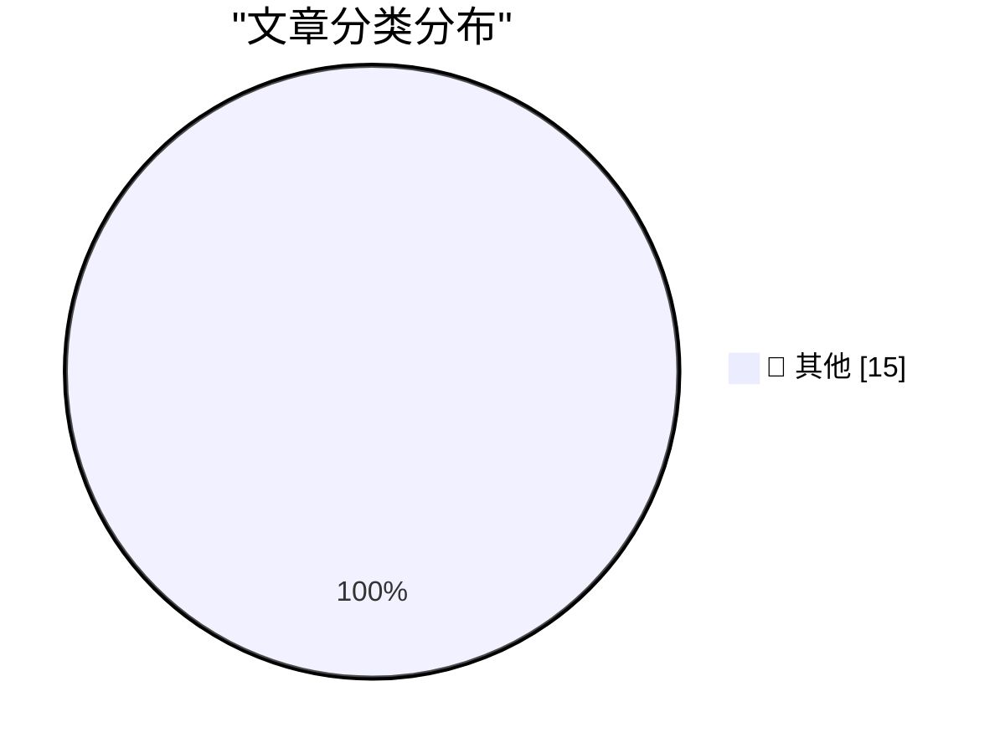

# 📰 AI 博客每日精选 — 2026-08-29

> 来自 Karpathy 推荐的 92 个顶级技术博客，AI 精选 Top 15

## 🏆 今日必读

🥇 **Just a rumour of a bug is enough to find a security exploit these days**

[Just a rumour of a bug is enough to find a security exploit these days](https://simonwillison.net/2026/Aug/28/just-a-rumour-of-a-bug/) — simonwillison.net · 2 小时前 · 📝 其他

> Just a rumour of a bug is enough to find a security exploit these days

🥈 **Building a mini Homelab that fits in my carry-on**

[Building a mini Homelab that fits in my carry-on](https://www.jeffgeerling.com/blog/2026/mini-homelab-network-fits-in-carry-on/) — jeffgeerling.com · 9 小时前 · 📝 其他

> Building a mini Homelab that fits in my carry-on

🥉 **Apple Announces Price Increase for Apple TV and Apple One Subscriptions**

[Apple Announces Price Increase for Apple TV and Apple One Subscriptions](https://9to5mac.com/2026/08/28/apple-announces-price-increase-for-apple-tv-and-apple-one-subscriptions/) — daringfireball.net · 2 小时前 · 📝 其他

> Apple Announces Price Increase for Apple TV and Apple One Subscriptions

---

## 📊 数据概览

| 扫描源 | 抓取文章 | 时间范围 | 精选 |
|:---:|:---:|:---:|:---:|
| 82/92 | 2517 篇 → 19 篇 | 24h | **15 篇** |

### 分类分布

---

## 📝 其他

### 1. Just a rumour of a bug is enough to find a security exploit these days

[Just a rumour of a bug is enough to find a security exploit these days](https://simonwillison.net/2026/Aug/28/just-a-rumour-of-a-bug/) — **simonwillison.net** · 2 小时前 · ⭐ 15/30

> Just a rumour of a bug is enough to find a security exploit these days

---

### 2. Building a mini Homelab that fits in my carry-on

[Building a mini Homelab that fits in my carry-on](https://www.jeffgeerling.com/blog/2026/mini-homelab-network-fits-in-carry-on/) — **jeffgeerling.com** · 9 小时前 · ⭐ 15/30

> Building a mini Homelab that fits in my carry-on

---

### 3. Apple Announces Price Increase for Apple TV and Apple One Subscriptions

[Apple Announces Price Increase for Apple TV and Apple One Subscriptions](https://9to5mac.com/2026/08/28/apple-announces-price-increase-for-apple-tv-and-apple-one-subscriptions/) — **daringfireball.net** · 2 小时前 · ⭐ 15/30

> Apple Announces Price Increase for Apple TV and Apple One Subscriptions

---

### 4. ‘I’m the Guy Who Destroys Antique Books After We Scan Them Into Our Company’s Insatiable AI Platform’

[‘I’m the Guy Who Destroys Antique Books After We Scan Them Into Our Company’s Insatiable AI Platform’](https://www.mcsweeneys.net/articles/im-the-guy-who-destroys-antique-books-after-we-scan-them-into-our-companys-insatiable-ai-platform) — **daringfireball.net** · 2 小时前 · ⭐ 15/30

> ‘I’m the Guy Who Destroys Antique Books After We Scan Them Into Our Company’s Insatiable AI Platform’

---

### 5. ‘How Americans See E.U. Tech’

[‘How Americans See E.U. Tech’](https://www.youtube.com/watch?v=gGlpBuW6ZFc) — **daringfireball.net** · 3 小时前 · ⭐ 15/30

> ‘How Americans See E.U. Tech’

---

### 6. We Certainly Have Made a Hames Out of This

[We Certainly Have Made a Hames Out of This](https://daringfireball.net/linked/2026/08/28/trump-lake-ontario) — **daringfireball.net** · 4 小时前 · ⭐ 15/30

> We Certainly Have Made a Hames Out of This

---

### 7. ‘Not Sure How You Own Canada by Deleting Your Own History’

[‘Not Sure How You Own Canada by Deleting Your Own History’](https://x.com/MattWalshBlog/status/2093060290371870948) — **daringfireball.net** · 8 小时前 · ⭐ 15/30

> ‘Not Sure How You Own Canada by Deleting Your Own History’

---

### 8. From the DF Archive: ‘Golfo Del Gringo Loco’

[From the DF Archive: ‘Golfo Del Gringo Loco’](https://daringfireball.net/2025/02/golfo_del_gringo_loco) — **daringfireball.net** · 9 小时前 · ⭐ 15/30

> From the DF Archive: ‘Golfo Del Gringo Loco’

---

### 9. Trump Declares That Lake Ontario Is Now ‘Lake America’

[Trump Declares That Lake Ontario Is Now ‘Lake America’](https://www.notus.org/trump-white-house/lake-america-ontario-canada-trade-war-trump-executive-order-rename) — **daringfireball.net** · 10 小时前 · ⭐ 15/30

> Trump Declares That Lake Ontario Is Now ‘Lake America’

---

### 10. U.S. Judge Blocks Trump Defense Department’s Anthropic Blacklisting

[U.S. Judge Blocks Trump Defense Department’s Anthropic Blacklisting](https://www.reuters.com/legal/government/us-judge-blocks-pentagons-anthropic-blacklisting-2026-08-28/) — **daringfireball.net** · 21 小时前 · ⭐ 15/30

> U.S. Judge Blocks Trump Defense Department’s Anthropic Blacklisting

---

### 11. "iT woRKs BeTter in THe aPp!!"

["iT woRKs BeTter in THe aPp!!"](https://shkspr.mobi/blog/2026/08/it-works-better-in-the-app/) — **shkspr.mobi** · 12 小时前 · ⭐ 15/30

> "iT woRKs BeTter in THe aPp!!"

---

### 12. Making the unnecessary easier

[Making the unnecessary easier](https://www.johndcook.com/blog/2026/08/28/making-the-unnecessary-easier/) — **johndcook.com** · 9 小时前 · ⭐ 15/30

> Making the unnecessary easier

---

### 13. Now Hiring: Senior Open Source Maintainer

[Now Hiring: Senior Open Source Maintainer](https://nesbitt.io/2026/08/28/now-hiring-senior-open-source-maintainer.html) — **nesbitt.io** · 14 小时前 · ⭐ 15/30

> Now Hiring: Senior Open Source Maintainer

---

### 14. Premium: The Hater's Guide To Circular Financing (Part One)

[Premium: The Hater's Guide To Circular Financing (Part One)](https://www.wheresyoured.at/premium-the-haters-guide-to-circular-financing-part-one/) — **wheresyoured.at** · 8 小时前 · ⭐ 15/30

> Premium: The Hater's Guide To Circular Financing (Part One)

---

### 15. This Week on The Analog Antiquarian

[This Week on The Analog Antiquarian](https://www.filfre.net/2026/08/this-week-on-the-analog-antiquarian/) — **filfre.net** · 8 小时前 · ⭐ 15/30

> This Week on The Analog Antiquarian

---

*生成于 2026-08-29 08:31 (Asia/Shanghai) | 扫描 82 源 → 获取 2517 篇 → 精选 15 篇*
*基于 [Hacker News Popularity Contest 2025](https://refactoringenglish.com/tools/hn-popularity/) RSS 源列表，由 [Andrej Karpathy](https://x.com/karpathy) 推荐*
*由「懂点儿AI」制作，欢迎关注同名微信公众号获取更多 AI 实用技巧 💡*
