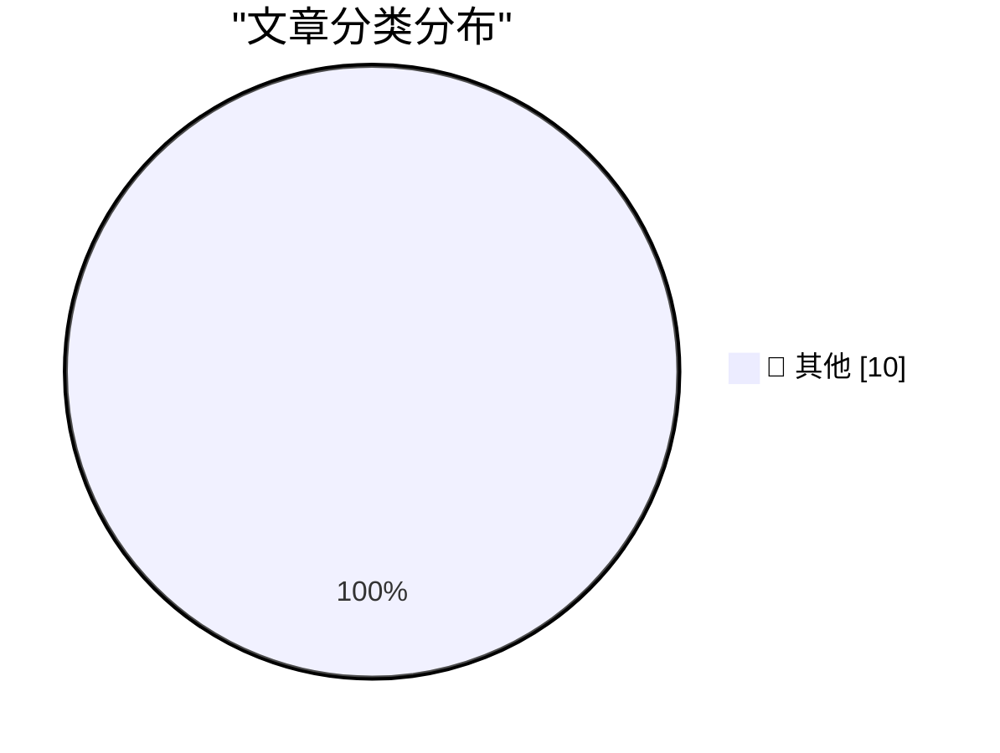

# 📰 AI 博客每日精选 — 2026-08-31

> 来自 Karpathy 推荐的 92 个顶级技术博客，AI 精选 Top 10

## 🏆 今日必读

🥇 **Introducing Hy4 Preview**

[Introducing Hy4 Preview](https://simonwillison.net/2026/Aug/29/hy4/) — simonwillison.net · 19 小时前 · 📝 其他

> Introducing Hy4 Preview

🥈 **You have to beat the models at something**

[You have to beat the models at something](https://seangoedecke.com/you-have-to-beat-the-models-at-something/) — seangoedecke.com · 19 小时前 · 📝 其他

> You have to beat the models at something

🥉 **Finalist 4**

[Finalist 4](https://www.finalist.works/?utm_source=df-aug-2026) — daringfireball.net · 40 分钟前 · 📝 其他

> Finalist 4

---

## 📊 数据概览

| 扫描源 | 抓取文章 | 时间范围 | 精选 |
|:---:|:---:|:---:|:---:|
| 84/92 | 2547 篇 → 10 篇 | 24h | **10 篇** |

### 分类分布

---

## 📝 其他

### 1. Introducing Hy4 Preview

[Introducing Hy4 Preview](https://simonwillison.net/2026/Aug/29/hy4/) — **simonwillison.net** · 19 小时前 · ⭐ 15/30

> Introducing Hy4 Preview

---

### 2. You have to beat the models at something

[You have to beat the models at something](https://seangoedecke.com/you-have-to-beat-the-models-at-something/) — **seangoedecke.com** · 19 小时前 · ⭐ 15/30

> You have to beat the models at something

---

### 3. Finalist 4

[Finalist 4](https://www.finalist.works/?utm_source=df-aug-2026) — **daringfireball.net** · 40 分钟前 · ⭐ 15/30

> Finalist 4

---

### 4. New Pebble Weather App + Software Updates

[New Pebble Weather App + Software Updates](https://repebble.com/blog/new-pebble-weather-app-software-updates) — **ericmigi.com** · 19 小时前 · ⭐ 15/30

> New Pebble Weather App + Software Updates

---

### 5. ActivityBot is the recipient of an NLnet grant!

[ActivityBot is the recipient of an NLnet grant!](https://shkspr.mobi/blog/2026/08/activitybot-is-the-recipient-of-an-nlnet-grant/) — **shkspr.mobi** · 7 小时前 · ⭐ 15/30

> ActivityBot is the recipient of an NLnet grant!

---

### 6. Cores in space: The core memory module from a 1980 Spacelab computer

[Cores in space: The core memory module from a 1980 Spacelab computer](http://www.righto.com/feeds/4645676918273740492/comments/default) — **righto.com** · 2 小时前 · ⭐ 15/30

> Cores in space: The core memory module from a 1980 Spacelab computer

---

### 7. The Server Called Paranoia: Defend Autistici/Inventati

[The Server Called Paranoia: Defend Autistici/Inventati](https://micahflee.com/the-server-called-paranoia-defend-autistici-inventati/) — **micahflee.com** · 23 小时前 · ⭐ 15/30

> The Server Called Paranoia: Defend Autistici/Inventati

---

### 8. The Rise and Fall of Agent Civilizations

[The Rise and Fall of Agent Civilizations](https://www.dwarkesh.com/p/openai-huggingface) — **dwarkesh.com** · 20 小时前 · ⭐ 15/30

> The Rise and Fall of Agent Civilizations

---

### 9. Apple prevails over Franklin, August 30, 1983

[Apple prevails over Franklin, August 30, 1983](https://dfarq.homeip.net/apple-prevails-over-franklin-august-30-1983/?utm_source=rss&#038;utm_medium=rss&#038;utm_campaign=apple-prevails-over-franklin-august-30-1983) — **dfarq.homeip.net** · 8 小时前 · ⭐ 15/30

> Apple prevails over Franklin, August 30, 1983

---

### 10. Forgejo Hack #2: Integration with Read The Docs

[Forgejo Hack #2: Integration with Read The Docs](https://blog.miguelgrinberg.com/post/forgejo-hack-2-integration-with-read-the-docs) — **miguelgrinberg.com** · 3 小时前 · ⭐ 15/30

> Forgejo Hack #2: Integration with Read The Docs

---

*生成于 2026-08-31 03:15 (Asia/Shanghai) | 扫描 84 源 → 获取 2547 篇 → 精选 10 篇*
*基于 [Hacker News Popularity Contest 2025](https://refactoringenglish.com/tools/hn-popularity/) RSS 源列表，由 [Andrej Karpathy](https://x.com/karpathy) 推荐*
*由「懂点儿AI」制作，欢迎关注同名微信公众号获取更多 AI 实用技巧 💡*
