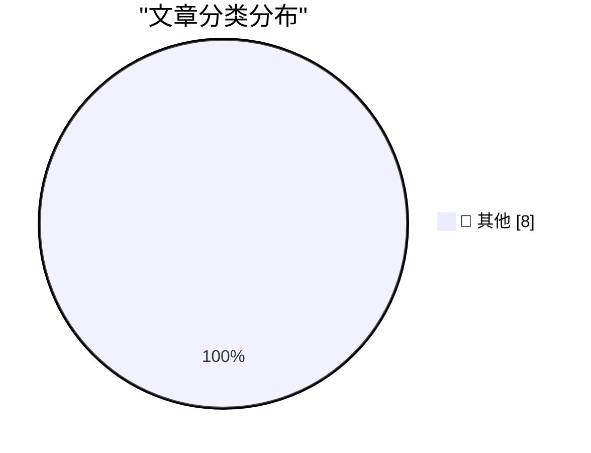

# 📰 AI 博客每日精选 — 2026-09-01

> 来自 Karpathy 推荐的 92 个顶级技术博客，AI 精选 Top 8

## 🏆 今日必读

🥇 **Understanding ChatGPT Work**

[Understanding ChatGPT Work](https://simonwillison.net/2026/Aug/30/understanding-chatgpt-work/) — simonwillison.net · 21 小时前 · 📝 其他

> Understanding ChatGPT Work

🥈 **Before NTP there were Time and Daytime**

[Before NTP there were Time and Daytime](https://www.jeffgeerling.com/blog/2026/rfc-867-868-time/) — jeffgeerling.com · 23 小时前 · 📝 其他

> Before NTP there were Time and Daytime

🥉 **Here's a good way to present AI videos**

[Here's a good way to present AI videos](https://idiallo.com/blog/a-good-way-to-present-ai-videos-on-youtube) — idiallo.com · 13 小时前 · 📝 其他

> Here's a good way to present AI videos

---

## 📊 数据概览

| 扫描源 | 抓取文章 | 时间范围 | 精选 |
|:---:|:---:|:---:|:---:|
| 82/92 | 2526 篇 → 8 篇 | 24h | **8 篇** |

### 分类分布

---

## 📝 其他

### 1. Understanding ChatGPT Work

[Understanding ChatGPT Work](https://simonwillison.net/2026/Aug/30/understanding-chatgpt-work/) — **simonwillison.net** · 21 小时前 · ⭐ 15/30

> Understanding ChatGPT Work

---

### 2. Before NTP there were Time and Daytime

[Before NTP there were Time and Daytime](https://www.jeffgeerling.com/blog/2026/rfc-867-868-time/) — **jeffgeerling.com** · 23 小时前 · ⭐ 15/30

> Before NTP there were Time and Daytime

---

### 3. Here's a good way to present AI videos

[Here's a good way to present AI videos](https://idiallo.com/blog/a-good-way-to-present-ai-videos-on-youtube) — **idiallo.com** · 13 小时前 · ⭐ 15/30

> Here's a good way to present AI videos

---

### 4. Review: Ruined Theatre's A Midsummer Night's Dream ★★★★☆

[Review: Ruined Theatre's A Midsummer Night's Dream ★★★★☆](https://shkspr.mobi/blog/2026/08/review-ruined-theatres-a-midsummer-nights-dream/) — **shkspr.mobi** · 9 小时前 · ⭐ 15/30

> Review: Ruined Theatre's A Midsummer Night's Dream ★★★★☆

---

### 5. Cancelation Terminology

[Cancelation Terminology](https://matklad.github.io/2026/08/31/cancelation-terminology.html) — **matklad.github.io** · 21 小时前 · ⭐ 15/30

> Cancelation Terminology

---

### 6. The rise and fall of agent civilizations

[The rise and fall of agent civilizations](https://www.dwarkesh.com/p/openai-huggingface-narration) — **dwarkesh.com** · 48 分钟前 · ⭐ 15/30

> The rise and fall of agent civilizations

---

### 7. Adobe’s August 1994 acquisition of Aldus

[Adobe’s August 1994 acquisition of Aldus](https://dfarq.homeip.net/adobes-august-1994-acquisition-of-aldus/?utm_source=rss&#038;utm_medium=rss&#038;utm_campaign=adobes-august-1994-acquisition-of-aldus) — **dfarq.homeip.net** · 10 小时前 · ⭐ 15/30

> Adobe’s August 1994 acquisition of Aldus

---

### 8. Reducing codebase cognitive debt through... quizzes?

[Reducing codebase cognitive debt through... quizzes?](https://martinalderson.com/posts/codebase-cognitive-debt-quizzes/?utm_source=rss&amp;utm_medium=rss&amp;utm_campaign=feed) — **martinalderson.com** · 21 小时前 · ⭐ 15/30

> Reducing codebase cognitive debt through... quizzes?

---

*生成于 2026-09-01 05:25 (Asia/Shanghai) | 扫描 82 源 → 获取 2526 篇 → 精选 8 篇*
*基于 [Hacker News Popularity Contest 2025](https://refactoringenglish.com/tools/hn-popularity/) RSS 源列表，由 [Andrej Karpathy](https://x.com/karpathy) 推荐*
*由「懂点儿AI」制作，欢迎关注同名微信公众号获取更多 AI 实用技巧 💡*
