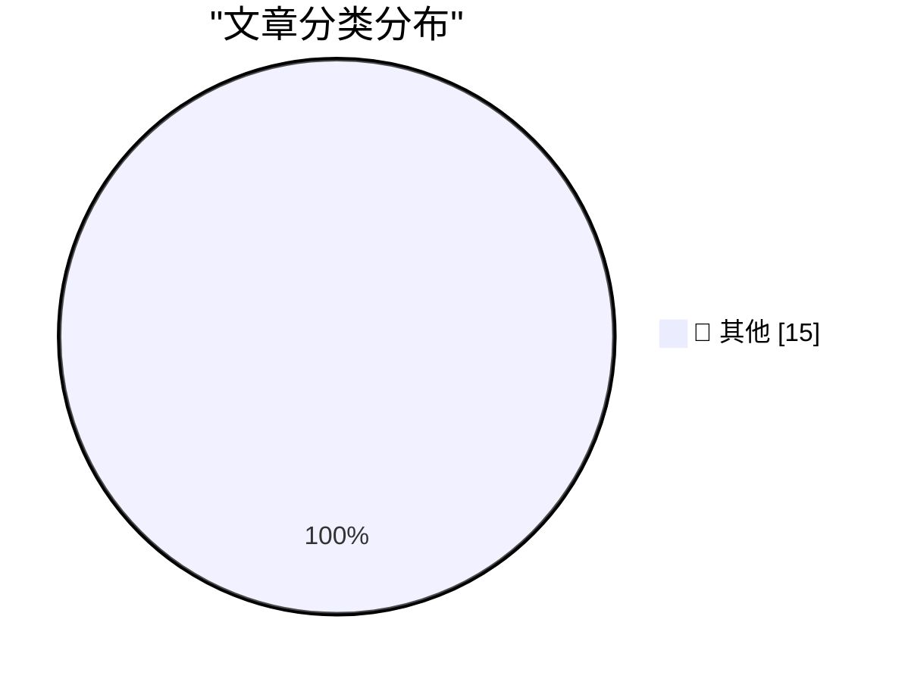

# 📰 AI 博客每日精选 — 2026-09-02

> 来自 Karpathy 推荐的 92 个顶级技术博客，AI 精选 Top 15

## 🏆 今日必读

🥇 **Codex bundles LibreOffice**

[Codex bundles LibreOffice](https://simonwillison.net/2026/Sep/1/codex-libreoffice/) — simonwillison.net · 18 分钟前 · 📝 其他

> Codex bundles LibreOffice

🥈 **Quoting Tarn Adams**

[Quoting Tarn Adams](https://simonwillison.net/2026/Sep/1/tarn-adams/) — simonwillison.net · 2 小时前 · 📝 其他

> Quoting Tarn Adams

🥉 **Python 3.15.0 candidate 2 is here!**

[Python 3.15.0 candidate 2 is here!](https://simonwillison.net/2026/Sep/1/python-315-rc-2/) — simonwillison.net · 4 小时前 · 📝 其他

> Python 3.15.0 candidate 2 is here!

---

## 📊 数据概览

| 扫描源 | 抓取文章 | 时间范围 | 精选 |
|:---:|:---:|:---:|:---:|
| 80/92 | 2479 篇 → 17 篇 | 24h | **15 篇** |

### 分类分布

---

## 📝 其他

### 1. Codex bundles LibreOffice

[Codex bundles LibreOffice](https://simonwillison.net/2026/Sep/1/codex-libreoffice/) — **simonwillison.net** · 18 分钟前 · ⭐ 15/30

> Codex bundles LibreOffice

---

### 2. Quoting Tarn Adams

[Quoting Tarn Adams](https://simonwillison.net/2026/Sep/1/tarn-adams/) — **simonwillison.net** · 2 小时前 · ⭐ 15/30

> Quoting Tarn Adams

---

### 3. Python 3.15.0 candidate 2 is here!

[Python 3.15.0 candidate 2 is here!](https://simonwillison.net/2026/Sep/1/python-315-rc-2/) — **simonwillison.net** · 4 小时前 · ⭐ 15/30

> Python 3.15.0 candidate 2 is here!

---

### 4. Introducing wrapture

[Introducing wrapture](https://simonwillison.net/2026/Aug/31/introducing-wrapture/) — **simonwillison.net** · 19 小时前 · ⭐ 15/30

> Introducing wrapture

---

### 5. Quoting Andrew Digby

[Quoting Andrew Digby](https://simonwillison.net/2026/Aug/31/andrew-digby/) — **simonwillison.net** · 20 小时前 · ⭐ 15/30

> Quoting Andrew Digby

---

### 6. Tim Cook’s Departure Memo on His Last Day as CEO

[Tim Cook’s Departure Memo on His Last Day as CEO](https://9to5mac.com/2026/08/31/read-tim-cooks-full-memo-to-apple-employees-on-his-last-day-as-ceo/) — **daringfireball.net** · 1 小时前 · ⭐ 15/30

> Tim Cook’s Departure Memo on His Last Day as CEO

---

### 7. Apple Reveals Forensic Evidence From Chang Liu’s MacBook in OpenAI Lawsuit

[Apple Reveals Forensic Evidence From Chang Liu’s MacBook in OpenAI Lawsuit](https://9to5mac.com/2026/08/31/apple-openai-forensic-macbook-evidence/) — **daringfireball.net** · 1 小时前 · ⭐ 15/30

> Apple Reveals Forensic Evidence From Chang Liu’s MacBook in OpenAI Lawsuit

---

### 8. [Sponsor] WorkOS: How to Give an Agent a Task Instead of a Token

[[Sponsor] WorkOS: How to Give an Agent a Task Instead of a Token](https://workos.com/blog/delegated-access-for-ai-agents?utm_source=daringfireball&amp;utm_medium=newsletter&amp;utm_campaign=q32026) — **daringfireball.net** · 11 小时前 · ⭐ 15/30

> [Sponsor] WorkOS: How to Give an Agent a Task Instead of a Token

---

### 9. Book Review: ActivityPub by Evan Prodromou ★★★★⯪

[Book Review: ActivityPub by Evan Prodromou ★★★★⯪](https://shkspr.mobi/blog/2026/09/book-review-activitypub-by-evan-prodromou/) — **shkspr.mobi** · 7 小时前 · ⭐ 15/30

> Book Review: ActivityPub by Evan Prodromou ★★★★⯪

---

### 10. Patented application of linear algebra

[Patented application of linear algebra](https://www.johndcook.com/blog/2026/08/31/patented-application-of-linear-algebra/) — **johndcook.com** · 19 小时前 · ⭐ 15/30

> Patented application of linear algebra

---

### 11. Git Submodules as a Package Manager

[Git Submodules as a Package Manager](https://nesbitt.io/2026/09/01/git-submodules-as-a-package-manager.html) — **nesbitt.io** · 10 小时前 · ⭐ 15/30

> Git Submodules as a Package Manager

---

### 12. Claude comment detection

[Claude comment detection](https://entropicthoughts.com/ai-comment-classifier) — **entropicthoughts.com** · 21 小时前 · ⭐ 15/30

> Claude comment detection

---

### 13. New Post: A Crash Course in Predicate Logic

[New Post: A Crash Course in Predicate Logic](https://buttondown.com/hillelwayne/archive/new-post-a-crash-course-in-predicate-logic/) — **buttondown.com/hillelwayne** · 51 分钟前 · ⭐ 15/30

> New Post: A Crash Course in Predicate Logic

---

### 14. Ajeya Cotra – Inside the OpenAI agent swarm that hacked Hugging Face

[Ajeya Cotra – Inside the OpenAI agent swarm that hacked Hugging Face](https://www.dwarkesh.com/p/ajeya-cotra) — **dwarkesh.com** · 3 小时前 · ⭐ 15/30

> Ajeya Cotra – Inside the OpenAI agent swarm that hacked Hugging Face

---

### 15. The rise and fall of agent civilizations

[The rise and fall of agent civilizations](https://www.dwarkesh.com/p/openai-huggingface-narration) — **dwarkesh.com** · 22 小时前 · ⭐ 15/30

> The rise and fall of agent civilizations

---

*生成于 2026-09-02 03:21 (Asia/Shanghai) | 扫描 80 源 → 获取 2479 篇 → 精选 15 篇*
*基于 [Hacker News Popularity Contest 2025](https://refactoringenglish.com/tools/hn-popularity/) RSS 源列表，由 [Andrej Karpathy](https://x.com/karpathy) 推荐*
*由「懂点儿AI」制作，欢迎关注同名微信公众号获取更多 AI 实用技巧 💡*
