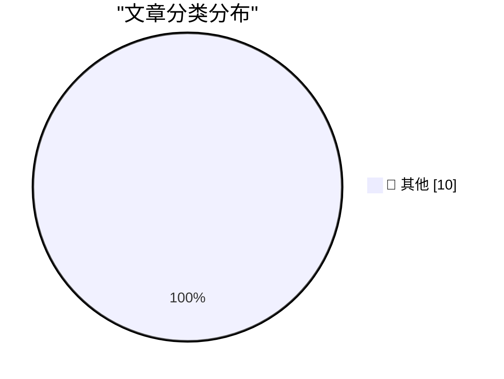

# 📰 AI 博客每日精选 — 2026-09-03

> 来自 Karpathy 推荐的 92 个顶级技术博客，AI 精选 Top 10

## 🏆 今日必读

🥇 **llm-gemini 0.34**

[llm-gemini 0.34](https://simonwillison.net/2026/Sep/2/llm-gemini/) — simonwillison.net · 2 小时前 · 📝 其他

> llm-gemini 0.34

🥈 **Claude's new system prompt really doesn't want to reproduce song lyrics**

[Claude's new system prompt really doesn't want to reproduce song lyrics](https://simonwillison.net/2026/Sep/2/claudes-new-system-prompt/) — simonwillison.net · 5 小时前 · 📝 其他

> Claude's new system prompt really doesn't want to reproduce song lyrics

🥉 **Quoting Rick Brewster**

[Quoting Rick Brewster](https://simonwillison.net/2026/Sep/2/rick-brewster/) — simonwillison.net · 13 小时前 · 📝 其他

> Quoting Rick Brewster

---

## 📊 数据概览

| 扫描源 | 抓取文章 | 时间范围 | 精选 |
|:---:|:---:|:---:|:---:|
| 84/92 | 2548 篇 → 10 篇 | 24h | **10 篇** |

### 分类分布

---

## 📝 其他

### 1. llm-gemini 0.34

[llm-gemini 0.34](https://simonwillison.net/2026/Sep/2/llm-gemini/) — **simonwillison.net** · 2 小时前 · ⭐ 15/30

> llm-gemini 0.34

---

### 2. Claude's new system prompt really doesn't want to reproduce song lyrics

[Claude's new system prompt really doesn't want to reproduce song lyrics](https://simonwillison.net/2026/Sep/2/claudes-new-system-prompt/) — **simonwillison.net** · 5 小时前 · ⭐ 15/30

> Claude's new system prompt really doesn't want to reproduce song lyrics

---

### 3. Quoting Rick Brewster

[Quoting Rick Brewster](https://simonwillison.net/2026/Sep/2/rick-brewster/) — **simonwillison.net** · 13 小时前 · ⭐ 15/30

> Quoting Rick Brewster

---

### 4. Claude Fable 5.1 made me a really nice animated pelican

[Claude Fable 5.1 made me a really nice animated pelican](https://simonwillison.net/2026/Sep/1/claude-fable-5-1/) — **simonwillison.net** · 19 小时前 · ⭐ 15/30

> Claude Fable 5.1 made me a really nice animated pelican

---

### 5. How to protect yourself from workslop

[How to protect yourself from workslop](https://seangoedecke.com/how-to-protect-yourself-from-workslop/) — **seangoedecke.com** · 19 小时前 · ⭐ 15/30

> How to protect yourself from workslop

---

### 6. FBI Probes Service Selling 153M+ Drivers Licenses

[FBI Probes Service Selling 153M+ Drivers Licenses](https://krebsonsecurity.com/2026/09/fbi-probes-service-selling-153m-drivers-licenses/) — **krebsonsecurity.com** · 20 小时前 · ⭐ 15/30

> FBI Probes Service Selling 153M+ Drivers Licenses

---

### 7. Pluralistic: Unpermissioned research (02 Sep 2026)

[Pluralistic: Unpermissioned research (02 Sep 2026)](https://pluralistic.net/2026/09/02/scrape-scrope-scrap/) — **pluralistic.net** · 9 小时前 · ⭐ 15/30

> Pluralistic: Unpermissioned research (02 Sep 2026)

---

### 8. Static Allocation, Constant Work

[Static Allocation, Constant Work](https://matklad.github.io/2026/09/02/static-allocation-constant-work.html) — **matklad.github.io** · 19 小时前 · ⭐ 15/30

> Static Allocation, Constant Work

---

### 9. Atari Lynx: The first color handheld game console

[Atari Lynx: The first color handheld game console](https://dfarq.homeip.net/atari-lynx-the-first-color-handheld-game-console/?utm_source=rss&#038;utm_medium=rss&#038;utm_campaign=atari-lynx-the-first-color-handheld-game-console) — **dfarq.homeip.net** · 8 小时前 · ⭐ 15/30

> Atari Lynx: The first color handheld game console

---

### 10. Weekly Update 519: Breaches & Data Integrity

[Weekly Update 519: Breaches & Data Integrity](https://www.troyhunt.com/weekly-update-519/) — **troyhunt.com** · 20 小时前 · ⭐ 15/30

> Weekly Update 519: Breaches & Data Integrity

---

*生成于 2026-09-03 03:20 (Asia/Shanghai) | 扫描 84 源 → 获取 2548 篇 → 精选 10 篇*
*基于 [Hacker News Popularity Contest 2025](https://refactoringenglish.com/tools/hn-popularity/) RSS 源列表，由 [Andrej Karpathy](https://x.com/karpathy) 推荐*
*由「懂点儿AI」制作，欢迎关注同名微信公众号获取更多 AI 实用技巧 💡*
