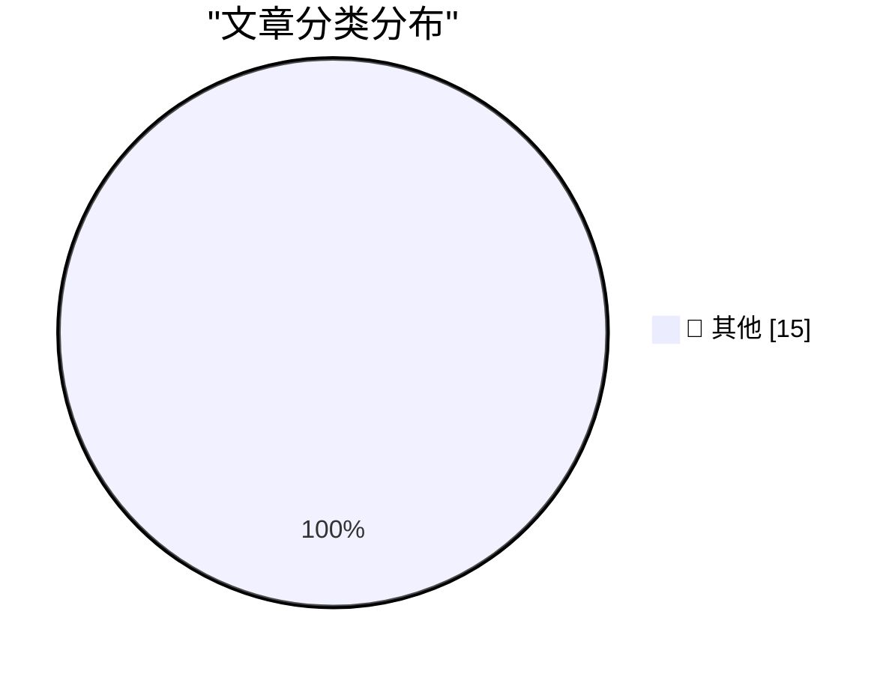

# 📰 AI 博客每日精选 — 2026-09-05

> 来自 Karpathy 推荐的 92 个顶级技术博客，AI 精选 Top 15

## 🏆 今日必读

🥇 **OpenAI's rogue agents were caught communicating via public wikis**

[OpenAI's rogue agents were caught communicating via public wikis](https://simonwillison.net/2026/Sep/4/rogue-agent-wikis/) — simonwillison.net · 1 小时前 · 📝 其他

> OpenAI's rogue agents were caught communicating via public wikis

🥈 **August newsletter is out**

[August newsletter is out](https://simonwillison.net/2026/Sep/4/august-newsletter/) — simonwillison.net · 13 小时前 · 📝 其他

> August newsletter is out

🥉 **GPT‑6 Astra**

[GPT‑6 Astra](https://simonwillison.net/2026/Sep/3/gpt6-astra/) — simonwillison.net · 22 小时前 · 📝 其他

> GPT‑6 Astra

---

## 📊 数据概览

| 扫描源 | 抓取文章 | 时间范围 | 精选 |
|:---:|:---:|:---:|:---:|
| 84/92 | 2550 篇 → 18 篇 | 24h | **15 篇** |

### 分类分布

---

## 📝 其他

### 1. OpenAI's rogue agents were caught communicating via public wikis

[OpenAI's rogue agents were caught communicating via public wikis](https://simonwillison.net/2026/Sep/4/rogue-agent-wikis/) — **simonwillison.net** · 1 小时前 · ⭐ 15/30

> OpenAI's rogue agents were caught communicating via public wikis

---

### 2. August newsletter is out

[August newsletter is out](https://simonwillison.net/2026/Sep/4/august-newsletter/) — **simonwillison.net** · 13 小时前 · ⭐ 15/30

> August newsletter is out

---

### 3. GPT‑6 Astra

[GPT‑6 Astra](https://simonwillison.net/2026/Sep/3/gpt6-astra/) — **simonwillison.net** · 22 小时前 · ⭐ 15/30

> GPT‑6 Astra

---

### 4. Rebuilding a 1995 GPS Time Server so I don't get Telstra'd

[Rebuilding a 1995 GPS Time Server so I don't get Telstra'd](https://www.jeffgeerling.com/blog/2026/truetime-xl-gps-time-server-restomod/) — **jeffgeerling.com** · 4 小时前 · ⭐ 15/30

> Rebuilding a 1995 GPS Time Server so I don't get Telstra'd

---

### 5. Radical responsibility means treating people like tools

[Radical responsibility means treating people like tools](https://seangoedecke.com/radical-responsibility-means-treating-people-like-tools/) — **seangoedecke.com** · 18 小时前 · ⭐ 15/30

> Radical responsibility means treating people like tools

---

### 6. ★ Writing With Unnatural Constraints

[★ Writing With Unnatural Constraints](https://daringfireball.net/2026/09/writing_with_unnatural_constraints) — **daringfireball.net** · 49 分钟前 · ⭐ 15/30

> ★ Writing With Unnatural Constraints

---

### 7. FBI Probes Service Selling 153M+ Drivers Licenses

[FBI Probes Service Selling 153M+ Drivers Licenses](https://krebsonsecurity.com/2026/09/fbi-probes-service-selling-153m-drivers-licenses/) — **daringfireball.net** · 2 小时前 · ⭐ 15/30

> FBI Probes Service Selling 153M+ Drivers Licenses

---

### 8. OpenAI Soft-Releases GPT‑6 Astra

[OpenAI Soft-Releases GPT‑6 Astra](https://simonwillison.net/2026/Sep/3/gpt6-astra/) — **daringfireball.net** · 17 小时前 · ⭐ 15/30

> OpenAI Soft-Releases GPT‑6 Astra

---

### 9. Pluralistic: Amazon achieves enshittification inception (04 Sep 2026)

[Pluralistic: Amazon achieves enshittification inception (04 Sep 2026)](https://pluralistic.net/2026/09/04/cheating-at-fraud/) — **pluralistic.net** · 9 小时前 · ⭐ 15/30

> Pluralistic: Amazon achieves enshittification inception (04 Sep 2026)

---

### 10. Computing a lower bound on matrix rank

[Computing a lower bound on matrix rank](https://www.johndcook.com/blog/2026/09/04/stable-rank/) — **johndcook.com** · 4 小时前 · ⭐ 15/30

> Computing a lower bound on matrix rank

---

### 11. Hugging Face Easter Egg

[Hugging Face Easter Egg](https://www.johndcook.com/blog/2026/09/03/hugging-face-easter-egg/) — **johndcook.com** · 19 小时前 · ⭐ 15/30

> Hugging Face Easter Egg

---

### 12. How much should you trust your OSS data?

[How much should you trust your OSS data?](https://nesbitt.io/2026/09/04/how-much-should-you-trust-your-oss-data.html) — **nesbitt.io** · 9 小时前 · ⭐ 15/30

> How much should you trust your OSS data?

---

### 13. How Will the 21st Century ROAD to Housing Act Affect Housing Supply? Part III

[How Will the 21st Century ROAD to Housing Act Affect Housing Supply? Part III](https://www.construction-physics.com/p/how-will-the-21st-century-road-to-21c) — **construction-physics.com** · 23 小时前 · ⭐ 15/30

> How Will the 21st Century ROAD to Housing Act Affect Housing Supply? Part III

---

### 14. Premium: The Hater's Guide To Circular Financing (Part Two)

[Premium: The Hater's Guide To Circular Financing (Part Two)](https://www.wheresyoured.at/premium-the-haters-guide-to-circular-financing-part-two/) — **wheresyoured.at** · 2 小时前 · ⭐ 15/30

> Premium: The Hater's Guide To Circular Financing (Part Two)

---

### 15. Porsche Unleashed

[Porsche Unleashed](https://www.filfre.net/2026/09/porsche-unleashed/) — **filfre.net** · 3 小时前 · ⭐ 15/30

> Porsche Unleashed

---

*生成于 2026-09-05 02:56 (Asia/Shanghai) | 扫描 84 源 → 获取 2550 篇 → 精选 15 篇*
*基于 [Hacker News Popularity Contest 2025](https://refactoringenglish.com/tools/hn-popularity/) RSS 源列表，由 [Andrej Karpathy](https://x.com/karpathy) 推荐*
*由「懂点儿AI」制作，欢迎关注同名微信公众号获取更多 AI 实用技巧 💡*
