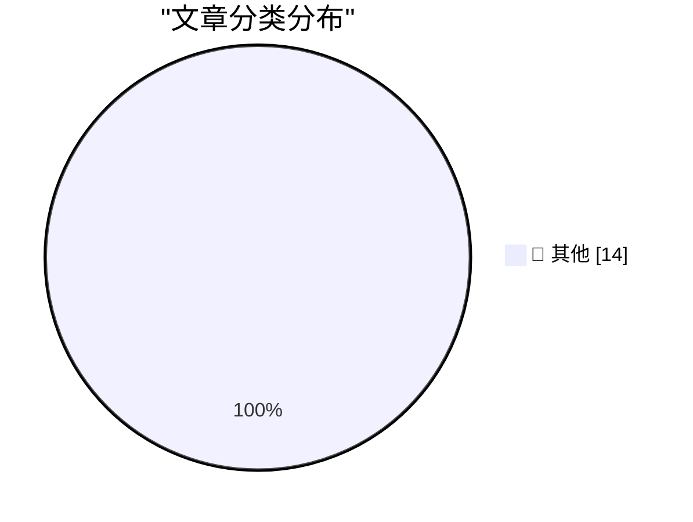

# 📰 AI 博客每日精选 — 2026-09-06

> 来自 Karpathy 推荐的 92 个顶级技术博客，AI 精选 Top 14

## 🏆 今日必读

🥇 **Using Blender with coding agents on macOS**

[Using Blender with coding agents on macOS](https://simonwillison.net/2026/Sep/5/blender-coding-agents-macos/) — simonwillison.net · 2 小时前 · 📝 其他

> Using Blender with coding agents on macOS

🥈 **The Pelican comparison grid for Astra is pretty interesting**

[The Pelican comparison grid for Astra is pretty interesting](https://simonwillison.net/2026/Sep/4/astra-pelicans/) — simonwillison.net · 18 小时前 · 📝 其他

> The Pelican comparison grid for Astra is pretty interesting

🥉 **‘Bob and Van’**

[‘Bob and Van’](https://marco.org/2026/09/04/bob-and-van) — daringfireball.net · 1 小时前 · 📝 其他

> ‘Bob and Van’

---

## 📊 数据概览

| 扫描源 | 抓取文章 | 时间范围 | 精选 |
|:---:|:---:|:---:|:---:|
| 84/92 | 2551 篇 → 14 篇 | 24h | **14 篇** |

### 分类分布

---

## 📝 其他

### 1. Using Blender with coding agents on macOS

[Using Blender with coding agents on macOS](https://simonwillison.net/2026/Sep/5/blender-coding-agents-macos/) — **simonwillison.net** · 2 小时前 · ⭐ 15/30

> Using Blender with coding agents on macOS

---

### 2. The Pelican comparison grid for Astra is pretty interesting

[The Pelican comparison grid for Astra is pretty interesting](https://simonwillison.net/2026/Sep/4/astra-pelicans/) — **simonwillison.net** · 18 小时前 · ⭐ 15/30

> The Pelican comparison grid for Astra is pretty interesting

---

### 3. ‘Bob and Van’

[‘Bob and Van’](https://marco.org/2026/09/04/bob-and-van) — **daringfireball.net** · 1 小时前 · ⭐ 15/30

> ‘Bob and Van’

---

### 4. Adobe Names Anil Chakravarthy as CEO, Replacing Shantanu Narayen

[Adobe Names Anil Chakravarthy as CEO, Replacing Shantanu Narayen](https://www.cnbc.com/2026/09/03/adobe-anil-chakravarthy-ceo.html) — **daringfireball.net** · 18 小时前 · ⭐ 15/30

> Adobe Names Anil Chakravarthy as CEO, Replacing Shantanu Narayen

---

### 5. NBA Brings the Hammer on the Clippers — $30 Million Fine, 5 First-Round Draft Picks, and Steve Ballmer Is Banned for a Year

[NBA Brings the Hammer on the Clippers — $30 Million Fine, 5 First-Round Draft Picks, and Steve Ballmer Is Banned for a Year](https://www.nytimes.com/athletic/7513882/2026/09/02/clippers-kawhi-leonard-punishment-fine-suspensions-nba-investigation/?unlocked_article_code=1.-lA.wcSN.awOHwzojR5nR) — **daringfireball.net** · 18 小时前 · ⭐ 15/30

> NBA Brings the Hammer on the Clippers — $30 Million Fine, 5 First-Round Draft Picks, and Steve Ballmer Is Banned for a Year

---

### 6. Apple Fixed ‎TestFlight’s Screwy Sort Order

[Apple Fixed ‎TestFlight’s Screwy Sort Order](https://apps.apple.com/us/app/testflight/id899247664) — **daringfireball.net** · 22 小时前 · ⭐ 15/30

> Apple Fixed ‎TestFlight’s Screwy Sort Order

---

### 7. Vinted

[Vinted](https://www.vinted.com/) — **daringfireball.net** · 22 小时前 · ⭐ 15/30

> Vinted

---

### 8. ★ Writing With Unnatural Constraints

[★ Writing With Unnatural Constraints](https://daringfireball.net/2026/09/writing_with_unnatural_constraints) — **daringfireball.net** · 23 小时前 · ⭐ 15/30

> ★ Writing With Unnatural Constraints

---

### 9. Pluralistic: Google skates (05 Sep 2026)

[Pluralistic: Google skates (05 Sep 2026)](https://pluralistic.net/2026/09/05/divorce-court/) — **pluralistic.net** · 10 小时前 · ⭐ 15/30

> Pluralistic: Google skates (05 Sep 2026)

---

### 10. Book Review: The Passing of the Dragon and Other Stories by Ken Liu ★★★★☆

[Book Review: The Passing of the Dragon and Other Stories by Ken Liu ★★★★☆](https://shkspr.mobi/blog/2026/09/book-review-the-passing-of-the-dragon-and-other-stories-by-ken-liu/) — **shkspr.mobi** · 6 小时前 · ⭐ 15/30

> Book Review: The Passing of the Dragon and Other Stories by Ken Liu ★★★★☆

---

### 11. Latent Powers

[Latent Powers](https://lucumr.pocoo.org/2026/9/5/latent-powers/) — **lucumr.pocoo.org** · 18 小时前 · ⭐ 15/30

> Latent Powers

---

### 12. Proof of the rank-trace theorem

[Proof of the rank-trace theorem](https://www.johndcook.com/blog/2026/09/05/proof-of-the-rank-trace-theorem/) — **johndcook.com** · 1 小时前 · ⭐ 15/30

> Proof of the rank-trace theorem

---

### 13. This Week in Package Management: 5 September 2026

[This Week in Package Management: 5 September 2026](https://nesbitt.io/2026/09/05/this-week-in-package-management.html) — **nesbitt.io** · 8 小时前 · ⭐ 15/30

> This Week in Package Management: 5 September 2026

---

### 14. Reading List - 09/05/2026

[Reading List - 09/05/2026](https://www.construction-physics.com/p/reading-list-09052026) — **construction-physics.com** · 6 小时前 · ⭐ 15/30

> Reading List - 09/05/2026

---

*生成于 2026-09-06 02:06 (Asia/Shanghai) | 扫描 84 源 → 获取 2551 篇 → 精选 14 篇*
*基于 [Hacker News Popularity Contest 2025](https://refactoringenglish.com/tools/hn-popularity/) RSS 源列表，由 [Andrej Karpathy](https://x.com/karpathy) 推荐*
*由「懂点儿AI」制作，欢迎关注同名微信公众号获取更多 AI 实用技巧 💡*
