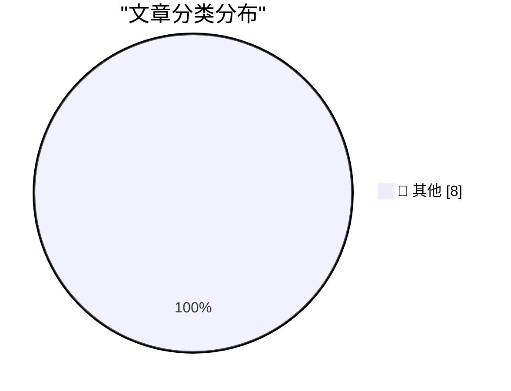

# 📰 AI 博客每日精选 — 2026-09-08

> 来自 Karpathy 推荐的 92 个顶级技术博客，AI 精选 Top 8

## 🏆 今日必读

🥇 **Research acceleration: The view inside OpenAI**

[Research acceleration: The view inside OpenAI](https://simonwillison.net/2026/Sep/6/research-acceleration-the-view-inside-openai/) — simonwillison.net · 19 小时前 · 📝 其他

> Research acceleration: The view inside OpenAI

🥈 **★ It’s True That I Stole Your Lighter, and It’s Also True That I Lost the Map**

[★ It’s True That I Stole Your Lighter, and It’s Also True That I Lost the Map](https://daringfireball.net/2026/09/its_true_that_i_stole_your_lighter) — daringfireball.net · 3 小时前 · 📝 其他

> ★ It’s True That I Stole Your Lighter, and It’s Also True That I Lost the Map

🥉 **Meta AI Has a Native Mac App Now, and It Seems Decent**

[Meta AI Has a Native Mac App Now, and It Seems Decent](https://9to5mac.com/2026/08/19/meta-ai-is-now-available-as-a-more-capable-desktop-app-for-mac/) — daringfireball.net · 23 小时前 · 📝 其他

> Meta AI Has a Native Mac App Now, and It Seems Decent

---

## 📊 数据概览

| 扫描源 | 抓取文章 | 时间范围 | 精选 |
|:---:|:---:|:---:|:---:|
| 84/92 | 2553 篇 → 8 篇 | 24h | **8 篇** |

### 分类分布

---

## 📝 其他

### 1. Research acceleration: The view inside OpenAI

[Research acceleration: The view inside OpenAI](https://simonwillison.net/2026/Sep/6/research-acceleration-the-view-inside-openai/) — **simonwillison.net** · 19 小时前 · ⭐ 15/30

> Research acceleration: The view inside OpenAI

---

### 2. ★ It’s True That I Stole Your Lighter, and It’s Also True That I Lost the Map

[★ It’s True That I Stole Your Lighter, and It’s Also True That I Lost the Map](https://daringfireball.net/2026/09/its_true_that_i_stole_your_lighter) — **daringfireball.net** · 3 小时前 · ⭐ 15/30

> ★ It’s True That I Stole Your Lighter, and It’s Also True That I Lost the Map

---

### 3. Meta AI Has a Native Mac App Now, and It Seems Decent

[Meta AI Has a Native Mac App Now, and It Seems Decent](https://9to5mac.com/2026/08/19/meta-ai-is-now-available-as-a-more-capable-desktop-app-for-mac/) — **daringfireball.net** · 23 小时前 · ⭐ 15/30

> Meta AI Has a Native Mac App Now, and It Seems Decent

---

### 4. Pluralistic: How corporate America built a better Roach Motel (07 Sep 2026)

[Pluralistic: How corporate America built a better Roach Motel (07 Sep 2026)](https://pluralistic.net/2026/09/06/hotels-california/) — **pluralistic.net** · 14 小时前 · ⭐ 15/30

> Pluralistic: How corporate America built a better Roach Motel (07 Sep 2026)

---

### 5. Ngram error rate

[Ngram error rate](https://www.johndcook.com/blog/2026/09/07/ngram-error-rate/) — **johndcook.com** · 1 小时前 · ⭐ 15/30

> Ngram error rate

---

### 6. The Education of a Doomer

[The Education of a Doomer](https://borretti.me/article/the-education-of-a-doomer) — **borretti.me** · 5 小时前 · ⭐ 15/30

> The Education of a Doomer

---

### 7. The ill-fated HP-Compaq merger

[The ill-fated HP-Compaq merger](https://dfarq.homeip.net/the-ill-fated-hp-compaq-merger/?utm_source=rss&#038;utm_medium=rss&#038;utm_campaign=the-ill-fated-hp-compaq-merger) — **dfarq.homeip.net** · 8 小时前 · ⭐ 15/30

> The ill-fated HP-Compaq merger

---

### 8. Weekly Update 520: The Unscripted Edition

[Weekly Update 520: The Unscripted Edition](https://www.troyhunt.com/weekly-update-520/) — **troyhunt.com** · 20 小时前 · ⭐ 15/30

> Weekly Update 520: The Unscripted Edition

---

*生成于 2026-09-08 03:49 (Asia/Shanghai) | 扫描 84 源 → 获取 2553 篇 → 精选 8 篇*
*基于 [Hacker News Popularity Contest 2025](https://refactoringenglish.com/tools/hn-popularity/) RSS 源列表，由 [Andrej Karpathy](https://x.com/karpathy) 推荐*
*由「懂点儿AI」制作，欢迎关注同名微信公众号获取更多 AI 实用技巧 💡*
