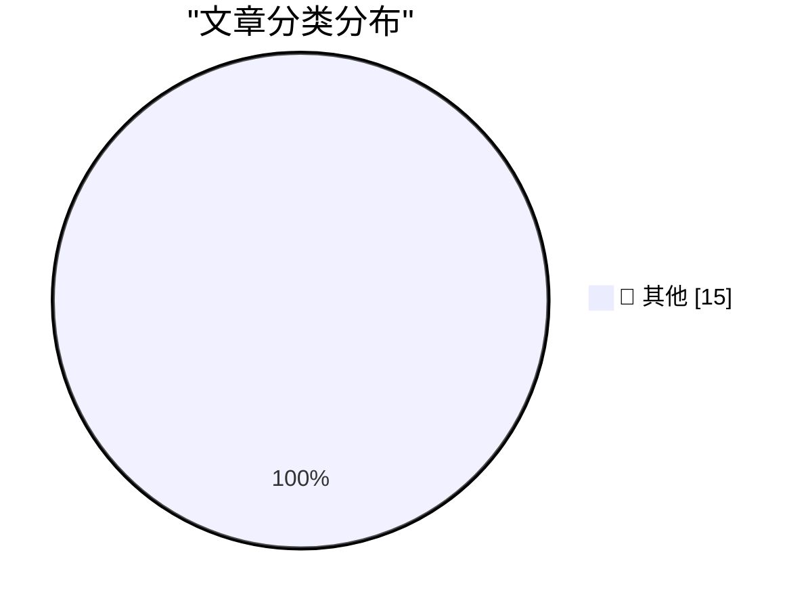

# 📰 AI 博客每日精选 — 2026-09-09

> 来自 Karpathy 推荐的 92 个顶级技术博客，AI 精选 Top 15

## 🏆 今日必读

🥇 **llm 0.35**

[llm 0.35](https://simonwillison.net/2026/Sep/7/llm/) — simonwillison.net · 19 小时前 · 📝 其他

> llm 0.35

🥈 **Creepy crawlies**

[Creepy crawlies](https://simonwillison.net/2026/Sep/7/creepy-crawlies/) — simonwillison.net · 20 小时前 · 📝 其他

> Creepy crawlies

🥉 **Quoting Jakub Pachocki**

[Quoting Jakub Pachocki](https://simonwillison.net/2026/Sep/7/jakub-pachocki/) — simonwillison.net · 20 小时前 · 📝 其他

> Quoting Jakub Pachocki

---

## 📊 数据概览

| 扫描源 | 抓取文章 | 时间范围 | 精选 |
|:---:|:---:|:---:|:---:|
| 82/92 | 2499 篇 → 21 篇 | 24h | **15 篇** |

### 分类分布

---

## 📝 其他

### 1. llm 0.35

[llm 0.35](https://simonwillison.net/2026/Sep/7/llm/) — **simonwillison.net** · 19 小时前 · ⭐ 15/30

> llm 0.35

---

### 2. Creepy crawlies

[Creepy crawlies](https://simonwillison.net/2026/Sep/7/creepy-crawlies/) — **simonwillison.net** · 20 小时前 · ⭐ 15/30

> Creepy crawlies

---

### 3. Quoting Jakub Pachocki

[Quoting Jakub Pachocki](https://simonwillison.net/2026/Sep/7/jakub-pachocki/) — **simonwillison.net** · 20 小时前 · ⭐ 15/30

> Quoting Jakub Pachocki

---

### 4. OpenNMC is an open replacement for expensive APC management cards

[OpenNMC is an open replacement for expensive APC management cards](https://www.jeffgeerling.com/blog/2026/opennmc-apc-ups-replacement-card/) — **jeffgeerling.com** · 3 小时前 · ⭐ 15/30

> OpenNMC is an open replacement for expensive APC management cards

---

### 5. Automatically detecting AI text in my browser

[Automatically detecting AI text in my browser](https://seangoedecke.com/deckard/) — **seangoedecke.com** · 19 小时前 · ⭐ 15/30

> Automatically detecting AI text in my browser

---

### 6. ★ SuperDuper 4

[★ SuperDuper 4](https://daringfireball.net/2026/09/superduper_4) — **daringfireball.net** · 4 小时前 · ⭐ 15/30

> ★ SuperDuper 4

---

### 7. [Sponsor] Glyphs 4

[[Sponsor] Glyphs 4](https://glyphsapp.com/) — **daringfireball.net** · 21 小时前 · ⭐ 15/30

> [Sponsor] Glyphs 4

---

### 8. Trackables 1.5

[Trackables 1.5](https://trackables.app/) — **daringfireball.net** · 21 小时前 · ⭐ 15/30

> Trackables 1.5

---

### 9. The Onion’s Exclusive Interview With Larry Ellison

[The Onion’s Exclusive Interview With Larry Ellison](https://theonion.com/the-onions-exclusive-interview-with-larry-ellison/) — **daringfireball.net** · 23 小时前 · ⭐ 15/30

> The Onion’s Exclusive Interview With Larry Ellison

---

### 10. McKinley 1.0

[McKinley 1.0](https://mckinleysymbols.com/) — **daringfireball.net** · 23 小时前 · ⭐ 15/30

> McKinley 1.0

---

### 11. Matt Birchler’s Folding iPhone Predictions

[Matt Birchler’s Folding iPhone Predictions](https://birchtree.me/blog/my-folding-iphone-predictions/) — **daringfireball.net** · 23 小时前 · ⭐ 15/30

> Matt Birchler’s Folding iPhone Predictions

---

### 12. I found an old interview mine (2017)

[I found an old interview mine (2017)](https://idiallo.com/byte-size/interviewing-with-thatsoftware-dude) — **idiallo.com** · 20 小时前 · ⭐ 15/30

> I found an old interview mine (2017)

---

### 13. Clickable whitespace

[Clickable whitespace](https://idiallo.com/blog/clickable-whitespace) — **idiallo.com** · 21 小时前 · ⭐ 15/30

> Clickable whitespace

---

### 14. ActivityPub - Is it worth defending against replay attacks and message/signature time skew?

[ActivityPub - Is it worth defending against replay attacks and message/signature time skew?](https://shkspr.mobi/blog/2026/09/activitypub-is-it-worth-defending-against-replay-attacks-and-message-signature-time-skew/) — **shkspr.mobi** · 7 小时前 · ⭐ 15/30

> ActivityPub - Is it worth defending against replay attacks and message/signature time skew?

---

### 15. A sample use of the winstart.bat file in Windows 95

[A sample use of the winstart.bat file in Windows 95](https://devblogs.microsoft.com/oldnewthing/20260908-00/?p=112679) — **devblogs.microsoft.com/oldnewthing** · 5 小时前 · ⭐ 15/30

> A sample use of the winstart.bat file in Windows 95

---

*生成于 2026-09-09 03:23 (Asia/Shanghai) | 扫描 82 源 → 获取 2499 篇 → 精选 15 篇*
*基于 [Hacker News Popularity Contest 2025](https://refactoringenglish.com/tools/hn-popularity/) RSS 源列表，由 [Andrej Karpathy](https://x.com/karpathy) 推荐*
*由「懂点儿AI」制作，欢迎关注同名微信公众号获取更多 AI 实用技巧 💡*
