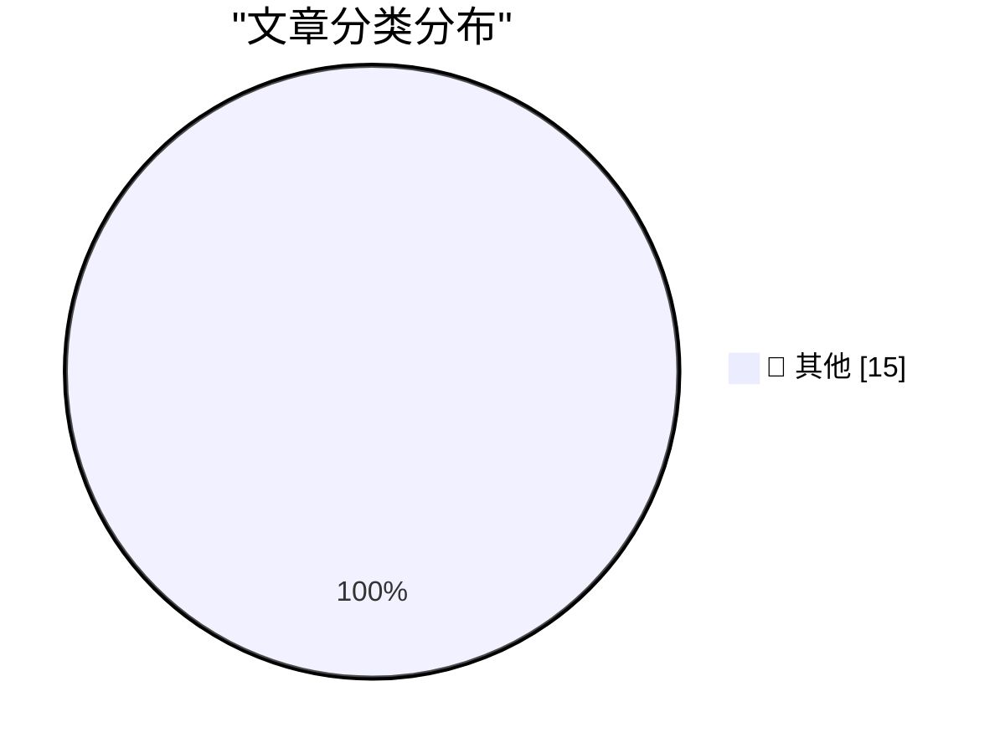

# 📰 AI 博客每日精选 — 2026-09-10

> 来自 Karpathy 推荐的 92 个顶级技术博客，AI 精选 Top 15

## 🏆 今日必读

🥇 **Quoting Terence Tao**

[Quoting Terence Tao](https://simonwillison.net/2026/Sep/9/terence-tao/) — simonwillison.net · 18 小时前 · 📝 其他

> Quoting Terence Tao

🥈 **On the Navier–Stokes Millennium Prize Problem**

[On the Navier–Stokes Millennium Prize Problem](https://simonwillison.net/2026/Sep/8/on-navier-stokes/) — simonwillison.net · 19 小时前 · 📝 其他

> On the Navier–Stokes Millennium Prize Problem

🥉 **Introducing ChatGPT Images 2.5**

[Introducing ChatGPT Images 2.5](https://simonwillison.net/2026/Sep/8/introducing-chatgpt-images-25/) — simonwillison.net · 20 小时前 · 📝 其他

> Introducing ChatGPT Images 2.5

---

## 📊 数据概览

| 扫描源 | 抓取文章 | 时间范围 | 精选 |
|:---:|:---:|:---:|:---:|
| 83/92 | 2524 篇 → 16 篇 | 24h | **15 篇** |

### 分类分布

---

## 📝 其他

### 1. Quoting Terence Tao

[Quoting Terence Tao](https://simonwillison.net/2026/Sep/9/terence-tao/) — **simonwillison.net** · 18 小时前 · ⭐ 15/30

> Quoting Terence Tao

---

### 2. On the Navier–Stokes Millennium Prize Problem

[On the Navier–Stokes Millennium Prize Problem](https://simonwillison.net/2026/Sep/8/on-navier-stokes/) — **simonwillison.net** · 19 小时前 · ⭐ 15/30

> On the Navier–Stokes Millennium Prize Problem

---

### 3. Introducing ChatGPT Images 2.5

[Introducing ChatGPT Images 2.5](https://simonwillison.net/2026/Sep/8/introducing-chatgpt-images-25/) — **simonwillison.net** · 20 小时前 · ⭐ 15/30

> Introducing ChatGPT Images 2.5

---

### 4. Why we should anthropomorphize AI agents

[Why we should anthropomorphize AI agents](https://seangoedecke.com/why-we-should-anthropomorphize-ai-agents/) — **seangoedecke.com** · 19 小时前 · ⭐ 15/30

> Why we should anthropomorphize AI agents

---

### 5. Microsoft Plugs Nearly 1,000 Security Holes

[Microsoft Plugs Nearly 1,000 Security Holes](https://krebsonsecurity.com/2026/09/microsoft-plugs-nearly-1000-security-holes/) — **krebsonsecurity.com** · 21 小时前 · ⭐ 15/30

> Microsoft Plugs Nearly 1,000 Security Holes

---

### 6. ★ The iPhone Air and iPhone 17 Pro

[★ The iPhone Air and iPhone 17 Pro](https://daringfireball.net/2026/09/the_iphone_air_and_iphone_17_pro) — **daringfireball.net** · 18 小时前 · ⭐ 15/30

> ★ The iPhone Air and iPhone 17 Pro

---

### 7. ‘Modern Day Typographer’

[‘Modern Day Typographer’](https://www.youtube.com/watch?v=0Ck-NPqf2c8) — **daringfireball.net** · 20 小时前 · ⭐ 15/30

> ‘Modern Day Typographer’

---

### 8. Pluralistic: Anti-vax/anti-trust (09 Sep 2026)

[Pluralistic: Anti-vax/anti-trust (09 Sep 2026)](https://pluralistic.net/2026/09/09/when-it-dont-rain/) — **pluralistic.net** · 8 小时前 · ⭐ 15/30

> Pluralistic: Anti-vax/anti-trust (09 Sep 2026)

---

### 9. A 50-year-old computer-assisted proof

[A 50-year-old computer-assisted proof](https://www.johndcook.com/blog/2026/09/09/four-colors/) — **johndcook.com** · 4 小时前 · ⭐ 15/30

> A 50-year-old computer-assisted proof

---

### 10. AI is an intelligence multiplier

[AI is an intelligence multiplier](https://www.johndcook.com/blog/2026/09/09/ai-multiplier/) — **johndcook.com** · 4 小时前 · ⭐ 15/30

> AI is an intelligence multiplier

---

### 11. The part of Navier-Stokes no one is talking about

[The part of Navier-Stokes no one is talking about](https://www.johndcook.com/blog/2026/09/09/formal-method-revolution/) — **johndcook.com** · 6 小时前 · ⭐ 15/30

> The part of Navier-Stokes no one is talking about

---

### 12. Better AI code comment detector

[Better AI code comment detector](https://entropicthoughts.com/better-ai-comment-classifier) — **entropicthoughts.com** · 21 小时前 · ⭐ 15/30

> Better AI code comment detector

---

### 13. Don’t Let Anyone Take Away Your Big Box of Cables

[Don’t Let Anyone Take Away Your Big Box of Cables](https://blog.jim-nielsen.com/2026/hands-off-my-cables/) — **blog.jim-nielsen.com** · 13 分钟前 · ⭐ 15/30

> Don’t Let Anyone Take Away Your Big Box of Cables

---

### 14. The first VHS VCR: JVC HR-3300

[The first VHS VCR: JVC HR-3300](https://dfarq.homeip.net/the-first-vhs-vcr-jvc-hr-3300/?utm_source=rss&#038;utm_medium=rss&#038;utm_campaign=the-first-vhs-vcr-jvc-hr-3300) — **dfarq.homeip.net** · 8 小时前 · ⭐ 15/30

> The first VHS VCR: JVC HR-3300

---

### 15. Analysing 2048 on a 3×3 board

[Analysing 2048 on a 3×3 board](https://www.chiark.greenend.org.uk/~sgtatham/quasiblog/small2048/) — **chiark.greenend.org.uk/~sgtatham** · 19 小时前 · ⭐ 15/30

> Analysing 2048 on a 3×3 board

---

*生成于 2026-09-10 03:13 (Asia/Shanghai) | 扫描 83 源 → 获取 2524 篇 → 精选 15 篇*
*基于 [Hacker News Popularity Contest 2025](https://refactoringenglish.com/tools/hn-popularity/) RSS 源列表，由 [Andrej Karpathy](https://x.com/karpathy) 推荐*
*由「懂点儿AI」制作，欢迎关注同名微信公众号获取更多 AI 实用技巧 💡*
