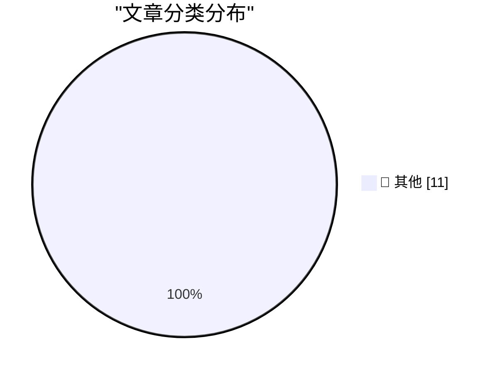

# 📰 AI 博客每日精选 — 2026-09-11

> 来自 Karpathy 推荐的 92 个顶级技术博客，AI 精选 Top 11

## 🏆 今日必读

🥇 **Quoting Calif Research**

[Quoting Calif Research](https://simonwillison.net/2026/Sep/10/calif-research/) — simonwillison.net · 18 小时前 · 📝 其他

> Quoting Calif Research

🥈 **.blend URL Viewer**

[.blend URL Viewer](https://simonwillison.net/2026/Sep/9/blender-viewer/) — simonwillison.net · 19 小时前 · 📝 其他

> .blend URL Viewer

🥉 **They really do think AI might kill everyone**

[They really do think AI might kill everyone](https://seangoedecke.com/they-really-do-think-ai-might-kill-everyone/) — seangoedecke.com · 19 小时前 · 📝 其他

> They really do think AI might kill everyone

---

## 📊 数据概览

| 扫描源 | 抓取文章 | 时间范围 | 精选 |
|:---:|:---:|:---:|:---:|
| 84/92 | 2554 篇 → 11 篇 | 24h | **11 篇** |

### 分类分布

---

## 📝 其他

### 1. Quoting Calif Research

[Quoting Calif Research](https://simonwillison.net/2026/Sep/10/calif-research/) — **simonwillison.net** · 18 小时前 · ⭐ 15/30

> Quoting Calif Research

---

### 2. .blend URL Viewer

[.blend URL Viewer](https://simonwillison.net/2026/Sep/9/blender-viewer/) — **simonwillison.net** · 19 小时前 · ⭐ 15/30

> .blend URL Viewer

---

### 3. They really do think AI might kill everyone

[They really do think AI might kill everyone](https://seangoedecke.com/they-really-do-think-ai-might-kill-everyone/) — **seangoedecke.com** · 19 小时前 · ⭐ 15/30

> They really do think AI might kill everyone

---

### 4. Joanna Stern on the iPhone Duo

[Joanna Stern on the iPhone Duo](https://youtu.be/VNzl-q0EGfg) — **daringfireball.net** · 1 小时前 · ⭐ 15/30

> Joanna Stern on the iPhone Duo

---

### 5. We own the Glass

[We own the Glass](https://idiallo.com/byte-size/) — **idiallo.com** · 22 小时前 · ⭐ 15/30

> We own the Glass

---

### 6. Put an AV test at the start of your slides

[Put an AV test at the start of your slides](https://shkspr.mobi/blog/2026/09/put-an-av-test-at-the-start-of-your-slides/) — **shkspr.mobi** · 7 小时前 · ⭐ 15/30

> Put an AV test at the start of your slides

---

### 7. Bayesian OCR

[Bayesian OCR](https://www.johndcook.com/blog/2026/09/10/bayesian-ocr/) — **johndcook.com** · 6 小时前 · ⭐ 15/30

> Bayesian OCR

---

### 8. AI Is Breaking This Thing We Call Trust

[AI Is Breaking This Thing We Call Trust](https://terriblesoftware.org/2026/09/10/ai-is-breaking-this-thing-we-call-trust/) — **terriblesoftware.org** · 4 小时前 · ⭐ 15/30

> AI Is Breaking This Thing We Call Trust

---

### 9. Package Manager Trends

[Package Manager Trends](https://nesbitt.io/2026/09/10/package-manager-trends.html) — **nesbitt.io** · 9 小时前 · ⭐ 15/30

> Package Manager Trends

---

### 10. Automattic Minus Matt

[Automattic Minus Matt](https://feed.tedium.co/link/15204/17444080/matt-mullenweg-automattic-leave-absence) — **tedium.co** · 13 小时前 · ⭐ 15/30

> Automattic Minus Matt

---

### 11. When the RIAA sued a 12-year-old for MP3 piracy

[When the RIAA sued a 12-year-old for MP3 piracy](https://dfarq.homeip.net/that-time-the-riaa-sued-a-12-year-old-for-mp3-usage/?utm_source=rss&#038;utm_medium=rss&#038;utm_campaign=that-time-the-riaa-sued-a-12-year-old-for-mp3-usage) — **dfarq.homeip.net** · 8 小时前 · ⭐ 15/30

> When the RIAA sued a 12-year-old for MP3 piracy

---

*生成于 2026-09-11 03:04 (Asia/Shanghai) | 扫描 84 源 → 获取 2554 篇 → 精选 11 篇*
*基于 [Hacker News Popularity Contest 2025](https://refactoringenglish.com/tools/hn-popularity/) RSS 源列表，由 [Andrej Karpathy](https://x.com/karpathy) 推荐*
*由「懂点儿AI」制作，欢迎关注同名微信公众号获取更多 AI 实用技巧 💡*
