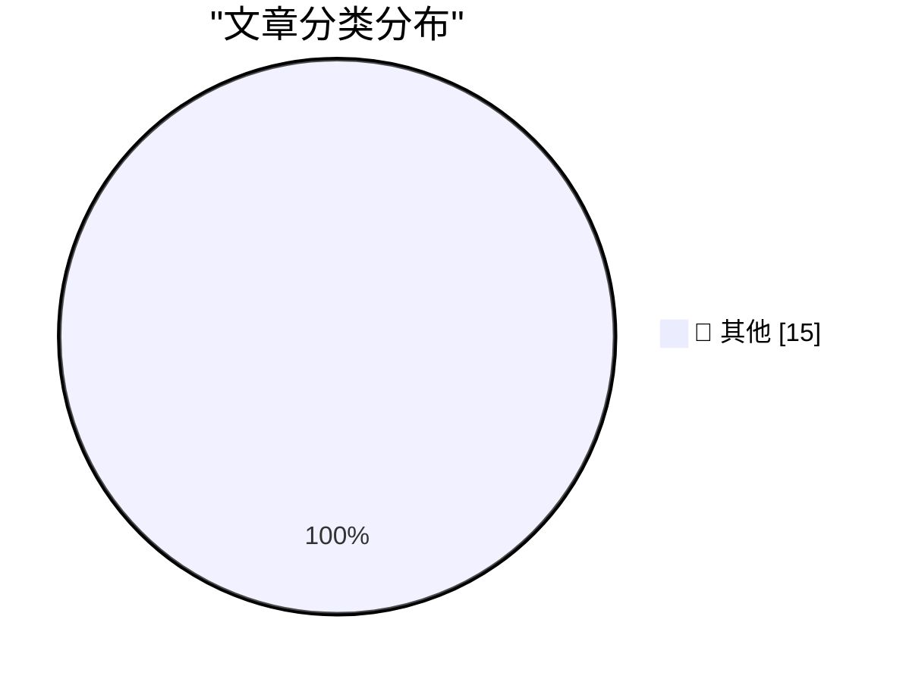

# 📰 AI 博客每日精选 — 2026-09-12

> 来自 Karpathy 推荐的 92 个顶级技术博客，AI 精选 Top 15

## 🏆 今日必读

🥇 **Quoting Boris Cherny**

[Quoting Boris Cherny](https://simonwillison.net/2026/Sep/11/boris-cherny/) — simonwillison.net · 1 小时前 · 📝 其他

> Quoting Boris Cherny

🥈 **Quoting huggingface.co/security.txt**

[Quoting huggingface.co/security.txt](https://simonwillison.net/2026/Sep/11/hugging-face-security/) — simonwillison.net · 3 小时前 · 📝 其他

> Quoting huggingface.co/security.txt

🥉 **Soft-deprecating re.match()**

[Soft-deprecating re.match()](https://simonwillison.net/2026/Sep/11/soft-deprecating-re-match/) — simonwillison.net · 4 小时前 · 📝 其他

> Soft-deprecating re.match()

---

## 📊 数据概览

| 扫描源 | 抓取文章 | 时间范围 | 精选 |
|:---:|:---:|:---:|:---:|
| 83/92 | 2524 篇 → 19 篇 | 24h | **15 篇** |

### 分类分布

---

## 📝 其他

### 1. Quoting Boris Cherny

[Quoting Boris Cherny](https://simonwillison.net/2026/Sep/11/boris-cherny/) — **simonwillison.net** · 1 小时前 · ⭐ 15/30

> Quoting Boris Cherny

---

### 2. Quoting huggingface.co/security.txt

[Quoting huggingface.co/security.txt](https://simonwillison.net/2026/Sep/11/hugging-face-security/) — **simonwillison.net** · 3 小时前 · ⭐ 15/30

> Quoting huggingface.co/security.txt

---

### 3. Soft-deprecating re.match()

[Soft-deprecating re.match()](https://simonwillison.net/2026/Sep/11/soft-deprecating-re-match/) — **simonwillison.net** · 4 小时前 · ⭐ 15/30

> Soft-deprecating re.match()

---

### 4. Don't sleep on wrapture

[Don't sleep on wrapture](https://simonwillison.net/2026/Sep/11/wrapture/) — **simonwillison.net** · 5 小时前 · ⭐ 15/30

> Don't sleep on wrapture

---

### 5. Datasette 1.0a39 and 0.65.4 security releases

[Datasette 1.0a39 and 0.65.4 security releases](https://simonwillison.net/2026/Sep/11/datasette-security/) — **simonwillison.net** · 15 小时前 · ⭐ 15/30

> Datasette 1.0a39 and 0.65.4 security releases

---

### 6. Any Nix package, live in your browser

[Any Nix package, live in your browser](https://simonwillison.net/2026/Sep/10/trynix/) — **simonwillison.net** · 19 小时前 · ⭐ 15/30

> Any Nix package, live in your browser

---

### 7. Native is now the future of mobile at Shopify

[Native is now the future of mobile at Shopify](https://simonwillison.net/2026/Sep/10/shopify-react-native/) — **simonwillison.net** · 21 小时前 · ⭐ 15/30

> Native is now the future of mobile at Shopify

---

### 8. iPhone Duo Only Works With the $80 USB-C Apple Pencil, Not the $130 Apple Pencil Pro

[iPhone Duo Only Works With the $80 USB-C Apple Pencil, Not the $130 Apple Pencil Pro](https://www.macrumors.com/2026/09/09/apple-pencil-usb-c-iphone-duo/) — **daringfireball.net** · 2 小时前 · ⭐ 15/30

> iPhone Duo Only Works With the $80 USB-C Apple Pencil, Not the $130 Apple Pencil Pro

---

### 9. Apple’s OS 27 Updates Will Be Released on Monday, 14 September

[Apple’s OS 27 Updates Will Be Released on Monday, 14 September](https://9to5mac.com/2026/09/09/apple-confirms-macos-27-golden-gate-launch-date-september-14/) — **daringfireball.net** · 22 小时前 · ⭐ 15/30

> Apple’s OS 27 Updates Will Be Released on Monday, 14 September

---

### 10. Pluralistic: Inefficiency is bad, actually (11 Sep 2026)

[Pluralistic: Inefficiency is bad, actually (11 Sep 2026)](https://pluralistic.net/2026/09/11/mazzucato-thought/) — **pluralistic.net** · 4 小时前 · ⭐ 15/30

> Pluralistic: Inefficiency is bad, actually (11 Sep 2026)

---

### 11. [RSS Club] Sneak peek at new DOI functionality

[[RSS Club] Sneak peek at new DOI functionality](https://shkspr.mobi/blog/2026/09/rss-club-sneak-peek-at-new-doi-functionality/) — **shkspr.mobi** · 7 小时前 · ⭐ 15/30

> [RSS Club] Sneak peek at new DOI functionality

---

### 12. Where Has Construction Automation Been Successful?

[Where Has Construction Automation Been Successful?](https://www.construction-physics.com/p/where-has-construction-automation) — **construction-physics.com** · 7 小时前 · ⭐ 15/30

> Where Has Construction Automation Been Successful?

---

### 13. The Worst Spam Emails

[The Worst Spam Emails](https://feed.tedium.co/link/15204/17445398/ilands-agents-email-spam-kaixin-tang) — **tedium.co** · 5 小时前 · ⭐ 15/30

> The Worst Spam Emails

---

### 14. AI researchers debate how close we are to recursive self-improvement

[AI researchers debate how close we are to recursive self-improvement](https://www.dwarkesh.com/p/john-beren-charlie) — **dwarkesh.com** · 2 小时前 · ⭐ 15/30

> AI researchers debate how close we are to recursive self-improvement

---

### 15. Premium: The Hater's Guide To Broadcom

[Premium: The Hater's Guide To Broadcom](https://www.wheresyoured.at/premium-the-haters-guide-to-broadcom/) — **wheresyoured.at** · 5 小时前 · ⭐ 15/30

> Premium: The Hater's Guide To Broadcom

---

*生成于 2026-09-12 03:06 (Asia/Shanghai) | 扫描 83 源 → 获取 2524 篇 → 精选 15 篇*
*基于 [Hacker News Popularity Contest 2025](https://refactoringenglish.com/tools/hn-popularity/) RSS 源列表，由 [Andrej Karpathy](https://x.com/karpathy) 推荐*
*由「懂点儿AI」制作，欢迎关注同名微信公众号获取更多 AI 实用技巧 💡*
