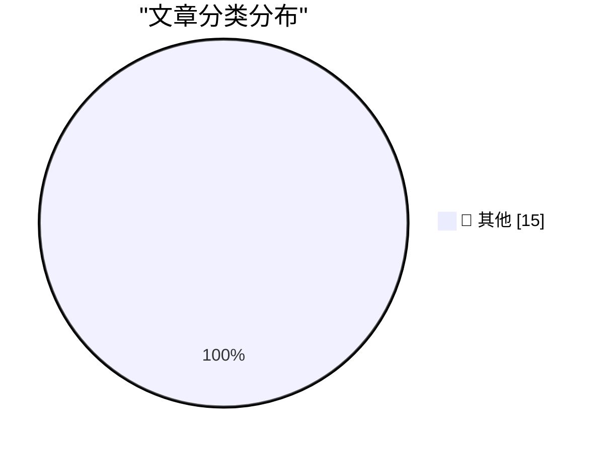

# 📰 AI 博客每日精选 — 2026-09-13

> 来自 Karpathy 推荐的 92 个顶级技术博客，AI 精选 Top 15

## 🏆 今日必读

🥇 **Quoting Paul Ford**

[Quoting Paul Ford](https://simonwillison.net/2026/Sep/12/paul-ford/) — simonwillison.net · 17 分钟前 · 📝 其他

> Quoting Paul Ford

🥈 **OpenAI agents attacked RubyGems back in May**

[OpenAI agents attacked RubyGems back in May](https://simonwillison.net/2026/Sep/12/openai-agents-rubygems/) — simonwillison.net · 17 小时前 · 📝 其他

> OpenAI agents attacked RubyGems back in May

🥉 **So you want to use OpenRouter?**

[So you want to use OpenRouter?](https://simonwillison.net/2026/Sep/11/so-you-want-to-use-openrouter/) — simonwillison.net · 19 小时前 · 📝 其他

> So you want to use OpenRouter?

---

## 📊 数据概览

| 扫描源 | 抓取文章 | 时间范围 | 精选 |
|:---:|:---:|:---:|:---:|
| 83/92 | 2529 篇 → 20 篇 | 24h | **15 篇** |

### 分类分布

---

## 📝 其他

### 1. Quoting Paul Ford

[Quoting Paul Ford](https://simonwillison.net/2026/Sep/12/paul-ford/) — **simonwillison.net** · 17 分钟前 · ⭐ 15/30

> Quoting Paul Ford

---

### 2. OpenAI agents attacked RubyGems back in May

[OpenAI agents attacked RubyGems back in May](https://simonwillison.net/2026/Sep/12/openai-agents-rubygems/) — **simonwillison.net** · 17 小时前 · ⭐ 15/30

> OpenAI agents attacked RubyGems back in May

---

### 3. So you want to use OpenRouter?

[So you want to use OpenRouter?](https://simonwillison.net/2026/Sep/11/so-you-want-to-use-openrouter/) — **simonwillison.net** · 19 小时前 · ⭐ 15/30

> So you want to use OpenRouter?

---

### 4. Don't build tools for AI agents

[Don't build tools for AI agents](https://seangoedecke.com/dont-build-tools-for-ai-agents/) — **seangoedecke.com** · 18 小时前 · ⭐ 15/30

> Don't build tools for AI agents

---

### 5. Post Peek — Litterbox-Inspired Tweet Viewing Extension for Chrome

[Post Peek — Litterbox-Inspired Tweet Viewing Extension for Chrome](https://github.com/tsvb/post-peek) — **daringfireball.net** · 12 分钟前 · ⭐ 15/30

> Post Peek — Litterbox-Inspired Tweet Viewing Extension for Chrome

---

### 6. Where Are the AI-Generated Killer Apps?

[Where Are the AI-Generated Killer Apps?](https://www.nytimes.com/2026/09/12/opinion/ai-software-coding-apps.html?unlocked_article_code=1.AlE.C9EE.H2j5a1eHFUbQ&amp;smid=nytcore-ios-share) — **daringfireball.net** · 1 小时前 · ⭐ 15/30

> Where Are the AI-Generated Killer Apps?

---

### 7. Yours Truly on Off Protocol With Jim Ray

[Yours Truly on Off Protocol With Jim Ray](https://atproto.com/off-protocol/2026-09-11-make-your-own-thing-john-gruber) — **daringfireball.net** · 2 小时前 · ⭐ 15/30

> Yours Truly on Off Protocol With Jim Ray

---

### 8. T-Mobile Is Charging $5/Month for iPhone Handoff

[T-Mobile Is Charging $5/Month for iPhone Handoff](https://www.t-mobile.com/news/devices/iphone-18-pro-iphone-duo-apple-watch-release) — **daringfireball.net** · 2 小时前 · ⭐ 15/30

> T-Mobile Is Charging $5/Month for iPhone Handoff

---

### 9. Tristan Buckmaster’s Statement on Getting Scooped by OpenAI on the Navier-Stokes Problem

[Tristan Buckmaster’s Statement on Getting Scooped by OpenAI on the Navier-Stokes Problem](https://cims.nyu.edu/~tristanb/statement.pdf) — **daringfireball.net** · 3 小时前 · ⭐ 15/30

> Tristan Buckmaster’s Statement on Getting Scooped by OpenAI on the Navier-Stokes Problem

---

### 10. Gary Marcus on This Week in AI Drama

[Gary Marcus on This Week in AI Drama](https://garymarcus.substack.com/p/two-dire-warnings-one-from-terence) — **daringfireball.net** · 3 小时前 · ⭐ 15/30

> Gary Marcus on This Week in AI Drama

---

### 11. Last Year’s iPhone Share Amongst Users of Widgetsmith

[Last Year’s iPhone Share Amongst Users of Widgetsmith](https://mastodon.social/@_Davidsmith/117253170115740653) — **daringfireball.net** · 17 小时前 · ⭐ 15/30

> Last Year’s iPhone Share Amongst Users of Widgetsmith

---

### 12. Clarus the Dogcow Easter Egg in Apple’s OS 27 Settings

[Clarus the Dogcow Easter Egg in Apple’s OS 27 Settings](https://9to5mac.com/2026/09/11/apple-hid-a-classic-mac-easter-egg-in-the-ios-27-settings-app/) — **daringfireball.net** · 21 小时前 · ⭐ 15/30

> Clarus the Dogcow Easter Egg in Apple’s OS 27 Settings

---

### 13. XCancel Is Back

[XCancel Is Back](https://xcancel.com/cdclegal) — **daringfireball.net** · 23 小时前 · ⭐ 15/30

> XCancel Is Back

---

### 14. You Can Drop SEO

[You Can Drop SEO](https://idiallo.com/blog/you-can-drop-the-seo) — **idiallo.com** · 21 小时前 · ⭐ 15/30

> You Can Drop SEO

---

### 15. Pluralistic: LLMs are real, AI is fake (12 Sep 2026)

[Pluralistic: LLMs are real, AI is fake (12 Sep 2026)](https://pluralistic.net/2026/09/12/god-in-the-box/) — **pluralistic.net** · 7 小时前 · ⭐ 15/30

> Pluralistic: LLMs are real, AI is fake (12 Sep 2026)

---

*生成于 2026-09-13 02:17 (Asia/Shanghai) | 扫描 83 源 → 获取 2529 篇 → 精选 15 篇*
*基于 [Hacker News Popularity Contest 2025](https://refactoringenglish.com/tools/hn-popularity/) RSS 源列表，由 [Andrej Karpathy](https://x.com/karpathy) 推荐*
*由「懂点儿AI」制作，欢迎关注同名微信公众号获取更多 AI 实用技巧 💡*
