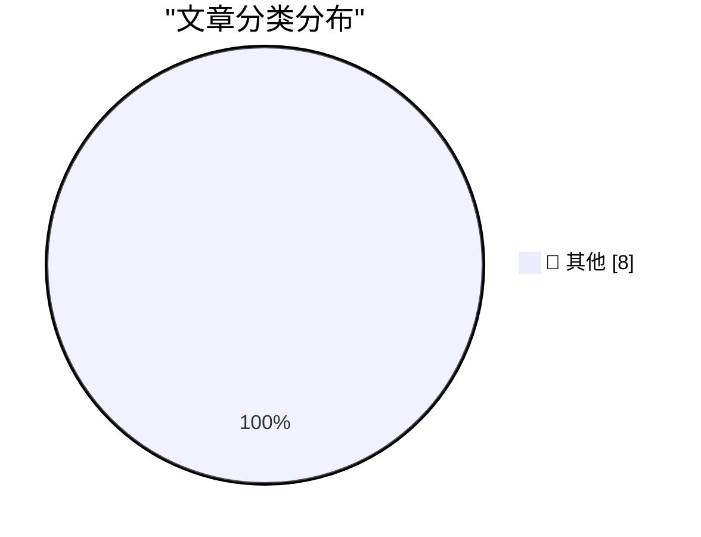

# 📰 AI 博客每日精选 — 2026-09-14

> 来自 Karpathy 推荐的 92 个顶级技术博客，AI 精选 Top 8

## 🏆 今日必读

🥇 **Generating running routes with GPT-6 Astra and ChatGPT Work**

[Generating running routes with GPT-6 Astra and ChatGPT Work](https://simonwillison.net/2026/Sep/12/astra-running-routes/) — simonwillison.net · 18 小时前 · 📝 其他

> Generating running routes with GPT-6 Astra and ChatGPT Work

🥈 **California Brown Pelican**

[California Brown Pelican](https://simonwillison.net/2026/Sep/12/sighting-399708714/) — simonwillison.net · 21 小时前 · 📝 其他

> California Brown Pelican

🥉 **AI is breaking our proxies for expertise**

[AI is breaking our proxies for expertise](https://seangoedecke.com/ai-is-breaking-our-proxies-for-expertise/) — seangoedecke.com · 18 小时前 · 📝 其他

> AI is breaking our proxies for expertise

---

## 📊 数据概览

| 扫描源 | 抓取文章 | 时间范围 | 精选 |
|:---:|:---:|:---:|:---:|
| 82/92 | 2511 篇 → 8 篇 | 24h | **8 篇** |

### 分类分布

---

## 📝 其他

### 1. Generating running routes with GPT-6 Astra and ChatGPT Work

[Generating running routes with GPT-6 Astra and ChatGPT Work](https://simonwillison.net/2026/Sep/12/astra-running-routes/) — **simonwillison.net** · 18 小时前 · ⭐ 15/30

> Generating running routes with GPT-6 Astra and ChatGPT Work

---

### 2. California Brown Pelican

[California Brown Pelican](https://simonwillison.net/2026/Sep/12/sighting-399708714/) — **simonwillison.net** · 21 小时前 · ⭐ 15/30

> California Brown Pelican

---

### 3. AI is breaking our proxies for expertise

[AI is breaking our proxies for expertise](https://seangoedecke.com/ai-is-breaking-our-proxies-for-expertise/) — **seangoedecke.com** · 18 小时前 · ⭐ 15/30

> AI is breaking our proxies for expertise

---

### 4. Unread 5.0

[Unread 5.0](https://www.goldenhillsoftware.com/2026/09/unread-50/) — **daringfireball.net** · 23 小时前 · ⭐ 15/30

> Unread 5.0

---

### 5. The expectations of privacy in driverless cars

[The expectations of privacy in driverless cars](https://shkspr.mobi/blog/2026/09/the-expectations-of-privacy-in-driverless-cars/) — **shkspr.mobi** · 7 小时前 · ⭐ 15/30

> The expectations of privacy in driverless cars

---

### 6. Anecdotally, programmers dislike "reduce"

[Anecdotally, programmers dislike "reduce"](https://evanhahn.com/posts/2026-09-13-programmers-dislike-reduce/) — **evanhahn.com** · 18 小时前 · ⭐ 15/30

> Anecdotally, programmers dislike "reduce"

---

### 7. The spy in your living room

[The spy in your living room](https://dfarq.homeip.net/the-spy-in-your-living-room/?utm_source=rss&#038;utm_medium=rss&#038;utm_campaign=the-spy-in-your-living-room) — **dfarq.homeip.net** · 2 小时前 · ⭐ 15/30

> The spy in your living room

---

### 8. A Dick Smith VZ200 without the Dick Smith (but with a serial port)

[A Dick Smith VZ200 without the Dick Smith (but with a serial port)](https://oldvcr.blogspot.com/feeds/1295709944879299504/comments/default) — **oldvcr.blogspot.com** · 16 小时前 · ⭐ 15/30

> A Dick Smith VZ200 without the Dick Smith (but with a serial port)

---

*生成于 2026-09-14 02:43 (Asia/Shanghai) | 扫描 82 源 → 获取 2511 篇 → 精选 8 篇*
*基于 [Hacker News Popularity Contest 2025](https://refactoringenglish.com/tools/hn-popularity/) RSS 源列表，由 [Andrej Karpathy](https://x.com/karpathy) 推荐*
*由「懂点儿AI」制作，欢迎关注同名微信公众号获取更多 AI 实用技巧 💡*
