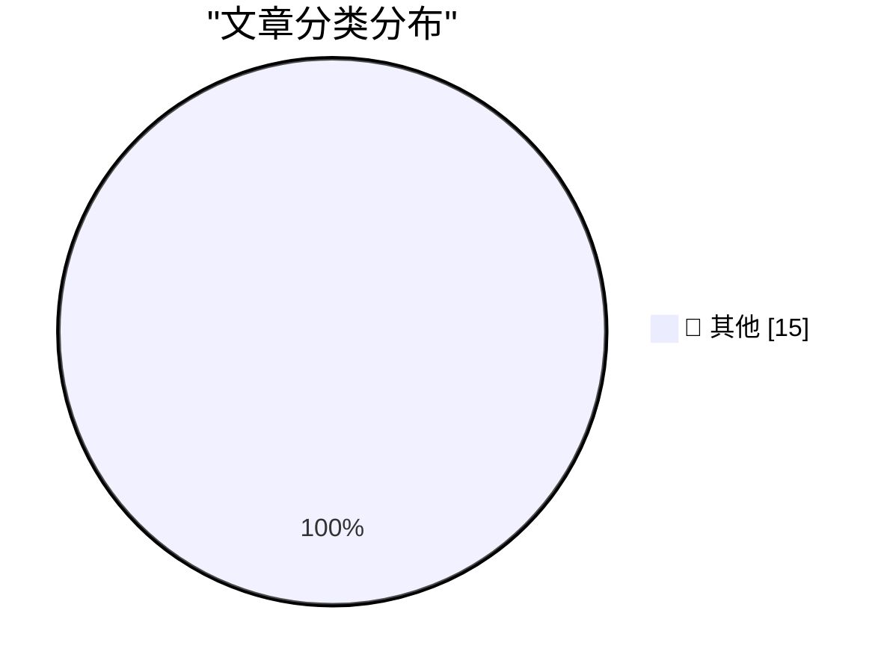

# 📰 AI 博客每日精选 — 2026-09-16

> 来自 Karpathy 推荐的 92 个顶级技术博客，AI 精选 Top 15

## 🏆 今日必读

🥇 **The contagion of fear**

[The contagion of fear](https://simonwillison.net/2026/Sep/14/the-contagion-of-fear/) — simonwillison.net · 22 小时前 · 📝 其他

> The contagion of fear

🥈 **What blog posts influenced your thinking the most?**

[What blog posts influenced your thinking the most?](https://simonwillison.net/2026/Sep/14/influences/) — simonwillison.net · 23 小时前 · 📝 其他

> What blog posts influenced your thinking the most?

🥉 **Tell agents the why, not just the how**

[Tell agents the why, not just the how](https://seangoedecke.com/tell-agents-the-why/) — seangoedecke.com · 19 小时前 · 📝 其他

> Tell agents the why, not just the how

---

## 📊 数据概览

| 扫描源 | 抓取文章 | 时间范围 | 精选 |
|:---:|:---:|:---:|:---:|
| 83/92 | 2530 篇 → 15 篇 | 24h | **15 篇** |

### 分类分布

---

## 📝 其他

### 1. The contagion of fear

[The contagion of fear](https://simonwillison.net/2026/Sep/14/the-contagion-of-fear/) — **simonwillison.net** · 22 小时前 · ⭐ 15/30

> The contagion of fear

---

### 2. What blog posts influenced your thinking the most?

[What blog posts influenced your thinking the most?](https://simonwillison.net/2026/Sep/14/influences/) — **simonwillison.net** · 23 小时前 · ⭐ 15/30

> What blog posts influenced your thinking the most?

---

### 3. Tell agents the why, not just the how

[Tell agents the why, not just the how](https://seangoedecke.com/tell-agents-the-why/) — **seangoedecke.com** · 19 小时前 · ⭐ 15/30

> Tell agents the why, not just the how

---

### 4. FT: ‘Steve Bannon and Bernie Sanders Unite in AI Safety Call’

[FT: ‘Steve Bannon and Bernie Sanders Unite in AI Safety Call’](https://www.ft.com/content/bab5c4c5-5377-4dd0-8b46-d8c4ce9a36d5?syn-25a6b1a6=1) — **daringfireball.net** · 38 分钟前 · ⭐ 15/30

> FT: ‘Steve Bannon and Bernie Sanders Unite in AI Safety Call’

---

### 5. ★ Thoughts and Observations on Apple’s ‘Surprise and Shine’ Event; the Announcements of the iPhones 18 Pro, AirPods 5, Apple Watches Series 12 and Ultra 4, and the iPhone Duo; and the Dawn of the Ternus, John Ternus Era at Apple

[★ Thoughts and Observations on Apple’s ‘Surprise and Shine’ Event; the Announcements of the iPhones 18 Pro, AirPods 5, Apple Watches Series 12 and Ultra 4, and the iPhone Duo; and the Dawn of the Ternus, John Ternus Era at Apple](https://daringfireball.net/2026/09/thoughts_and_observations_on_apples_surprise_and_shine_event) — **daringfireball.net** · 1 小时前 · ⭐ 15/30

> ★ Thoughts and Observations on Apple’s ‘Surprise and Shine’ Event; the Announcements of the iPhones 18 Pro, AirPods 5, Apple Watches Series 12 and Ultra 4, and the iPhone Duo; and the Dawn of the Ternus, John Ternus Era at Apple

---

### 6. [Sponsor] WorkOS: How SSO Works and the Fastest Way to Add It

[[Sponsor] WorkOS: How SSO Works and the Fastest Way to Add It](https://workos.com/guide/the-developers-guide-to-sso?utm_source=daringfireball&amp;utm_medium=newsletter&amp;utm_campaign=q32026) — **daringfireball.net** · 4 小时前 · ⭐ 15/30

> [Sponsor] WorkOS: How SSO Works and the Fastest Way to Add It

---

### 7. Apple’s 27.0 OS Updates

[Apple’s 27.0 OS Updates](https://scriptingosx.com/2026/09/apple-27-platform-updates-september-2026/) — **daringfireball.net** · 23 小时前 · ⭐ 15/30

> Apple’s 27.0 OS Updates

---

### 8. Pluralistic: Everybody pees (15 Sep 2026)

[Pluralistic: Everybody pees (15 Sep 2026)](https://pluralistic.net/2026/09/15/bitter-lemon-energy-drink/) — **pluralistic.net** · 12 小时前 · ⭐ 15/30

> Pluralistic: Everybody pees (15 Sep 2026)

---

### 9. [RSS Club] Sorry for breaking your feed readers!

[[RSS Club] Sorry for breaking your feed readers!](https://shkspr.mobi/blog/2026/09/rss-club-sorry-for-breaking-your-feed-readers/) — **shkspr.mobi** · 8 小时前 · ⭐ 15/30

> [RSS Club] Sorry for breaking your feed readers!

---

### 10. What counts as a large cosine similarity?

[What counts as a large cosine similarity?](https://www.johndcook.com/blog/2026/09/15/cosine-similarity/) — **johndcook.com** · 3 小时前 · ⭐ 15/30

> What counts as a large cosine similarity?

---

### 11. Shadowing the Standard Library

[Shadowing the Standard Library](https://nesbitt.io/2026/09/15/shadowing-the-standard-library.html) — **nesbitt.io** · 10 小时前 · ⭐ 15/30

> Shadowing the Standard Library

---

### 12. alt.time-capsule.reopened

[alt.time-capsule.reopened](https://feed.tedium.co/link/15204/17462130/usenet-rewind-archive-revival-website) — **tedium.co** · 16 小时前 · ⭐ 15/30

> alt.time-capsule.reopened

---

### 13. Tag index for Org mode blog

[Tag index for Org mode blog](https://entropicthoughts.com/tag-index-for-org-mode-blog) — **entropicthoughts.com** · 21 小时前 · ⭐ 15/30

> Tag index for Org mode blog

---

### 14. Diamond Rio PMP300

[Diamond Rio PMP300](https://dfarq.homeip.net/diamond-rio-pmp300/?utm_source=rss&#038;utm_medium=rss&#038;utm_campaign=diamond-rio-pmp300) — **dfarq.homeip.net** · 8 小时前 · ⭐ 15/30

> Diamond Rio PMP300

---

### 15. There is no epidemic of loneliness, but there is an epidemic of scurvy

[There is no epidemic of loneliness, but there is an epidemic of scurvy](https://www.experimental-history.com/p/there-is-no-epidemic-of-loneliness) — **experimental-history.com** · 6 小时前 · ⭐ 15/30

> There is no epidemic of loneliness, but there is an epidemic of scurvy

---

*生成于 2026-09-16 03:39 (Asia/Shanghai) | 扫描 83 源 → 获取 2530 篇 → 精选 15 篇*
*基于 [Hacker News Popularity Contest 2025](https://refactoringenglish.com/tools/hn-popularity/) RSS 源列表，由 [Andrej Karpathy](https://x.com/karpathy) 推荐*
*由「懂点儿AI」制作，欢迎关注同名微信公众号获取更多 AI 实用技巧 💡*
