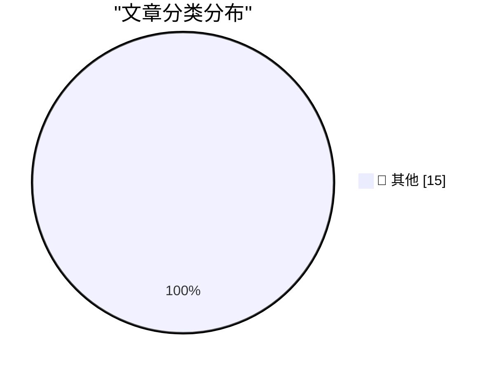

# 📰 AI 博客每日精选 — 2026-09-17

> 来自 Karpathy 推荐的 92 个顶级技术博客，AI 精选 Top 15

## 🏆 今日必读

🥇 **Claude Cowork and chat are now one Claude**

[Claude Cowork and chat are now one Claude](https://simonwillison.net/2026/Sep/16/one-claude/) — simonwillison.net · 1 小时前 · 📝 其他

> Claude Cowork and chat are now one Claude

🥈 **Quoting Mustafa Suleyman**

[Quoting Mustafa Suleyman](https://simonwillison.net/2026/Sep/16/mustafa-suleyman/) — simonwillison.net · 3 小时前 · 📝 其他

> Quoting Mustafa Suleyman

🥉 **Gemini Live audio**

[Gemini Live audio](https://simonwillison.net/2026/Sep/15/gemini-live/) — simonwillison.net · 20 小时前 · 📝 其他

> Gemini Live audio

---

## 📊 数据概览

| 扫描源 | 抓取文章 | 时间范围 | 精选 |
|:---:|:---:|:---:|:---:|
| 83/92 | 2525 篇 → 15 篇 | 24h | **15 篇** |

### 分类分布

---

## 📝 其他

### 1. Claude Cowork and chat are now one Claude

[Claude Cowork and chat are now one Claude](https://simonwillison.net/2026/Sep/16/one-claude/) — **simonwillison.net** · 1 小时前 · ⭐ 15/30

> Claude Cowork and chat are now one Claude

---

### 2. Quoting Mustafa Suleyman

[Quoting Mustafa Suleyman](https://simonwillison.net/2026/Sep/16/mustafa-suleyman/) — **simonwillison.net** · 3 小时前 · ⭐ 15/30

> Quoting Mustafa Suleyman

---

### 3. Gemini Live audio

[Gemini Live audio](https://simonwillison.net/2026/Sep/15/gemini-live/) — **simonwillison.net** · 20 小时前 · ⭐ 15/30

> Gemini Live audio

---

### 4. Jev means structured output is interesting again

[Jev means structured output is interesting again](https://seangoedecke.com/jev-means-structured-output-is-interesting-again/) — **seangoedecke.com** · 19 小时前 · ⭐ 15/30

> Jev means structured output is interesting again

---

### 5. Data Broker Radaris Loses Domains in Privacy Fight

[Data Broker Radaris Loses Domains in Privacy Fight](https://krebsonsecurity.com/2026/09/data-broker-radaris-loses-domains-in-privacy-fight/) — **krebsonsecurity.com** · 1 小时前 · ⭐ 15/30

> Data Broker Radaris Loses Domains in Privacy Fight

---

### 6. Apple OS 27.2 Betas Are Out; Version 27.1 Is the Duo-Exclusive iOS Fork

[Apple OS 27.2 Betas Are Out; Version 27.1 Is the Duo-Exclusive iOS Fork](https://www.macrumors.com/2026/09/16/heres-why-apple-released-ios-27-2-beta/) — **daringfireball.net** · 54 分钟前 · ⭐ 15/30

> Apple OS 27.2 Betas Are Out; Version 27.1 Is the Duo-Exclusive iOS Fork

---

### 7. AirPods 5 With Wireless Charging Case Works With MagSafe, But Not Magnetically

[AirPods 5 With Wireless Charging Case Works With MagSafe, But Not Magnetically](https://www.apple.com/airpods-5/specs/) — **daringfireball.net** · 4 小时前 · ⭐ 15/30

> AirPods 5 With Wireless Charging Case Works With MagSafe, But Not Magnetically

---

### 8. ‘Apple Reference Image: A New Approach for Verified Photography’

[‘Apple Reference Image: A New Approach for Verified Photography’](https://security.apple.com/blog/apple-reference-image/) — **daringfireball.net** · 16 小时前 · ⭐ 15/30

> ‘Apple Reference Image: A New Approach for Verified Photography’

---

### 9. Pluralistic: How an AI moratorium can save AI bosses (16 Sep 2026)

[Pluralistic: How an AI moratorium can save AI bosses (16 Sep 2026)](https://pluralistic.net/2026/09/16/beggar-thy-neighbor/) — **pluralistic.net** · 11 小时前 · ⭐ 15/30

> Pluralistic: How an AI moratorium can save AI bosses (16 Sep 2026)

---

### 10. How to get a DOI for your blog posts

[How to get a DOI for your blog posts](https://shkspr.mobi/blog/2026/09/how-to-get-a-doi-for-your-blog-posts/) — **shkspr.mobi** · 7 小时前 · ⭐ 15/30

> How to get a DOI for your blog posts

---

### 11. Converting between cosine similarity and concentration ratio

[Converting between cosine similarity and concentration ratio](https://www.johndcook.com/blog/2026/09/16/concentration-ratio/) — **johndcook.com** · 3 小时前 · ⭐ 15/30

> Converting between cosine similarity and concentration ratio

---

### 12. Coffee + milk ≠ latte

[Coffee + milk ≠ latte](https://www.johndcook.com/blog/2026/09/16/coffee-milk-latte/) — **johndcook.com** · 4 小时前 · ⭐ 15/30

> Coffee + milk ≠ latte

---

### 13. Fibonacci product

[Fibonacci product](https://www.johndcook.com/blog/2026/09/16/fibonacci-product/) — **johndcook.com** · 7 小时前 · ⭐ 15/30

> Fibonacci product

---

### 14. Simple approximation for spherical cap area

[Simple approximation for spherical cap area](https://www.johndcook.com/blog/2026/09/15/simple-approximation-for-spherical-cap-area/) — **johndcook.com** · 21 小时前 · ⭐ 15/30

> Simple approximation for spherical cap area

---

### 15. The 6502 CPU’s odd debut

[The 6502 CPU’s odd debut](https://dfarq.homeip.net/the-6502-cpus-odd-debut/?utm_source=rss&#038;utm_medium=rss&#038;utm_campaign=the-6502-cpus-odd-debut) — **dfarq.homeip.net** · 8 小时前 · ⭐ 15/30

> The 6502 CPU’s odd debut

---

*生成于 2026-09-17 03:30 (Asia/Shanghai) | 扫描 83 源 → 获取 2525 篇 → 精选 15 篇*
*基于 [Hacker News Popularity Contest 2025](https://refactoringenglish.com/tools/hn-popularity/) RSS 源列表，由 [Andrej Karpathy](https://x.com/karpathy) 推荐*
*由「懂点儿AI」制作，欢迎关注同名微信公众号获取更多 AI 实用技巧 💡*
