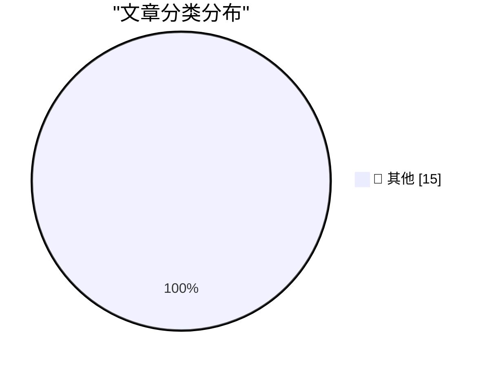

# 📰 AI 博客每日精选 — 2026-09-19

> 来自 Karpathy 推荐的 92 个顶级技术博客，AI 精选 Top 15

## 🏆 今日必读

🥇 **The Creative Spirit of Who Framed Roger Rabbit**

[The Creative Spirit of Who Framed Roger Rabbit](https://simonwillison.net/2026/Sep/18/the-creative-spirit-of-who-framed-roger-rabbit/) — simonwillison.net · 4 小时前 · 📝 其他

> The Creative Spirit of Who Framed Roger Rabbit

🥈 **Be alert: targeted attacks on prominent Rustaceans**

[Be alert: targeted attacks on prominent Rustaceans](https://simonwillison.net/2026/Sep/17/targeted-attacks-on-rustaceans/) — simonwillison.net · 19 小时前 · 📝 其他

> Be alert: targeted attacks on prominent Rustaceans

🥉 **How To Write With An LLM**

[How To Write With An LLM](https://simonwillison.net/2026/Sep/17/how-to-write-with-an-llm/) — simonwillison.net · 19 小时前 · 📝 其他

> How To Write With An LLM

---

## 📊 数据概览

| 扫描源 | 抓取文章 | 时间范围 | 精选 |
|:---:|:---:|:---:|:---:|
| 83/92 | 2527 篇 → 19 篇 | 24h | **15 篇** |

### 分类分布

---

## 📝 其他

### 1. The Creative Spirit of Who Framed Roger Rabbit

[The Creative Spirit of Who Framed Roger Rabbit](https://simonwillison.net/2026/Sep/18/the-creative-spirit-of-who-framed-roger-rabbit/) — **simonwillison.net** · 4 小时前 · ⭐ 15/30

> The Creative Spirit of Who Framed Roger Rabbit

---

### 2. Be alert: targeted attacks on prominent Rustaceans

[Be alert: targeted attacks on prominent Rustaceans](https://simonwillison.net/2026/Sep/17/targeted-attacks-on-rustaceans/) — **simonwillison.net** · 19 小时前 · ⭐ 15/30

> Be alert: targeted attacks on prominent Rustaceans

---

### 3. How To Write With An LLM

[How To Write With An LLM](https://simonwillison.net/2026/Sep/17/how-to-write-with-an-llm/) — **simonwillison.net** · 19 小时前 · ⭐ 15/30

> How To Write With An LLM

---

### 4. Self-generated prompt injections in compaction summaries

[Self-generated prompt injections in compaction summaries](https://simonwillison.net/2026/Sep/17/compaction-summaries/) — **simonwillison.net** · 22 小时前 · ⭐ 15/30

> Self-generated prompt injections in compaction summaries

---

### 5. NTP, an atomic clock, and having a great time at the world's largest VCF

[NTP, an atomic clock, and having a great time at the world's largest VCF](https://www.jeffgeerling.com/blog/2026/vcf-midwest-21-ntp-time/) — **jeffgeerling.com** · 4 小时前 · ⭐ 15/30

> NTP, an atomic clock, and having a great time at the world's largest VCF

---

### 6. Two techniques for working with System One models

[Two techniques for working with System One models](https://seangoedecke.com/two-techniques-for-working-with-system-one-models/) — **seangoedecke.com** · 18 小时前 · ⭐ 15/30

> Two techniques for working with System One models

---

### 7. Hollywood Wants the Duo

[Hollywood Wants the Duo](https://pagesix.com/2026/09/16/hollywood/mysterious-apple-ceo-charms-hollywood-following-big-emmys-night-by-showing-off-new-iphone/) — **daringfireball.net** · 1 小时前 · ⭐ 15/30

> Hollywood Wants the Duo

---

### 8. Gauging Interest in the iPhone Duo

[Gauging Interest in the iPhone Duo](https://maxfrequency.net/2026/09/17/iphone-duo-mkbhd-popularity-or-curiosity/) — **daringfireball.net** · 2 小时前 · ⭐ 15/30

> Gauging Interest in the iPhone Duo

---

### 9. ★ One More Thing About the iPhones 18 Pro: the Bigger/Smaller Dynamic Island

[★ One More Thing About the iPhones 18 Pro: the Bigger/Smaller Dynamic Island](https://daringfireball.net/2026/09/iphone_18_pro_dynamic_island) — **daringfireball.net** · 2 小时前 · ⭐ 15/30

> ★ One More Thing About the iPhones 18 Pro: the Bigger/Smaller Dynamic Island

---

### 10. YouTube Changed How It Counts ‘Views’ Last Month, Inflating New Numbers

[YouTube Changed How It Counts ‘Views’ Last Month, Inflating New Numbers](https://support.google.com/youtube/thread/433409976/an-update-to-how-we-count-public-views-across-youtube?hl=en) — **daringfireball.net** · 2 小时前 · ⭐ 15/30

> YouTube Changed How It Counts ‘Views’ Last Month, Inflating New Numbers

---

### 11. ★ The iPhones 18 Pro

[★ The iPhones 18 Pro](https://daringfireball.net/2026/09/the_iphones_18_pro) — **daringfireball.net** · 16 小时前 · ⭐ 15/30

> ★ The iPhones 18 Pro

---

### 12. The Front Page of the Internet Is Up for Grabs

[The Front Page of the Internet Is Up for Grabs](https://idiallo.com/byte-size/the-front-page-of-the-internet) — **idiallo.com** · 19 小时前 · ⭐ 15/30

> The Front Page of the Internet Is Up for Grabs

---

### 13. Pluralistic: Textured (18 Sep 2026)

[Pluralistic: Textured (18 Sep 2026)](https://pluralistic.net/2026/09/18/surprise/) — **pluralistic.net** · 11 小时前 · ⭐ 15/30

> Pluralistic: Textured (18 Sep 2026)

---

### 14. Theatre Review: The School for Wives - at Riverside Studios ★★★★★

[Theatre Review: The School for Wives - at Riverside Studios ★★★★★](https://shkspr.mobi/blog/2026/09/theatre-review-the-school-for-wives/) — **shkspr.mobi** · 7 小时前 · ⭐ 15/30

> Theatre Review: The School for Wives - at Riverside Studios ★★★★★

---

### 15. How I Vibed a Proof of Conway’s Conjecture

[How I Vibed a Proof of Conway’s Conjecture](https://overreacted.io/how-i-vibed-a-proof-of-conways-conjecture/) — **overreacted.io** · 18 小时前 · ⭐ 15/30

> How I Vibed a Proof of Conway’s Conjecture

---

*生成于 2026-09-19 02:59 (Asia/Shanghai) | 扫描 83 源 → 获取 2527 篇 → 精选 15 篇*
*基于 [Hacker News Popularity Contest 2025](https://refactoringenglish.com/tools/hn-popularity/) RSS 源列表，由 [Andrej Karpathy](https://x.com/karpathy) 推荐*
*由「懂点儿AI」制作，欢迎关注同名微信公众号获取更多 AI 实用技巧 💡*
