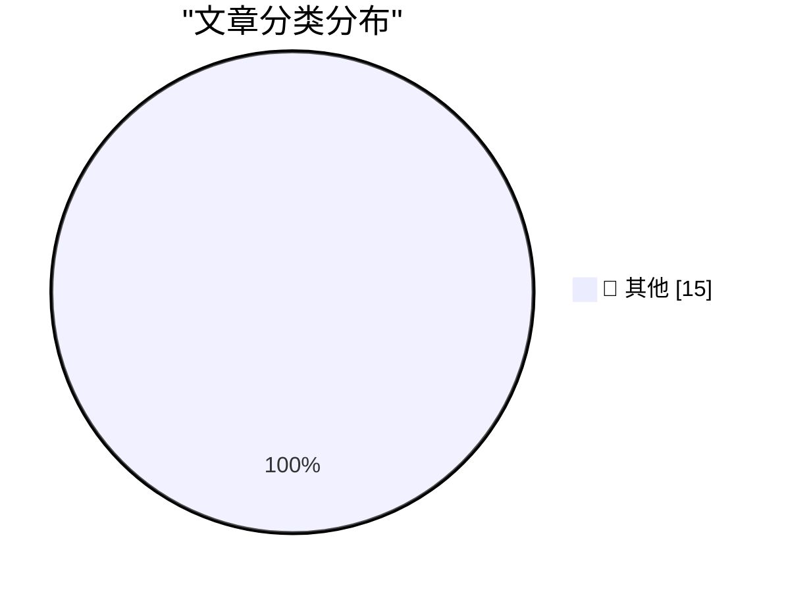

# 📰 AI 博客每日精选 — 2026-09-20

> 来自 Karpathy 推荐的 92 个顶级技术博客，AI 精选 Top 15

## 🏆 今日必读

🥇 **California Sea Lion, Brandt's Cormorant**

[California Sea Lion, Brandt's Cormorant](https://simonwillison.net/2026/Sep/19/sighting-401567341/) — simonwillison.net · 1 小时前 · 📝 其他

> California Sea Lion, Brandt's Cormorant

🥈 **Gemini Hacked Three Companies in First Known Breakout by Google’s AI**

[Gemini Hacked Three Companies in First Known Breakout by Google’s AI](https://simonwillison.net/2026/Sep/18/gemini-hacked-three-companies/) — simonwillison.net · 18 小时前 · 📝 其他

> Gemini Hacked Three Companies in First Known Breakout by Google’s AI

🥉 **Note on 18th September 2026**

[Note on 18th September 2026](https://simonwillison.net/2026/Sep/18/probably-gonna-eat-you/) — simonwillison.net · 23 小时前 · 📝 其他

> Note on 18th September 2026

---

## 📊 数据概览

| 扫描源 | 抓取文章 | 时间范围 | 精选 |
|:---:|:---:|:---:|:---:|
| 82/92 | 2502 篇 → 16 篇 | 24h | **15 篇** |

### 分类分布

---

## 📝 其他

### 1. California Sea Lion, Brandt's Cormorant

[California Sea Lion, Brandt's Cormorant](https://simonwillison.net/2026/Sep/19/sighting-401567341/) — **simonwillison.net** · 1 小时前 · ⭐ 15/30

> California Sea Lion, Brandt's Cormorant

---

### 2. Gemini Hacked Three Companies in First Known Breakout by Google’s AI

[Gemini Hacked Three Companies in First Known Breakout by Google’s AI](https://simonwillison.net/2026/Sep/18/gemini-hacked-three-companies/) — **simonwillison.net** · 18 小时前 · ⭐ 15/30

> Gemini Hacked Three Companies in First Known Breakout by Google’s AI

---

### 3. Note on 18th September 2026

[Note on 18th September 2026](https://simonwillison.net/2026/Sep/18/probably-gonna-eat-you/) — **simonwillison.net** · 23 小时前 · ⭐ 15/30

> Note on 18th September 2026

---

### 4. Quoting Thariq Shihipar

[Quoting Thariq Shihipar](https://simonwillison.net/2026/Sep/18/thariq-shihipar/) — **simonwillison.net** · 23 小时前 · ⭐ 15/30

> Quoting Thariq Shihipar

---

### 5. Tyler Stalman’s iPhone 18 Pro Camera Review

[Tyler Stalman’s iPhone 18 Pro Camera Review](https://www.youtube.com/watch?v=m6cDErtCKAc) — **daringfireball.net** · 2 小时前 · ⭐ 15/30

> Tyler Stalman’s iPhone 18 Pro Camera Review

---

### 6. Austin Mann’s iPhone 18 Pro Camera Review, From Dunton, Colorado

[Austin Mann’s iPhone 18 Pro Camera Review, From Dunton, Colorado](https://www.austinmann.com/trek/iphone-18-pro-camera-review-dunton) — **daringfireball.net** · 2 小时前 · ⭐ 15/30

> Austin Mann’s iPhone 18 Pro Camera Review, From Dunton, Colorado

---

### 7. Just Me or Does This Argument Not Add Up?

[Just Me or Does This Argument Not Add Up?](https://www.nytimes.com/2026/09/16/opinion/university-of-california-sat.html?unlocked_article_code=1.CFE.bXBA.V6BFzBn1jlKG) — **daringfireball.net** · 21 小时前 · ⭐ 15/30

> Just Me or Does This Argument Not Add Up?

---

### 8. Will Oremus Is a Duo Doubter

[Will Oremus Is a Duo Doubter](https://www.theatlantic.com/technology/2026/09/apple-folding-iphone/688562/?gift=aQyUJR7AIw1mJWdQ6Ed6yE6RbvpIGGpQGFPIX827p48) — **daringfireball.net** · 21 小时前 · ⭐ 15/30

> Will Oremus Is a Duo Doubter

---

### 9. Apple Releases Xcode 27.1, First SDK With Support for iPhone Duo

[Apple Releases Xcode 27.1, First SDK With Support for iPhone Duo](https://developer.apple.com/news/?id=nyuppv9r) — **daringfireball.net** · 22 小时前 · ⭐ 15/30

> Apple Releases Xcode 27.1, First SDK With Support for iPhone Duo

---

### 10. Warren Buffett, at 96, Steps Down as Chairman at Berkshire Hathaway

[Warren Buffett, at 96, Steps Down as Chairman at Berkshire Hathaway](https://www.berkshirehathaway.com/news/sep1826.pdf) — **daringfireball.net** · 23 小时前 · ⭐ 15/30

> Warren Buffett, at 96, Steps Down as Chairman at Berkshire Hathaway

---

### 11. Trump Says He’s Banning MS NOW, CNN, and Politico From White House

[Trump Says He’s Banning MS NOW, CNN, and Politico From White House](https://truthsocial.com/@realDonaldTrump/posts/117293599348325006) — **daringfireball.net** · 23 小时前 · ⭐ 15/30

> Trump Says He’s Banning MS NOW, CNN, and Politico From White House

---

### 12. Why fitting a logistic is nearly impossible from early data

[Why fitting a logistic is nearly impossible from early data](https://www.johndcook.com/blog/2026/09/18/logistic-fit-sensitivity/) — **johndcook.com** · 17 小时前 · ⭐ 15/30

> Why fitting a logistic is nearly impossible from early data

---

### 13. This Week in Package Management: 19 September 2026

[This Week in Package Management: 19 September 2026](https://nesbitt.io/2026/09/19/this-week-in-package-management.html) — **nesbitt.io** · 8 小时前 · ⭐ 15/30

> This Week in Package Management: 19 September 2026

---

### 14. Reading List 09/19/2026

[Reading List 09/19/2026](https://www.construction-physics.com/p/reading-list-09192026) — **construction-physics.com** · 6 小时前 · ⭐ 15/30

> Reading List 09/19/2026

---

### 15. Do You Prefer Artificial?

[Do You Prefer Artificial?](https://blog.jim-nielsen.com/2026/who-wants-artificial/) — **blog.jim-nielsen.com** · 23 小时前 · ⭐ 15/30

> Do You Prefer Artificial?

---

*生成于 2026-09-20 02:33 (Asia/Shanghai) | 扫描 82 源 → 获取 2502 篇 → 精选 15 篇*
*基于 [Hacker News Popularity Contest 2025](https://refactoringenglish.com/tools/hn-popularity/) RSS 源列表，由 [Andrej Karpathy](https://x.com/karpathy) 推荐*
*由「懂点儿AI」制作，欢迎关注同名微信公众号获取更多 AI 实用技巧 💡*
