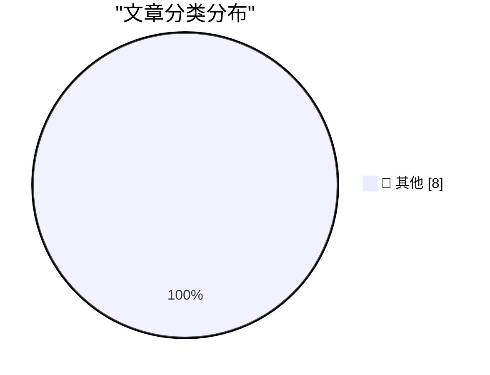

# 📰 AI 博客每日精选 — 2026-09-21

> 来自 Karpathy 推荐的 92 个顶级技术博客，AI 精选 Top 8

## 🏆 今日必读

🥇 **datasette-auth-github 1.0**

[datasette-auth-github 1.0](https://simonwillison.net/2026/Sep/19/datasette-auth-github/) — simonwillison.net · 22 小时前 · 📝 其他

> datasette-auth-github 1.0

🥈 **Grit your teeth and ship it**

[Grit your teeth and ship it](https://seangoedecke.com/grit-your-teeth-and-ship-it/) — seangoedecke.com · 18 小时前 · 📝 其他

> Grit your teeth and ship it

🥉 **System One models like Jev can train their own replacements**

[System One models like Jev can train their own replacements](https://seangoedecke.com/system-one-models-can-train-their-own-replacements/) — seangoedecke.com · 18 小时前 · 📝 其他

> System One models like Jev can train their own replacements

---

## 📊 数据概览

| 扫描源 | 抓取文章 | 时间范围 | 精选 |
|:---:|:---:|:---:|:---:|
| 83/92 | 2527 篇 → 8 篇 | 24h | **8 篇** |

### 分类分布

---

## 📝 其他

### 1. datasette-auth-github 1.0

[datasette-auth-github 1.0](https://simonwillison.net/2026/Sep/19/datasette-auth-github/) — **simonwillison.net** · 22 小时前 · ⭐ 15/30

> datasette-auth-github 1.0

---

### 2. Grit your teeth and ship it

[Grit your teeth and ship it](https://seangoedecke.com/grit-your-teeth-and-ship-it/) — **seangoedecke.com** · 18 小时前 · ⭐ 15/30

> Grit your teeth and ship it

---

### 3. System One models like Jev can train their own replacements

[System One models like Jev can train their own replacements](https://seangoedecke.com/system-one-models-can-train-their-own-replacements/) — **seangoedecke.com** · 18 小时前 · ⭐ 15/30

> System One models like Jev can train their own replacements

---

### 4. WorkOS: How SSO Works and the Fastest Way to Add It

[WorkOS: How SSO Works and the Fastest Way to Add It](https://workos.com/guide/the-developers-guide-to-sso?utm_source=daringfireball&amp;utm_medium=newsletter&amp;utm_campaign=q32026) — **daringfireball.net** · 1 小时前 · ⭐ 15/30

> WorkOS: How SSO Works and the Fastest Way to Add It

---

### 5. GM Revives CarPlay for 2027 Trucks

[GM Revives CarPlay for 2027 Trucks](https://www.autoweek.com/news/a73761352/gm-revives-apple-carplay-for-2027-chevy-silverado-gmc-sierra/) — **daringfireball.net** · 1 小时前 · ⭐ 15/30

> GM Revives CarPlay for 2027 Trucks

---

### 6. Marques Brownlee’s iPhone 18 Pro Review

[Marques Brownlee’s iPhone 18 Pro Review](https://www.youtube.com/watch?v=ohqxP8EEumo) — **daringfireball.net** · 3 小时前 · ⭐ 15/30

> Marques Brownlee’s iPhone 18 Pro Review

---

### 7. Book Review: How to Build a Space Station by Jonathan Morrison ★★★⯪☆

[Book Review: How to Build a Space Station by Jonathan Morrison ★★★⯪☆](https://shkspr.mobi/blog/2026/09/book-review-how-to-build-a-space-station-by-jonathan-morrison/) — **shkspr.mobi** · 7 小时前 · ⭐ 15/30

> Book Review: How to Build a Space Station by Jonathan Morrison ★★★⯪☆

---

### 8. This is why we play

[This is why we play](https://xeiaso.net/blog/2026/this-is-why-we-play/) — **xeiaso.net** · -320 分钟前 · ⭐ 15/30

> This is why we play

---

*生成于 2026-09-21 02:40 (Asia/Shanghai) | 扫描 83 源 → 获取 2527 篇 → 精选 8 篇*
*基于 [Hacker News Popularity Contest 2025](https://refactoringenglish.com/tools/hn-popularity/) RSS 源列表，由 [Andrej Karpathy](https://x.com/karpathy) 推荐*
*由「懂点儿AI」制作，欢迎关注同名微信公众号获取更多 AI 实用技巧 💡*
