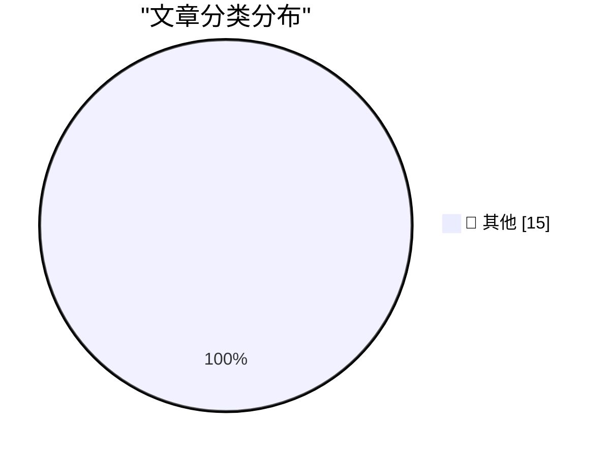

# 📰 AI 博客每日精选 — 2026-09-23

> 来自 Karpathy 推荐的 92 个顶级技术博客，AI 精选 Top 15

## 🏆 今日必读

🥇 **Quoting @therealcornpop**

[Quoting @therealcornpop](https://simonwillison.net/2026/Sep/22/therealcornpop/) — simonwillison.net · 1 小时前 · 📝 其他

> Quoting @therealcornpop

🥈 **llm-typesafe 0.1a0**

[llm-typesafe 0.1a0](https://simonwillison.net/2026/Sep/22/llm-typesafe/) — simonwillison.net · 3 小时前 · 📝 其他

> llm-typesafe 0.1a0

🥉 **Jev introduces a new shape of LLM - System One, aka Decision Models**

[Jev introduces a new shape of LLM - System One, aka Decision Models](https://simonwillison.net/2026/Sep/21/jev/) — simonwillison.net · 20 小时前 · 📝 其他

> Jev introduces a new shape of LLM - System One, aka Decision Models

---

## 📊 数据概览

| 扫描源 | 抓取文章 | 时间范围 | 精选 |
|:---:|:---:|:---:|:---:|
| 82/92 | 2518 篇 → 22 篇 | 24h | **15 篇** |

### 分类分布

---

## 📝 其他

### 1. Quoting @therealcornpop

[Quoting @therealcornpop](https://simonwillison.net/2026/Sep/22/therealcornpop/) — **simonwillison.net** · 1 小时前 · ⭐ 15/30

> Quoting @therealcornpop

---

### 2. llm-typesafe 0.1a0

[llm-typesafe 0.1a0](https://simonwillison.net/2026/Sep/22/llm-typesafe/) — **simonwillison.net** · 3 小时前 · ⭐ 15/30

> llm-typesafe 0.1a0

---

### 3. Jev introduces a new shape of LLM - System One, aka Decision Models

[Jev introduces a new shape of LLM - System One, aka Decision Models](https://simonwillison.net/2026/Sep/21/jev/) — **simonwillison.net** · 20 小时前 · ⭐ 15/30

> Jev introduces a new shape of LLM - System One, aka Decision Models

---

### 4. Cloudflare Python Workers are now generally available

[Cloudflare Python Workers are now generally available](https://simonwillison.net/2026/Sep/21/cloudflare-python-worker/) — **simonwillison.net** · 21 小时前 · ⭐ 15/30

> Cloudflare Python Workers are now generally available

---

### 5. Xcode 27.2 Now Supports a New JSON Project File Format

[Xcode 27.2 Now Supports a New JSON Project File Format](https://developer.apple.com/documentation/xcode-release-notes/xcode-27_2-release-notes) — **daringfireball.net** · 15 分钟前 · ⭐ 15/30

> Xcode 27.2 Now Supports a New JSON Project File Format

---

### 6. Siri AI Class-Action Lawsuit Settlement Website Is Now Live

[Siri AI Class-Action Lawsuit Settlement Website Is Now Live](https://www.macrumors.com/2026/09/20/siri-ai-settlement-website-now-live/) — **daringfireball.net** · 3 小时前 · ⭐ 15/30

> Siri AI Class-Action Lawsuit Settlement Website Is Now Live

---

### 7. [Sponsor] Mux: Turn Your Video Into Context

[[Sponsor] Mux: Turn Your Video Into Context](https://www.mux.com/?utm_campaign=fireball&amp;utm_source=DF) — **daringfireball.net** · 20 小时前 · ⭐ 15/30

> [Sponsor] Mux: Turn Your Video Into Context

---

### 8. Lex Friedman Brings Back Strategery

[Lex Friedman Brings Back Strategery](https://lexontech.org/strategery-is-back-and-im-the-developer) — **daringfireball.net** · 20 小时前 · ⭐ 15/30

> Lex Friedman Brings Back Strategery

---

### 9. GM Confirms They’re Still Smoking Crack

[GM Confirms They’re Still Smoking Crack](https://x.com/JoannaStern/status/2102105565195288859) — **daringfireball.net** · 21 小时前 · ⭐ 15/30

> GM Confirms They’re Still Smoking Crack

---

### 10. America’s Decline Can Be Measured by the Names of Ballparks and Arenas

[America’s Decline Can Be Measured by the Names of Ballparks and Arenas](https://www.mlb.com/news/tigers-ballpark-name-changed-to-fifth-third-park) — **daringfireball.net** · 22 小时前 · ⭐ 15/30

> America’s Decline Can Be Measured by the Names of Ballparks and Arenas

---

### 11. It's Not Just True, It's False

[It's Not Just True, It's False](https://idiallo.com/byte-size/its-not-just-true-its-false) — **idiallo.com** · 17 小时前 · ⭐ 15/30

> It's Not Just True, It's False

---

### 12. Pluralistic: Bonta sold us out to Trump's oligarchs (22 Sep 2026)

[Pluralistic: Bonta sold us out to Trump's oligarchs (22 Sep 2026)](https://pluralistic.net/2026/09/22/happy-chudmas/) — **pluralistic.net** · 11 小时前 · ⭐ 15/30

> Pluralistic: Bonta sold us out to Trump's oligarchs (22 Sep 2026)

---

### 13. Are LLMs still surprisingly bad at some simple tasks?

[Are LLMs still surprisingly bad at some simple tasks?](https://shkspr.mobi/blog/2026/09/are-llms-still-surprisingly-bad-at-some-simple-tasks/) — **shkspr.mobi** · 8 小时前 · ⭐ 15/30

> Are LLMs still surprisingly bad at some simple tasks?

---

### 14. Nathaniel Bowditch

[Nathaniel Bowditch](https://www.johndcook.com/blog/2026/09/22/nathaniel-bowditch/) — **johndcook.com** · 5 小时前 · ⭐ 15/30

> Nathaniel Bowditch

---

### 15. Haversine law

[Haversine law](https://www.johndcook.com/blog/2026/09/21/haversine-law/) — **johndcook.com** · 20 小时前 · ⭐ 15/30

> Haversine law

---

*生成于 2026-09-23 03:41 (Asia/Shanghai) | 扫描 82 源 → 获取 2518 篇 → 精选 15 篇*
*基于 [Hacker News Popularity Contest 2025](https://refactoringenglish.com/tools/hn-popularity/) RSS 源列表，由 [Andrej Karpathy](https://x.com/karpathy) 推荐*
*由「懂点儿AI」制作，欢迎关注同名微信公众号获取更多 AI 实用技巧 💡*
