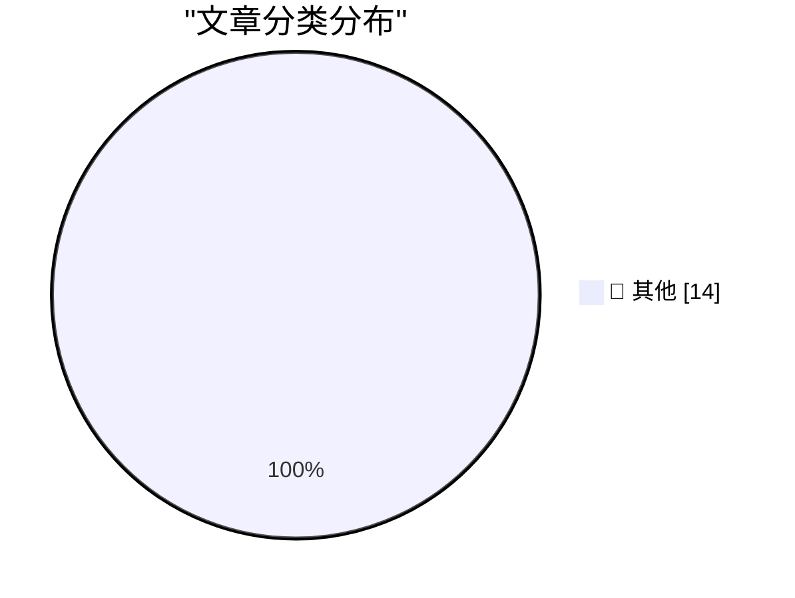

# 📰 AI 博客每日精选 — 2026-09-24

> 来自 Karpathy 推荐的 92 个顶级技术博客，AI 精选 Top 14

## 🏆 今日必读

🥇 **SF October 14th: A Birds of a Feather Session on Agentic Engineering**

[SF October 14th: A Birds of a Feather Session on Agentic Engineering](https://simonwillison.net/2026/Sep/23/bof-agentic-engineering/) — simonwillison.net · 16 小时前 · 📝 其他

> SF October 14th: A Birds of a Feather Session on Agentic Engineering

🥈 **Claude Opus 5.5, GPT-6 Sol, GPT-6 Luna, and a new price war**

[Claude Opus 5.5, GPT-6 Sol, GPT-6 Luna, and a new price war](https://simonwillison.net/2026/Sep/22/opus-and-sol-and-luna/) — simonwillison.net · 19 小时前 · 📝 其他

> Claude Opus 5.5, GPT-6 Sol, GPT-6 Luna, and a new price war

🥉 **App Store Scam of the Week: ‘Update My Phone & Apps: Guide’ by Tair Olzhasev**

[App Store Scam of the Week: ‘Update My Phone & Apps: Guide’ by Tair Olzhasev](https://apps.apple.com/us/app/update-my-phone-apps-guide/id6753936837) — daringfireball.net · 58 分钟前 · 📝 其他

> App Store Scam of the Week: ‘Update My Phone & Apps: Guide’ by Tair Olzhasev

---

## 📊 数据概览

| 扫描源 | 抓取文章 | 时间范围 | 精选 |
|:---:|:---:|:---:|:---:|
| 83/92 | 2528 篇 → 14 篇 | 24h | **14 篇** |

### 分类分布

---

## 📝 其他

### 1. SF October 14th: A Birds of a Feather Session on Agentic Engineering

[SF October 14th: A Birds of a Feather Session on Agentic Engineering](https://simonwillison.net/2026/Sep/23/bof-agentic-engineering/) — **simonwillison.net** · 16 小时前 · ⭐ 15/30

> SF October 14th: A Birds of a Feather Session on Agentic Engineering

---

### 2. Claude Opus 5.5, GPT-6 Sol, GPT-6 Luna, and a new price war

[Claude Opus 5.5, GPT-6 Sol, GPT-6 Luna, and a new price war](https://simonwillison.net/2026/Sep/22/opus-and-sol-and-luna/) — **simonwillison.net** · 19 小时前 · ⭐ 15/30

> Claude Opus 5.5, GPT-6 Sol, GPT-6 Luna, and a new price war

---

### 3. App Store Scam of the Week: ‘Update My Phone & Apps: Guide’ by Tair Olzhasev

[App Store Scam of the Week: ‘Update My Phone & Apps: Guide’ by Tair Olzhasev](https://apps.apple.com/us/app/update-my-phone-apps-guide/id6753936837) — **daringfireball.net** · 58 分钟前 · ⭐ 15/30

> App Store Scam of the Week: ‘Update My Phone & Apps: Guide’ by Tair Olzhasev

---

### 4. ★ AppZapper 3000

[★ AppZapper 3000](https://daringfireball.net/2026/09/appzapper_3000) — **daringfireball.net** · 2 小时前 · ⭐ 15/30

> ★ AppZapper 3000

---

### 5. Super Intelligence, Indeed

[Super Intelligence, Indeed](https://bsky.app/profile/atrupar.com/post/3mw4it5l5fd23) — **daringfireball.net** · 5 小时前 · ⭐ 15/30

> Super Intelligence, Indeed

---

### 6. Meta’s Muse Logomark, Designed by Jessica Hische

[Meta’s Muse Logomark, Designed by Jessica Hische](https://thedieline.com/jessica-hische-metas-muse-and-the-ethical-landmines-of-design/) — **daringfireball.net** · 20 小时前 · ⭐ 15/30

> Meta’s Muse Logomark, Designed by Jessica Hische

---

### 7. Meta’s New Muse AI Agent Read Jason Aten’s Messages Database

[Meta’s New Muse AI Agent Read Jason Aten’s Messages Database](https://www.inc.com/jason-aten/metas-new-muse-ai-agent-read-my-private-messages-i-never-asked-it-to/91408202) — **daringfireball.net** · 22 小时前 · ⭐ 15/30

> Meta’s New Muse AI Agent Read Jason Aten’s Messages Database

---

### 8. Why Didn’t Google Build Muse?

[Why Didn’t Google Build Muse?](https://spyglass.org/why-didnt-google-build-muse/) — **daringfireball.net** · 22 小时前 · ⭐ 15/30

> Why Didn’t Google Build Muse?

---

### 9. Amazon Blocks Meta’s Muse AI Assistant

[Amazon Blocks Meta’s Muse AI Assistant](https://www.geekwire.com/2026/amazon-blocks-metas-muse-ai-assistant-in-new-standoff-over-agentic-shopping/) — **daringfireball.net** · 22 小时前 · ⭐ 15/30

> Amazon Blocks Meta’s Muse AI Assistant

---

### 10. Meta’s New Muse AI Agent App Overtakes ChatGPT as Top iPhone App

[Meta’s New Muse AI Agent App Overtakes ChatGPT as Top iPhone App](https://9to5mac.com/2026/09/18/metas-new-muse-ai-agent-app-overtakes-chatgpt-as-top-iphone-app/) — **daringfireball.net** · 23 小时前 · ⭐ 15/30

> Meta’s New Muse AI Agent App Overtakes ChatGPT as Top iPhone App

---

### 11. Navigation with only addition, subtraction, and tables

[Navigation with only addition, subtraction, and tables](https://www.johndcook.com/blog/2026/09/23/navigation-minimum/) — **johndcook.com** · 5 小时前 · ⭐ 15/30

> Navigation with only addition, subtraction, and tables

---

### 12. Ebay’s IPO: The rare dotcom survivor

[Ebay’s IPO: The rare dotcom survivor](https://dfarq.homeip.net/ebays-ipo-the-rare-dotcom-survivor/?utm_source=rss&#038;utm_medium=rss&#038;utm_campaign=ebays-ipo-the-rare-dotcom-survivor) — **dfarq.homeip.net** · 8 小时前 · ⭐ 15/30

> Ebay’s IPO: The rare dotcom survivor

---

### 13. The Year AI Came For Us: Teaching Entrepreneurship Will Never Be The Same

[The Year AI Came For Us: Teaching Entrepreneurship Will Never Be The Same](https://steveblank.com/2026/09/23/the-year-ai-came-for-us-teaching-entrepreneurship-will-never-be-the-same/) — **steveblank.com** · 6 小时前 · ⭐ 15/30

> The Year AI Came For Us: Teaching Entrepreneurship Will Never Be The Same

---

### 14. Weekly Update 522: Live From Oslo with Scott Helme

[Weekly Update 522: Live From Oslo with Scott Helme](https://www.troyhunt.com/weekly-update-522/) — **troyhunt.com** · 14 小时前 · ⭐ 15/30

> Weekly Update 522: Live From Oslo with Scott Helme

---

*生成于 2026-09-24 03:37 (Asia/Shanghai) | 扫描 83 源 → 获取 2528 篇 → 精选 14 篇*
*基于 [Hacker News Popularity Contest 2025](https://refactoringenglish.com/tools/hn-popularity/) RSS 源列表，由 [Andrej Karpathy](https://x.com/karpathy) 推荐*
*由「懂点儿AI」制作，欢迎关注同名微信公众号获取更多 AI 实用技巧 💡*
