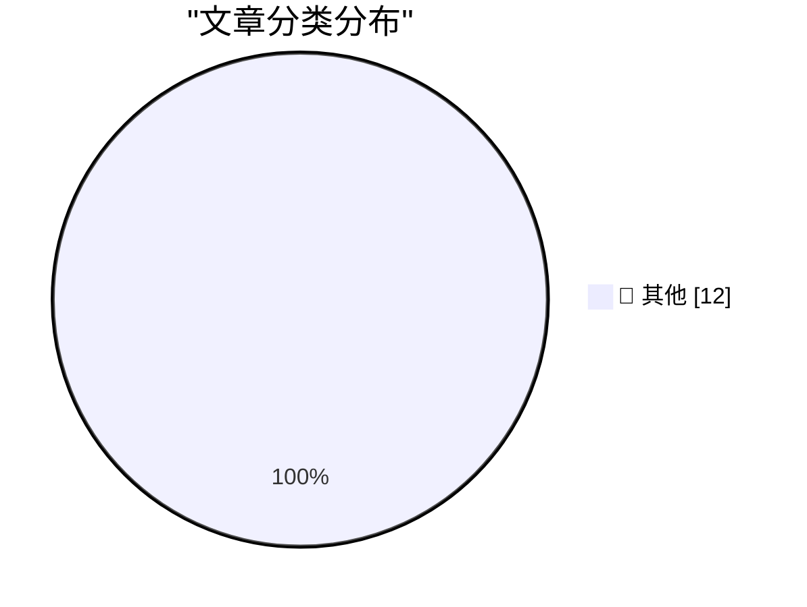

# 📰 AI 博客每日精选 — 2026-09-25

> 来自 Karpathy 推荐的 92 个顶级技术博客，AI 精选 Top 12

## 🏆 今日必读

🥇 **‘Apple Opens Apple Music Hall, a State-of-the-Art Live Music Venue in London’**

[‘Apple Opens Apple Music Hall, a State-of-the-Art Live Music Venue in London’](https://www.apple.com/newsroom/2026/09/apple-opens-apple-music-hall-a-state-of-the-art-live-music-venue-in-london/) — daringfireball.net · 2 小时前 · 📝 其他

> ‘Apple Opens Apple Music Hall, a State-of-the-Art Live Music Venue in London’

🥈 **Ed Zitron’s AI Prediction Track Record**

[Ed Zitron’s AI Prediction Track Record](https://danluu.com/zitron/) — daringfireball.net · 2 小时前 · 📝 其他

> Ed Zitron’s AI Prediction Track Record

🥉 **Copland D11E4, Emulated in Your Browser**

[Copland D11E4, Emulated in Your Browser](https://www.pagetable.com/300) — daringfireball.net · 3 小时前 · 📝 其他

> Copland D11E4, Emulated in Your Browser

---

## 📊 数据概览

| 扫描源 | 抓取文章 | 时间范围 | 精选 |
|:---:|:---:|:---:|:---:|
| 83/92 | 2534 篇 → 12 篇 | 24h | **12 篇** |

### 分类分布

---

## 📝 其他

### 1. ‘Apple Opens Apple Music Hall, a State-of-the-Art Live Music Venue in London’

[‘Apple Opens Apple Music Hall, a State-of-the-Art Live Music Venue in London’](https://www.apple.com/newsroom/2026/09/apple-opens-apple-music-hall-a-state-of-the-art-live-music-venue-in-london/) — **daringfireball.net** · 2 小时前 · ⭐ 15/30

> ‘Apple Opens Apple Music Hall, a State-of-the-Art Live Music Venue in London’

---

### 2. Ed Zitron’s AI Prediction Track Record

[Ed Zitron’s AI Prediction Track Record](https://danluu.com/zitron/) — **daringfireball.net** · 2 小时前 · ⭐ 15/30

> Ed Zitron’s AI Prediction Track Record

---

### 3. Copland D11E4, Emulated in Your Browser

[Copland D11E4, Emulated in Your Browser](https://www.pagetable.com/300) — **daringfireball.net** · 3 小时前 · ⭐ 15/30

> Copland D11E4, Emulated in Your Browser

---

### 4. Changes to App Tracking Transparency in the E.U.

[Changes to App Tracking Transparency in the E.U.](https://developer.apple.com/app-store/user-privacy-and-data-use/) — **daringfireball.net** · 20 小时前 · ⭐ 15/30

> Changes to App Tracking Transparency in the E.U.

---

### 5. ★ The iPhone 4 ‘Antennagate’ Press Conference Q&A — Finally

[★ The iPhone 4 ‘Antennagate’ Press Conference Q&A — Finally](https://daringfireball.net/2026/09/iphone_4_antennagate_q_and_a) — **daringfireball.net** · 21 小时前 · ⭐ 15/30

> ★ The iPhone 4 ‘Antennagate’ Press Conference Q&A — Finally

---

### 6. ‘Prepare to Ship’ Is a Clever Software Solution That Allows iPhone 18 Pro Max to Ship With a Battery That Would Otherwise Exceed International Shipping Regulations

[‘Prepare to Ship’ Is a Clever Software Solution That Allows iPhone 18 Pro Max to Ship With a Battery That Would Otherwise Exceed International Shipping Regulations](https://support.apple.com/en-us/127848) — **daringfireball.net** · 23 小时前 · ⭐ 15/30

> ‘Prepare to Ship’ Is a Clever Software Solution That Allows iPhone 18 Pro Max to Ship With a Battery That Would Otherwise Exceed International Shipping Regulations

---

### 7. Some thoughts on HTML's proposed previewsrc attribute

[Some thoughts on HTML's proposed previewsrc attribute](https://shkspr.mobi/blog/2026/09/some-thoughts-on-htmls-proposed-previewsrc-attribute/) — **shkspr.mobi** · 8 小时前 · ⭐ 15/30

> Some thoughts on HTML's proposed previewsrc attribute

---

### 8. Why is the human body so crap except for the liver?

[Why is the human body so crap except for the liver?](https://dynomight.net/liver/) — **dynomight.net** · 19 小时前 · ⭐ 15/30

> Why is the human body so crap except for the liver?

---

### 9. Package Manager Sandboxing

[Package Manager Sandboxing](https://nesbitt.io/2026/09/24/package-manager-sandboxing.html) — **nesbitt.io** · 10 小时前 · ⭐ 15/30

> Package Manager Sandboxing

---

### 10. Shrinking a Fedora virtual disk

[Shrinking a Fedora virtual disk](https://entropicthoughts.com/shrinking-fedora-virtual-disk) — **entropicthoughts.com** · 21 小时前 · ⭐ 15/30

> Shrinking a Fedora virtual disk

---

### 11. Motorola born September 25, 1928

[Motorola born September 25, 1928](https://dfarq.homeip.net/motorola-born-on-this-day-in-1928/?utm_source=rss&#038;utm_medium=rss&#038;utm_campaign=motorola-born-on-this-day-in-1928) — **dfarq.homeip.net** · 8 小时前 · ⭐ 15/30

> Motorola born September 25, 1928

---

### 12. So yeah it was written using AI

[So yeah it was written using AI](https://berthub.eu/articles/posts/so-yeah-it-is-written-using-ai/) — **berthub.eu** · 4 小时前 · ⭐ 15/30

> So yeah it was written using AI

---

*生成于 2026-09-25 03:56 (Asia/Shanghai) | 扫描 83 源 → 获取 2534 篇 → 精选 12 篇*
*基于 [Hacker News Popularity Contest 2025](https://refactoringenglish.com/tools/hn-popularity/) RSS 源列表，由 [Andrej Karpathy](https://x.com/karpathy) 推荐*
*由「懂点儿AI」制作，欢迎关注同名微信公众号获取更多 AI 实用技巧 💡*
