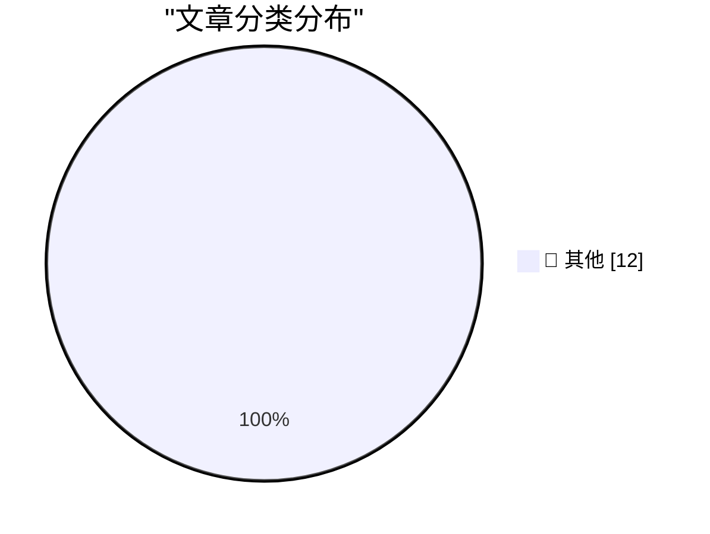

# 📰 AI 博客每日精选 — 2026-09-27

> 来自 Karpathy 推荐的 92 个顶级技术博客，AI 精选 Top 12

## 🏆 今日必读

🥇 **Advice to a beginning software engineer**

[Advice to a beginning software engineer](https://seangoedecke.com/advice-to-a-beginning-software-engineer/) — seangoedecke.com · 19 小时前 · 📝 其他

> Advice to a beginning software engineer

🥈 **U.S. Soldier Gets 70 Months in Prison for AT&T, Verizon Extortions**

[U.S. Soldier Gets 70 Months in Prison for AT&T, Verizon Extortions](https://krebsonsecurity.com/2026/09/u-s-soldier-gets-70-months-in-prison-for-att-verizon-extortions/) — krebsonsecurity.com · 21 小时前 · 📝 其他

> U.S. Soldier Gets 70 Months in Prison for AT&T, Verizon Extortions

🥉 **International Standard Paper Sizes**

[International Standard Paper Sizes](https://www.cl.cam.ac.uk/~mgk25/iso-paper.html) — daringfireball.net · 24 分钟前 · 📝 其他

> International Standard Paper Sizes

---

## 📊 数据概览

| 扫描源 | 抓取文章 | 时间范围 | 精选 |
|:---:|:---:|:---:|:---:|
| 80/92 | 2457 篇 → 12 篇 | 24h | **12 篇** |

### 分类分布

---

## 📝 其他

### 1. Advice to a beginning software engineer

[Advice to a beginning software engineer](https://seangoedecke.com/advice-to-a-beginning-software-engineer/) — **seangoedecke.com** · 19 小时前 · ⭐ 15/30

> Advice to a beginning software engineer

---

### 2. U.S. Soldier Gets 70 Months in Prison for AT&T, Verizon Extortions

[U.S. Soldier Gets 70 Months in Prison for AT&T, Verizon Extortions](https://krebsonsecurity.com/2026/09/u-s-soldier-gets-70-months-in-prison-for-att-verizon-extortions/) — **krebsonsecurity.com** · 21 小时前 · ⭐ 15/30

> U.S. Soldier Gets 70 Months in Prison for AT&T, Verizon Extortions

---

### 3. International Standard Paper Sizes

[International Standard Paper Sizes](https://www.cl.cam.ac.uk/~mgk25/iso-paper.html) — **daringfireball.net** · 24 分钟前 · ⭐ 15/30

> International Standard Paper Sizes

---

### 4. Microsoft Took the ‘Copilot+ PC’ Brand Out Behind the Shed

[Microsoft Took the ‘Copilot+ PC’ Brand Out Behind the Shed](https://www.windowscentral.com/microsoft/windows-11/the-copilot-pc-brand-is-dead-microsoft-and-pc-makers-quietly-pull-back-on-tarnished-windows-11-ai-pc-branding) — **daringfireball.net** · 2 小时前 · ⭐ 15/30

> Microsoft Took the ‘Copilot+ PC’ Brand Out Behind the Shed

---

### 5. The Talk Show: ‘I’m Thinking X, Not X’

[The Talk Show: ‘I’m Thinking X, Not X’](https://daringfireball.net/thetalkshow/2026/09/25/ep-455) — **daringfireball.net** · 2 小时前 · ⭐ 15/30

> The Talk Show: ‘I’m Thinking X, Not X’

---

### 6. Mr. Choyka Is Apparently Doing Well

[Mr. Choyka Is Apparently Doing Well](https://www.usatoday.com/story/sports/golf/2020/02/02/golf-amateur-gary-choyka-sinks-two-holes-one-same-round/4639969002/) — **daringfireball.net** · 19 小时前 · ⭐ 15/30

> Mr. Choyka Is Apparently Doing Well

---

### 7. Stock UI in MacOS 27 Eschews Clarity

[Stock UI in MacOS 27 Eschews Clarity](https://mastodon.design/@thibault/117320401426286497) — **daringfireball.net** · 22 小时前 · ⭐ 15/30

> Stock UI in MacOS 27 Eschews Clarity

---

### 8. Brent Simmons on ‘Stock’ Mac UI

[Brent Simmons on ‘Stock’ Mac UI](https://inessential.com/2026/09/22/that-about-wraps-it-up-for.html) — **daringfireball.net** · 23 小时前 · ⭐ 15/30

> Brent Simmons on ‘Stock’ Mac UI

---

### 9. No errors, no warnings, no gods, no masters - HTML Purity is a Fetish

[No errors, no warnings, no gods, no masters - HTML Purity is a Fetish](https://shkspr.mobi/blog/2026/09/no-errors-no-warnings-no-gods-no-masters-html-purity-is-a-fetish/) — **shkspr.mobi** · 7 小时前 · ⭐ 15/30

> No errors, no warnings, no gods, no masters - HTML Purity is a Fetish

---

### 10. Reverse-engineering the vintage Intel 8087's tangent algorithm: more than CORDIC

[Reverse-engineering the vintage Intel 8087's tangent algorithm: more than CORDIC](http://www.righto.com/feeds/7735201633324934284/comments/default) — **righto.com** · 2 小时前 · ⭐ 15/30

> Reverse-engineering the vintage Intel 8087's tangent algorithm: more than CORDIC

---

### 11. This Week in Package Management: 26 September 2026

[This Week in Package Management: 26 September 2026](https://nesbitt.io/2026/09/26/this-week-in-package-management.html) — **nesbitt.io** · 9 小时前 · ⭐ 15/30

> This Week in Package Management: 26 September 2026

---

### 12. Rusty thoughts on "Parse, don't validate"

[Rusty thoughts on "Parse, don't validate"](https://eli.thegreenplace.net/2026/rusty-thoughts-on-parse-dont-validate/) — **eli.thegreenplace.net** · 3 小时前 · ⭐ 15/30

> Rusty thoughts on "Parse, don't validate"

---

*生成于 2026-09-27 03:10 (Asia/Shanghai) | 扫描 80 源 → 获取 2457 篇 → 精选 12 篇*
*基于 [Hacker News Popularity Contest 2025](https://refactoringenglish.com/tools/hn-popularity/) RSS 源列表，由 [Andrej Karpathy](https://x.com/karpathy) 推荐*
*由「懂点儿AI」制作，欢迎关注同名微信公众号获取更多 AI 实用技巧 💡*
