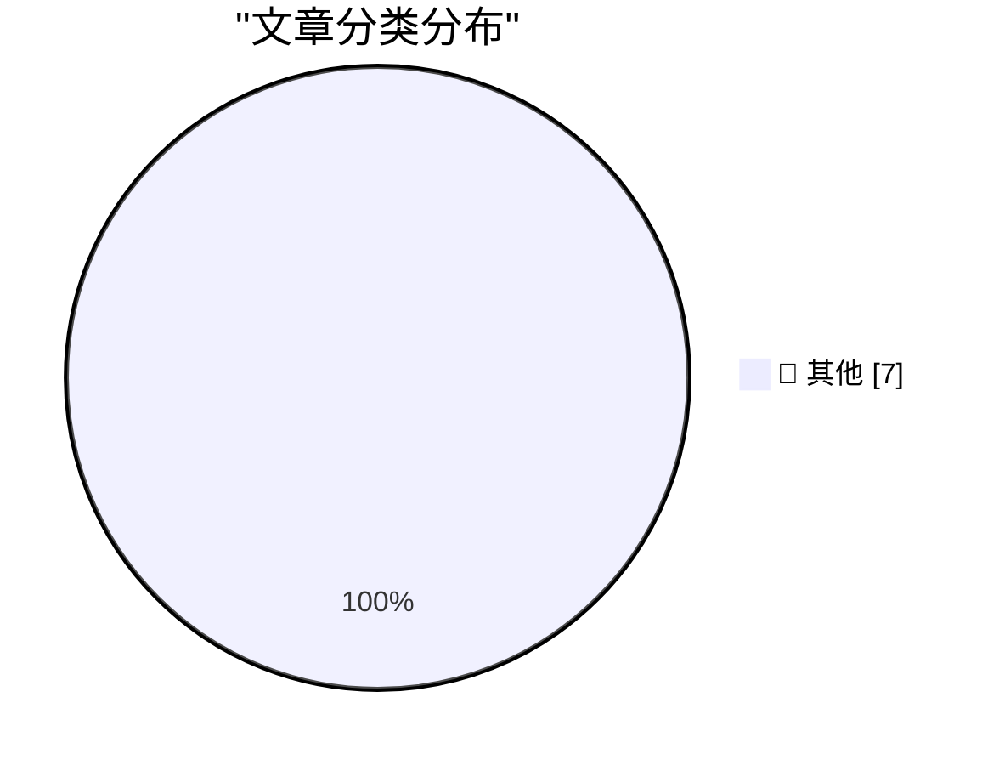

# 📰 AI 博客每日精选 — 2026-09-28

> 来自 Karpathy 推荐的 92 个顶级技术博客，AI 精选 Top 7

## 🏆 今日必读

🥇 **Kākāpō Party**

[Kākāpō Party](https://simonwillison.net/2026/Sep/26/kakapo-party/) — simonwillison.net · 20 小时前 · 📝 其他

> Kākāpō Party

🥈 **Human-AI partnerships are for alignment, not capability**

[Human-AI partnerships are for alignment, not capability](https://seangoedecke.com/human-ai-partnerships-are-for-alignment-not-capability/) — seangoedecke.com · 19 小时前 · 📝 其他

> Human-AI partnerships are for alignment, not capability

🥉 **Mux: Turn Your Video Into Context**

[Mux: Turn Your Video Into Context](https://www.mux.com/?utm_campaign=fireball&amp;utm_source=DF) — daringfireball.net · 2 分钟前 · 📝 其他

> Mux: Turn Your Video Into Context

---

## 📊 数据概览

| 扫描源 | 抓取文章 | 时间范围 | 精选 |
|:---:|:---:|:---:|:---:|
| 84/92 | 2559 篇 → 7 篇 | 24h | **7 篇** |

### 分类分布

---

## 📝 其他

### 1. Kākāpō Party

[Kākāpō Party](https://simonwillison.net/2026/Sep/26/kakapo-party/) — **simonwillison.net** · 20 小时前 · ⭐ 15/30

> Kākāpō Party

---

### 2. Human-AI partnerships are for alignment, not capability

[Human-AI partnerships are for alignment, not capability](https://seangoedecke.com/human-ai-partnerships-are-for-alignment-not-capability/) — **seangoedecke.com** · 19 小时前 · ⭐ 15/30

> Human-AI partnerships are for alignment, not capability

---

### 3. Mux: Turn Your Video Into Context

[Mux: Turn Your Video Into Context](https://www.mux.com/?utm_campaign=fireball&amp;utm_source=DF) — **daringfireball.net** · 2 分钟前 · ⭐ 15/30

> Mux: Turn Your Video Into Context

---

### 4. Reelizer Returns

[Reelizer Returns](https://www.reelizer.com/) — **daringfireball.net** · 22 小时前 · ⭐ 15/30

> Reelizer Returns

---

### 5. Alexandr Wang: ‘Why I’m Building Muse’

[Alexandr Wang: ‘Why I’m Building Muse’](https://x.com/alexandr_wang/status/2103551714536439951) — **daringfireball.net** · 23 小时前 · ⭐ 15/30

> Alexandr Wang: ‘Why I’m Building Muse’

---

### 6. Gig Review: Public Service Broadcasting's Race For Space at Alexandra Palace ★★★★⯪

[Gig Review: Public Service Broadcasting's Race For Space at Alexandra Palace ★★★★⯪](https://shkspr.mobi/blog/2026/09/gig-review-public-service-broadcastings-race-for-space-at-alexandra-palace/) — **shkspr.mobi** · 8 小时前 · ⭐ 15/30

> Gig Review: Public Service Broadcasting's Race For Space at Alexandra Palace ★★★★⯪

---

### 7. Combo Platter

[Combo Platter](https://feed.tedium.co/link/15204/17475461/combos-snack-food-history) — **tedium.co** · 3 小时前 · ⭐ 15/30

> Combo Platter

---

*生成于 2026-09-28 03:42 (Asia/Shanghai) | 扫描 84 源 → 获取 2559 篇 → 精选 7 篇*
*基于 [Hacker News Popularity Contest 2025](https://refactoringenglish.com/tools/hn-popularity/) RSS 源列表，由 [Andrej Karpathy](https://x.com/karpathy) 推荐*
*由「懂点儿AI」制作，欢迎关注同名微信公众号获取更多 AI 实用技巧 💡*
