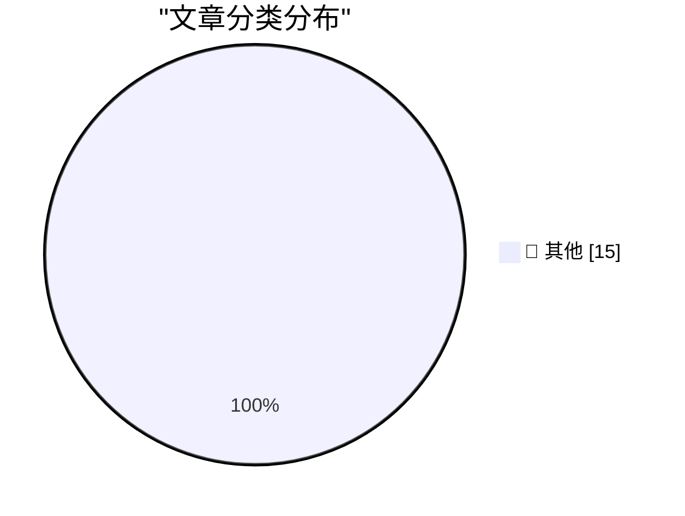

# 📰 AI 博客每日精选 — 2026-09-30

> 来自 Karpathy 推荐的 92 个顶级技术博客，AI 精选 Top 15

## 🏆 今日必读

🥇 **OpenAI DevDay 2026 live blog**

[OpenAI DevDay 2026 live blog](https://simonwillison.net/2026/Sep/29/openai-devday-2026-live-blog/) — simonwillison.net · 4 小时前 · 📝 其他

> OpenAI DevDay 2026 live blog

🥈 **Claude Sonnet 5.5**

[Claude Sonnet 5.5](https://simonwillison.net/2026/Sep/28/claude-sonnet-5-5/) — simonwillison.net · 22 小时前 · 📝 其他

> Claude Sonnet 5.5

🥉 **Follow-Up on my Spitballed Predictions for Apple’s October**

[Follow-Up on my Spitballed Predictions for Apple’s October](https://daringfireball.net/2026/09/spitballing_predictions_for_apples_october) — daringfireball.net · 5 小时前 · 📝 其他

> Follow-Up on my Spitballed Predictions for Apple’s October

---

## 📊 数据概览

| 扫描源 | 抓取文章 | 时间范围 | 精选 |
|:---:|:---:|:---:|:---:|
| 83/92 | 2536 篇 → 18 篇 | 24h | **15 篇** |

### 分类分布

---

## 📝 其他

### 1. OpenAI DevDay 2026 live blog

[OpenAI DevDay 2026 live blog](https://simonwillison.net/2026/Sep/29/openai-devday-2026-live-blog/) — **simonwillison.net** · 4 小时前 · ⭐ 15/30

> OpenAI DevDay 2026 live blog

---

### 2. Claude Sonnet 5.5

[Claude Sonnet 5.5](https://simonwillison.net/2026/Sep/28/claude-sonnet-5-5/) — **simonwillison.net** · 22 小时前 · ⭐ 15/30

> Claude Sonnet 5.5

---

### 3. Follow-Up on my Spitballed Predictions for Apple’s October

[Follow-Up on my Spitballed Predictions for Apple’s October](https://daringfireball.net/2026/09/spitballing_predictions_for_apples_october) — **daringfireball.net** · 5 小时前 · ⭐ 15/30

> Follow-Up on my Spitballed Predictions for Apple’s October

---

### 4. Destroy Any Website

[Destroy Any Website](https://destroy.spritefusion.com/) — **daringfireball.net** · 6 小时前 · ⭐ 15/30

> Destroy Any Website

---

### 5. Bastardica

[Bastardica](https://bastardica.mitpit.com/) — **daringfireball.net** · 18 小时前 · ⭐ 15/30

> Bastardica

---

### 6. ‘When Did Google Get So F-Ing Weird?’

[‘When Did Google Get So F-Ing Weird?’](https://sancho.bearblog.dev/google-weird/) — **daringfireball.net** · 18 小时前 · ⭐ 15/30

> ‘When Did Google Get So F-Ing Weird?’

---

### 7. Joanna Stern Pokes the Pickle

[Joanna Stern Pokes the Pickle](https://www.youtube.com/watch?v=YNqYEMuoQAI) — **daringfireball.net** · 18 小时前 · ⭐ 15/30

> Joanna Stern Pokes the Pickle

---

### 8. ‘Donald Decodes’ Interview Craig Federighi Regarding the iPhone Duo

[‘Donald Decodes’ Interview Craig Federighi Regarding the iPhone Duo](https://www.youtube.com/watch?v=y227RF0smAg) — **daringfireball.net** · 19 小时前 · ⭐ 15/30

> ‘Donald Decodes’ Interview Craig Federighi Regarding the iPhone Duo

---

### 9. Why Stolen Device Protection Makes Passwords Safer

[Why Stolen Device Protection Makes Passwords Safer](https://sixcolors.com/post/2026/09/stolen-device-protection-passwords-glenn/) — **daringfireball.net** · 19 小时前 · ⭐ 15/30

> Why Stolen Device Protection Makes Passwords Safer

---

### 10. Jeremy Stern’s Profile of Mark Zuckerberg for Colossus

[Jeremy Stern’s Profile of Mark Zuckerberg for Colossus](https://colossus.com/article/mark-zuckerberg-profile/) — **daringfireball.net** · 21 小时前 · ⭐ 15/30

> Jeremy Stern’s Profile of Mark Zuckerberg for Colossus

---

### 11. Pluralistic: Lindsay Owens's "Gouged" (29 Sep 2026)

[Pluralistic: Lindsay Owens's "Gouged" (29 Sep 2026)](https://pluralistic.net/2026/09/29/algorithmic-wage-theft/) — **pluralistic.net** · 6 小时前 · ⭐ 15/30

> Pluralistic: Lindsay Owens's "Gouged" (29 Sep 2026)

---

### 12. Donating to open source

[Donating to open source](https://entropicthoughts.com/open-source-donation) — **entropicthoughts.com** · 22 小时前 · ⭐ 15/30

> Donating to open source

---

### 13. Dead Money

[Dead Money](https://www.wheresyoured.at/dead-money/) — **wheresyoured.at** · 4 小时前 · ⭐ 15/30

> Dead Money

---

### 14. VLM Enhanced Metadata For My Icon Galleries

[VLM Enhanced Metadata For My Icon Galleries](https://blog.jim-nielsen.com/2026/icon-galleries-vlm/) — **blog.jim-nielsen.com** · 1 小时前 · ⭐ 15/30

> VLM Enhanced Metadata For My Icon Galleries

---

### 15. When Internet Explorer passed Netscape for the first time

[When Internet Explorer passed Netscape for the first time](https://dfarq.homeip.net/when-internet-explorer-passed-netscape-for-the-first-time/?utm_source=rss&#038;utm_medium=rss&#038;utm_campaign=when-internet-explorer-passed-netscape-for-the-first-time) — **dfarq.homeip.net** · 9 小时前 · ⭐ 15/30

> When Internet Explorer passed Netscape for the first time

---

*生成于 2026-09-30 04:39 (Asia/Shanghai) | 扫描 83 源 → 获取 2536 篇 → 精选 15 篇*
*基于 [Hacker News Popularity Contest 2025](https://refactoringenglish.com/tools/hn-popularity/) RSS 源列表，由 [Andrej Karpathy](https://x.com/karpathy) 推荐*
*由「懂点儿AI」制作，欢迎关注同名微信公众号获取更多 AI 实用技巧 💡*
