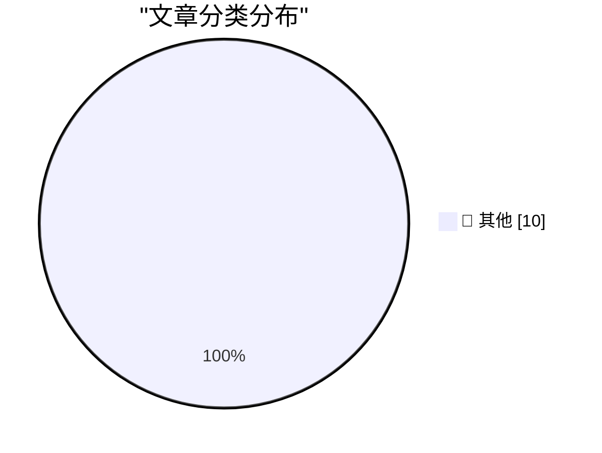

# 📰 AI 博客每日精选 — 2026-10-02

> 来自 Karpathy 推荐的 92 个顶级技术博客，AI 精选 Top 10

## 🏆 今日必读

🥇 **Quoting Matthew Green**

[Quoting Matthew Green](https://simonwillison.net/2026/Oct/1/matthew-green/) — simonwillison.net · 14 小时前 · 📝 其他

> Quoting Matthew Green

🥈 **He Built This City**

[He Built This City](https://simonwillison.net/2026/Sep/30/he-built-this-city/) — simonwillison.net · 23 小时前 · 📝 其他

> He Built This City

🥉 **Pluralistic: Voting is to politics as shopping is to boycotts (01 Oct 2026)**

[Pluralistic: Voting is to politics as shopping is to boycotts (01 Oct 2026)](https://pluralistic.net/2026/10/01/data-centers/) — pluralistic.net · 3 小时前 · 📝 其他

> Pluralistic: Voting is to politics as shopping is to boycotts (01 Oct 2026)

---

## 📊 数据概览

| 扫描源 | 抓取文章 | 时间范围 | 精选 |
|:---:|:---:|:---:|:---:|
| 83/92 | 2343 篇 → 10 篇 | 24h | **10 篇** |

### 分类分布

---

## 📝 其他

### 1. Quoting Matthew Green

[Quoting Matthew Green](https://simonwillison.net/2026/Oct/1/matthew-green/) — **simonwillison.net** · 14 小时前 · ⭐ 15/30

> Quoting Matthew Green

---

### 2. He Built This City

[He Built This City](https://simonwillison.net/2026/Sep/30/he-built-this-city/) — **simonwillison.net** · 23 小时前 · ⭐ 15/30

> He Built This City

---

### 3. Pluralistic: Voting is to politics as shopping is to boycotts (01 Oct 2026)

[Pluralistic: Voting is to politics as shopping is to boycotts (01 Oct 2026)](https://pluralistic.net/2026/10/01/data-centers/) — **pluralistic.net** · 3 小时前 · ⭐ 15/30

> Pluralistic: Voting is to politics as shopping is to boycotts (01 Oct 2026)

---

### 4. Why do OpenAI's GPT-2 weights beat mine?  Part five: data quality

[Why do OpenAI's GPT-2 weights beat mine?  Part five: data quality](https://www.gilesthomas.com/2026/10/why-do-openai-gpt2-weights-beat-mine-5-data-quality) — **gilesthomas.com** · 3 小时前 · ⭐ 15/30

> Why do OpenAI's GPT-2 weights beat mine?  Part five: data quality

---

### 5. Why Americans Stopped Throwing Dinner Parties

[Why Americans Stopped Throwing Dinner Parties](https://www.theatlantic.com/ideas/2026/10/americans-socialization-dinner-decline-hosting/688846/?utm_source=feed) — **derekthompson.org** · 9 小时前 · ⭐ 15/30

> Why Americans Stopped Throwing Dinner Parties

---

### 6. Software Heritage Identifiers

[Software Heritage Identifiers](https://nesbitt.io/2026/10/01/software-heritage-identifiers.html) — **nesbitt.io** · 9 小时前 · ⭐ 15/30

> Software Heritage Identifiers

---

### 7. Understanding the AI That Drives Robots

[Understanding the AI That Drives Robots](https://www.construction-physics.com/p/understanding-the-ai-that-drives) — **construction-physics.com** · 8 小时前 · ⭐ 15/30

> Understanding the AI That Drives Robots

---

### 8. Si Sheppard – How did a few hundred Spanish soldiers topple two empires?

[Si Sheppard – How did a few hundred Spanish soldiers topple two empires?](https://www.dwarkesh.com/p/si-sheppard) — **dwarkesh.com** · 5 小时前 · ⭐ 15/30

> Si Sheppard – How did a few hundred Spanish soldiers topple two empires?

---

### 9. The day GIF became free to use, forever

[The day GIF became free to use, forever](https://dfarq.homeip.net/the-day-gif-became-free-to-use-forever/?utm_source=rss&#038;utm_medium=rss&#038;utm_campaign=the-day-gif-became-free-to-use-forever) — **dfarq.homeip.net** · 9 小时前 · ⭐ 15/30

> The day GIF became free to use, forever

---

### 10. Summary of reading: July - September 2026

[Summary of reading: July - September 2026](https://eli.thegreenplace.net/2026/summary-of-reading-july-september-2026/) — **eli.thegreenplace.net** · 20 小时前 · ⭐ 15/30

> Summary of reading: July - September 2026

---

*生成于 2026-10-02 04:58 (Asia/Shanghai) | 扫描 83 源 → 获取 2343 篇 → 精选 10 篇*
*基于 [Hacker News Popularity Contest 2025](https://refactoringenglish.com/tools/hn-popularity/) RSS 源列表，由 [Andrej Karpathy](https://x.com/karpathy) 推荐*
*由「懂点儿AI」制作，欢迎关注同名微信公众号获取更多 AI 实用技巧 💡*
