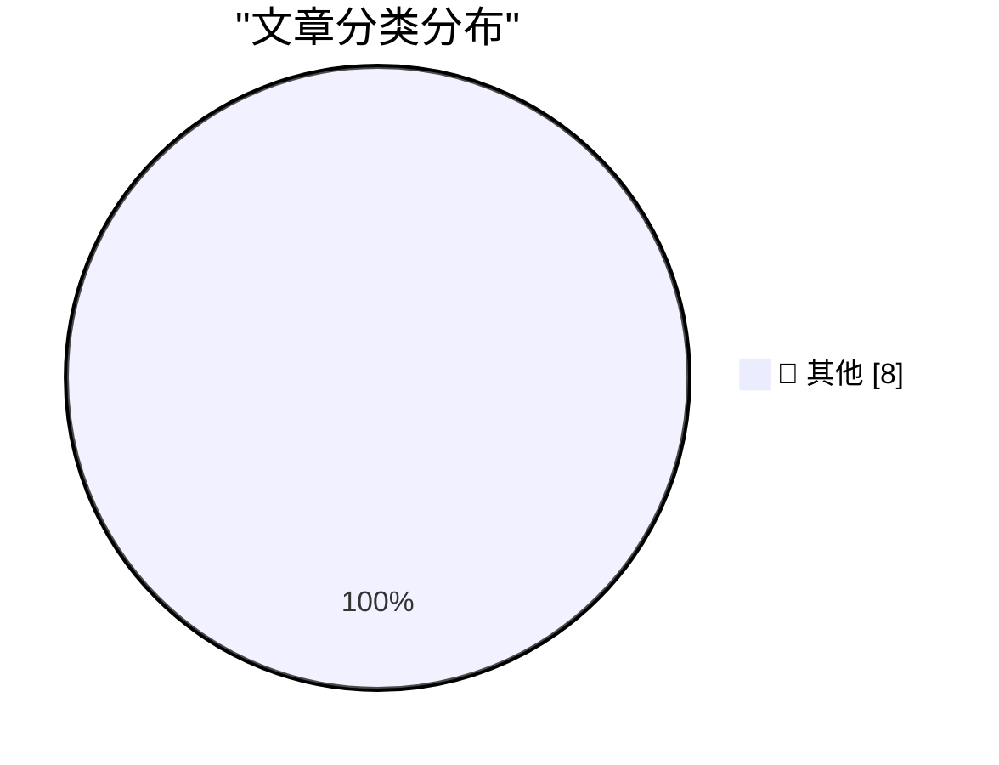

# 📰 AI 博客每日精选 — 2026-10-03

> 来自 Karpathy 推荐的 92 个顶级技术博客，AI 精选 Top 8

## 🏆 今日必读

🥇 **Do not build the LLM torture factory**

[Do not build the LLM torture factory](https://seangoedecke.com/do-not-build-the-llm-torture-factory/) — seangoedecke.com · 20 小时前 · 📝 其他

> Do not build the LLM torture factory

🥈 **Yankees Sweep Boston in Two Games, by Combined Score of 18-2**

[Yankees Sweep Boston in Two Games, by Combined Score of 18-2](https://www.nytimes.com/athletic/7648172/2026/09/30/yankees-beat-red-sox-mlb-wild-card-series/) — daringfireball.net · 20 小时前 · 📝 其他

> Yankees Sweep Boston in Two Games, by Combined Score of 18-2

🥉 **Gadget Review: Una Watch ★★★★☆**

[Gadget Review: Una Watch ★★★★☆](https://shkspr.mobi/blog/2026/10/gadget-review-una-watch/) — shkspr.mobi · 9 小时前 · 📝 其他

> Gadget Review: Una Watch ★★★★☆

---

## 📊 数据概览

| 扫描源 | 抓取文章 | 时间范围 | 精选 |
|:---:|:---:|:---:|:---:|
| 83/92 | 2344 篇 → 8 篇 | 24h | **8 篇** |

### 分类分布

---

## 📝 其他

### 1. Do not build the LLM torture factory

[Do not build the LLM torture factory](https://seangoedecke.com/do-not-build-the-llm-torture-factory/) — **seangoedecke.com** · 20 小时前 · ⭐ 15/30

> Do not build the LLM torture factory

---

### 2. Yankees Sweep Boston in Two Games, by Combined Score of 18-2

[Yankees Sweep Boston in Two Games, by Combined Score of 18-2](https://www.nytimes.com/athletic/7648172/2026/09/30/yankees-beat-red-sox-mlb-wild-card-series/) — **daringfireball.net** · 20 小时前 · ⭐ 15/30

> Yankees Sweep Boston in Two Games, by Combined Score of 18-2

---

### 3. Gadget Review: Una Watch ★★★★☆

[Gadget Review: Una Watch ★★★★☆](https://shkspr.mobi/blog/2026/10/gadget-review-una-watch/) — **shkspr.mobi** · 9 小时前 · ⭐ 15/30

> Gadget Review: Una Watch ★★★★☆

---

### 4. The Brain Sandwich

[The Brain Sandwich](https://terriblesoftware.org/2026/10/02/the-brain-sandwich/) — **terriblesoftware.org** · 6 小时前 · ⭐ 15/30

> The Brain Sandwich

---

### 5. Premium: How Has AI Changed The Economy?

[Premium: How Has AI Changed The Economy?](https://www.wheresyoured.at/premium-how-has-ai-changed-the-economy/) — **wheresyoured.at** · 1 小时前 · ⭐ 15/30

> Premium: How Has AI Changed The Economy?

---

### 6. What happened to Activision

[What happened to Activision](https://dfarq.homeip.net/what-happened-to-activision/?utm_source=rss&#038;utm_medium=rss&#038;utm_campaign=what-happened-to-activision) — **dfarq.homeip.net** · 9 小时前 · ⭐ 15/30

> What happened to Activision

---

### 7. Digitale autonomie in het kort bij KIVI, STT en NAE

[Digitale autonomie in het kort bij KIVI, STT en NAE](https://berthub.eu/articles/posts/praatje-kivi-stt-nae/) — **berthub.eu** · 11 小时前 · ⭐ 15/30

> Digitale autonomie in het kort bij KIVI, STT en NAE

---

### 8. Make tmux the OS

[Make tmux the OS](https://matduggan.com/what-does-my-dream-os-ui-look-like/) — **matduggan.com** · 10 小时前 · ⭐ 15/30

> Make tmux the OS

---

*生成于 2026-10-03 04:36 (Asia/Shanghai) | 扫描 83 源 → 获取 2344 篇 → 精选 8 篇*
*基于 [Hacker News Popularity Contest 2025](https://refactoringenglish.com/tools/hn-popularity/) RSS 源列表，由 [Andrej Karpathy](https://x.com/karpathy) 推荐*
*由「懂点儿AI」制作，欢迎关注同名微信公众号获取更多 AI 实用技巧 💡*
