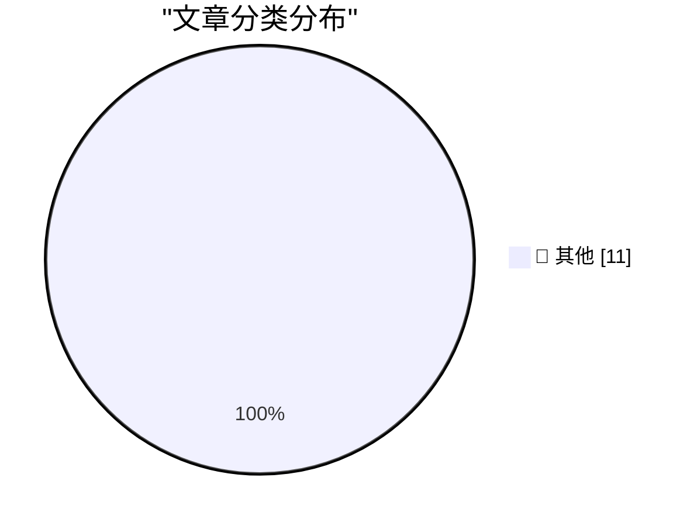

# 📰 AI 博客每日精选 — 2026-10-04

> 来自 Karpathy 推荐的 92 个顶级技术博客，AI 精选 Top 11

## 🏆 今日必读

🥇 **Rex's Dino Store**

[Rex's Dino Store](https://simonwillison.net/2026/Oct/2/rex-s-dino-store/) — simonwillison.net · 20 小时前 · 📝 其他

> Rex's Dino Store

🥈 **Superpersuasion will look like bribery**

[Superpersuasion will look like bribery](https://seangoedecke.com/superpersuasion-will-look-like-bribery/) — seangoedecke.com · 19 小时前 · 📝 其他

> Superpersuasion will look like bribery

🥉 **Shipping is the foundation**

[Shipping is the foundation](https://seangoedecke.com/shipping-is-the-foundation/) — seangoedecke.com · 19 小时前 · 📝 其他

> Shipping is the foundation

---

## 📊 数据概览

| 扫描源 | 抓取文章 | 时间范围 | 精选 |
|:---:|:---:|:---:|:---:|
| 81/92 | 2289 篇 → 11 篇 | 24h | **11 篇** |

### 分类分布

---

## 📝 其他

### 1. Rex's Dino Store

[Rex's Dino Store](https://simonwillison.net/2026/Oct/2/rex-s-dino-store/) — **simonwillison.net** · 20 小时前 · ⭐ 15/30

> Rex's Dino Store

---

### 2. Superpersuasion will look like bribery

[Superpersuasion will look like bribery](https://seangoedecke.com/superpersuasion-will-look-like-bribery/) — **seangoedecke.com** · 19 小时前 · ⭐ 15/30

> Superpersuasion will look like bribery

---

### 3. Shipping is the foundation

[Shipping is the foundation](https://seangoedecke.com/shipping-is-the-foundation/) — **seangoedecke.com** · 19 小时前 · ⭐ 15/30

> Shipping is the foundation

---

### 4. Apple Confirms iPhone 18 Pro Max AT&T Cellular Issues, Affected Devices Require Hardware Replacement

[Apple Confirms iPhone 18 Pro Max AT&T Cellular Issues, Affected Devices Require Hardware Replacement](https://9to5mac.com/2026/10/02/apple-confirms-iphone-18-pro-max-att-cellular-issues-affected-devices-require-hardware-replacement/) — **daringfireball.net** · 48 分钟前 · ⭐ 15/30

> Apple Confirms iPhone 18 Pro Max AT&T Cellular Issues, Affected Devices Require Hardware Replacement

---

### 5. ★ Apple Is Going to Further Tighten the Screws on Full Disk Access on MacOS, in Response to Agentic AI Apps Running Amok

[★ Apple Is Going to Further Tighten the Screws on Full Disk Access on MacOS, in Response to Agentic AI Apps Running Amok](https://daringfireball.net/2026/10/apple_full_disk_access) — **daringfireball.net** · 22 小时前 · ⭐ 15/30

> ★ Apple Is Going to Further Tighten the Screws on Full Disk Access on MacOS, in Response to Agentic AI Apps Running Amok

---

### 6. Pluralistic: Economic probabilities for our grandchildren (03 Oct 2026)

[Pluralistic: Economic probabilities for our grandchildren (03 Oct 2026)](https://pluralistic.net/2026/10/03/full-employment/) — **pluralistic.net** · 7 小时前 · ⭐ 15/30

> Pluralistic: Economic probabilities for our grandchildren (03 Oct 2026)

---

### 7. This Week in Package Management: 3 October 2026

[This Week in Package Management: 3 October 2026](https://nesbitt.io/2026/10/03/this-week-in-package-management.html) — **nesbitt.io** · 9 小时前 · ⭐ 15/30

> This Week in Package Management: 3 October 2026

---

### 8. Reading List 2026-10-03

[Reading List 2026-10-03](https://www.construction-physics.com/p/reading-list-2026-10-03) — **construction-physics.com** · 5 小时前 · ⭐ 15/30

> Reading List 2026-10-03

---

### 9. Connect Sony WH-1000XM3 on Arch Linux and a buggy UGREEN Bluetooth adapter

[Connect Sony WH-1000XM3 on Arch Linux and a buggy UGREEN Bluetooth adapter](https://jayd.ml/2026/10/03/sony-headphones-action-bluetooth-adapter.html) — **jayd.ml** · 9 小时前 · ⭐ 15/30

> Connect Sony WH-1000XM3 on Arch Linux and a buggy UGREEN Bluetooth adapter

---

### 10. Cull lumber at Menards

[Cull lumber at Menards](https://dfarq.homeip.net/cull-lumber-at-menards/?utm_source=rss&#038;utm_medium=rss&#038;utm_campaign=cull-lumber-at-menards) — **dfarq.homeip.net** · 8 小时前 · ⭐ 15/30

> Cull lumber at Menards

---

### 11. Altera Quartus Linux jtagd bug fixes

[Altera Quartus Linux jtagd bug fixes](https://www.downtowndougbrown.com/2026/10/altera-quartus-linux-jtagd-bug-fixes/) — **downtowndougbrown.com** · 13 小时前 · ⭐ 15/30

> Altera Quartus Linux jtagd bug fixes

---

*生成于 2026-10-04 03:09 (Asia/Shanghai) | 扫描 81 源 → 获取 2289 篇 → 精选 11 篇*
*基于 [Hacker News Popularity Contest 2025](https://refactoringenglish.com/tools/hn-popularity/) RSS 源列表，由 [Andrej Karpathy](https://x.com/karpathy) 推荐*
*由「懂点儿AI」制作，欢迎关注同名微信公众号获取更多 AI 实用技巧 💡*
