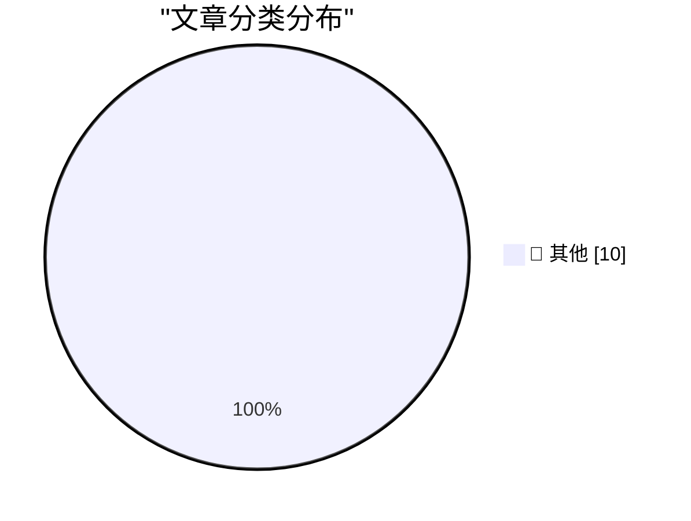

# 📰 AI 博客每日精选 — 2026-10-05

> 来自 Karpathy 推荐的 92 个顶级技术博客，AI 精选 Top 10

## 🏆 今日必读

🥇 **We're going to need default hard budget caps on pretty much everything**

[We're going to need default hard budget caps on pretty much everything](https://simonwillison.net/2026/Oct/3/default-hard-budget-caps/) — simonwillison.net · 19 小时前 · 📝 其他

> We're going to need default hard budget caps on pretty much everything

🥈 **September sponsors-only newsletter**

[September sponsors-only newsletter](https://simonwillison.net/2026/Oct/3/newsletter/) — simonwillison.net · 21 小时前 · 📝 其他

> September sponsors-only newsletter

🥉 **WorkOS**

[WorkOS](https://workos.com/guide/the-developers-guide-to-sso?utm_source=daringfireball&amp;utm_medium=newsletter&amp;utm_campaign=q32026) — daringfireball.net · 22 小时前 · 📝 其他

> WorkOS

---

## 📊 数据概览

| 扫描源 | 抓取文章 | 时间范围 | 精选 |
|:---:|:---:|:---:|:---:|
| 81/92 | 2294 篇 → 10 篇 | 24h | **10 篇** |

### 分类分布

---

## 📝 其他

### 1. We're going to need default hard budget caps on pretty much everything

[We're going to need default hard budget caps on pretty much everything](https://simonwillison.net/2026/Oct/3/default-hard-budget-caps/) — **simonwillison.net** · 19 小时前 · ⭐ 15/30

> We're going to need default hard budget caps on pretty much everything

---

### 2. September sponsors-only newsletter

[September sponsors-only newsletter](https://simonwillison.net/2026/Oct/3/newsletter/) — **simonwillison.net** · 21 小时前 · ⭐ 15/30

> September sponsors-only newsletter

---

### 3. WorkOS

[WorkOS](https://workos.com/guide/the-developers-guide-to-sso?utm_source=daringfireball&amp;utm_medium=newsletter&amp;utm_campaign=q32026) — **daringfireball.net** · 22 小时前 · ⭐ 15/30

> WorkOS

---

### 4. Why My Asus Laptop Kept Rebooting After Sleep and How to Fix it

[Why My Asus Laptop Kept Rebooting After Sleep and How to Fix it](https://idiallo.com/blog/asus-laptop-keeps-rebooting-after-sleep) — **idiallo.com** · 16 小时前 · ⭐ 15/30

> Why My Asus Laptop Kept Rebooting After Sleep and How to Fix it

---

### 5. Miquel’s pentagon theorem

[Miquel’s pentagon theorem](https://www.johndcook.com/blog/2026/10/04/miquels-pentagon-theorem/) — **johndcook.com** · 6 小时前 · ⭐ 15/30

> Miquel’s pentagon theorem

---

### 6. Topological models of modal logic

[Topological models of modal logic](https://www.johndcook.com/blog/2026/10/04/topological-models-of-modal-logic/) — **johndcook.com** · 7 小时前 · ⭐ 15/30

> Topological models of modal logic

---

### 7. Modal logic and topology

[Modal logic and topology](https://www.johndcook.com/blog/2026/10/04/modal-topology/) — **johndcook.com** · 7 小时前 · ⭐ 15/30

> Modal logic and topology

---

### 8. Miquel’s pivot theorem

[Miquel’s pivot theorem](https://www.johndcook.com/blog/2026/10/03/miquels-pivot-theorem/) — **johndcook.com** · 20 小时前 · ⭐ 15/30

> Miquel’s pivot theorem

---

### 9. Weekend content through the end of 2026

[Weekend content through the end of 2026](https://dfarq.homeip.net/weekend-content-through-the-end-of-2026/?utm_source=rss&#038;utm_medium=rss&#038;utm_campaign=weekend-content-through-the-end-of-2026) — **dfarq.homeip.net** · 6 小时前 · ⭐ 15/30

> Weekend content through the end of 2026

---

### 10. Weekly Update 524: Live From Copenhagen

[Weekly Update 524: Live From Copenhagen](https://www.troyhunt.com/weekly-update-524/) — **troyhunt.com** · 7 小时前 · ⭐ 15/30

> Weekly Update 524: Live From Copenhagen

---

*生成于 2026-10-05 03:29 (Asia/Shanghai) | 扫描 81 源 → 获取 2294 篇 → 精选 10 篇*
*基于 [Hacker News Popularity Contest 2025](https://refactoringenglish.com/tools/hn-popularity/) RSS 源列表，由 [Andrej Karpathy](https://x.com/karpathy) 推荐*
*由「懂点儿AI」制作，欢迎关注同名微信公众号获取更多 AI 实用技巧 💡*
