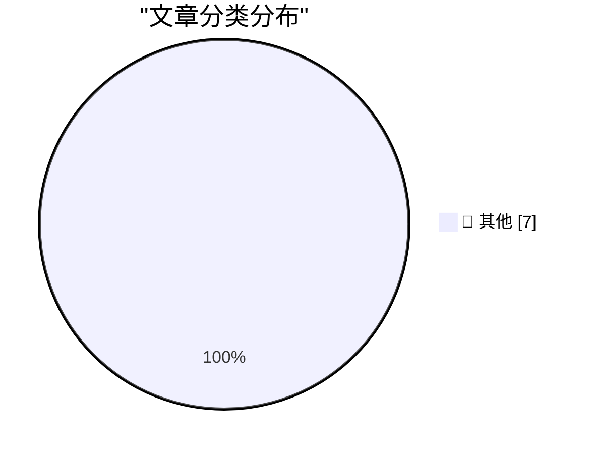

# 📰 AI 博客每日精选 — 2026-10-06

> 来自 Karpathy 推荐的 92 个顶级技术博客，AI 精选 Top 7

## 🏆 今日必读

🥇 **Qwen3.8 27B addition in words**

[Qwen3.8 27B addition in words](https://simonwillison.net/2026/Oct/4/qwen38-addition-in-words/) — simonwillison.net · 22 小时前 · 📝 其他

> Qwen3.8 27B addition in words

🥈 **Ternus and Cook Tweet Brief Remembrances on the 15th Anniversary of Steve Jobs’s Death**

[Ternus and Cook Tweet Brief Remembrances on the 15th Anniversary of Steve Jobs’s Death](https://x.com/johnternus/status/2107093462118199562) — daringfireball.net · 3 小时前 · 📝 其他

> Ternus and Cook Tweet Brief Remembrances on the 15th Anniversary of Steve Jobs’s Death

🥉 **Pluralistic: Scrutinized (05 Oct 2026)**

[Pluralistic: Scrutinized (05 Oct 2026)](https://pluralistic.net/2026/10/05/pervert-glasses/) — pluralistic.net · 3 小时前 · 📝 其他

> Pluralistic: Scrutinized (05 Oct 2026)

---

## 📊 数据概览

| 扫描源 | 抓取文章 | 时间范围 | 精选 |
|:---:|:---:|:---:|:---:|
| 83/92 | 2344 篇 → 7 篇 | 24h | **7 篇** |

### 分类分布

---

## 📝 其他

### 1. Qwen3.8 27B addition in words

[Qwen3.8 27B addition in words](https://simonwillison.net/2026/Oct/4/qwen38-addition-in-words/) — **simonwillison.net** · 22 小时前 · ⭐ 15/30

> Qwen3.8 27B addition in words

---

### 2. Ternus and Cook Tweet Brief Remembrances on the 15th Anniversary of Steve Jobs’s Death

[Ternus and Cook Tweet Brief Remembrances on the 15th Anniversary of Steve Jobs’s Death](https://x.com/johnternus/status/2107093462118199562) — **daringfireball.net** · 3 小时前 · ⭐ 15/30

> Ternus and Cook Tweet Brief Remembrances on the 15th Anniversary of Steve Jobs’s Death

---

### 3. Pluralistic: Scrutinized (05 Oct 2026)

[Pluralistic: Scrutinized (05 Oct 2026)](https://pluralistic.net/2026/10/05/pervert-glasses/) — **pluralistic.net** · 3 小时前 · ⭐ 15/30

> Pluralistic: Scrutinized (05 Oct 2026)

---

### 4. [RSS Club] Changes to the RSS and Atom feeds

[[RSS Club] Changes to the RSS and Atom feeds](https://shkspr.mobi/blog/2026/10/rss-club-changes-to-the-rss-and-atom-feeds/) — **shkspr.mobi** · 10 小时前 · ⭐ 15/30

> [RSS Club] Changes to the RSS and Atom feeds

---

### 5. Benchmark In Milliseconds

[Benchmark In Milliseconds](https://matklad.github.io/2026/10/05/benchmark-milliseconds.html) — **matklad.github.io** · 22 小时前 · ⭐ 15/30

> Benchmark In Milliseconds

---

### 6. The IBM Thinkpad’s 1992 debut

[The IBM Thinkpad’s 1992 debut](https://dfarq.homeip.net/the-ibm-thinkpads-1992-debut/?utm_source=rss&#038;utm_medium=rss&#038;utm_campaign=the-ibm-thinkpads-1992-debut) — **dfarq.homeip.net** · 11 小时前 · ⭐ 15/30

> The IBM Thinkpad’s 1992 debut

---

### 7. How fast is Python 3.15?

[How fast is Python 3.15?](https://blog.miguelgrinberg.com/post/how-fast-is-python-3-15) — **miguelgrinberg.com** · 12 小时前 · ⭐ 15/30

> How fast is Python 3.15?

---

*生成于 2026-10-06 06:29 (Asia/Shanghai) | 扫描 83 源 → 获取 2344 篇 → 精选 7 篇*
*基于 [Hacker News Popularity Contest 2025](https://refactoringenglish.com/tools/hn-popularity/) RSS 源列表，由 [Andrej Karpathy](https://x.com/karpathy) 推荐*
*由「懂点儿AI」制作，欢迎关注同名微信公众号获取更多 AI 实用技巧 💡*
