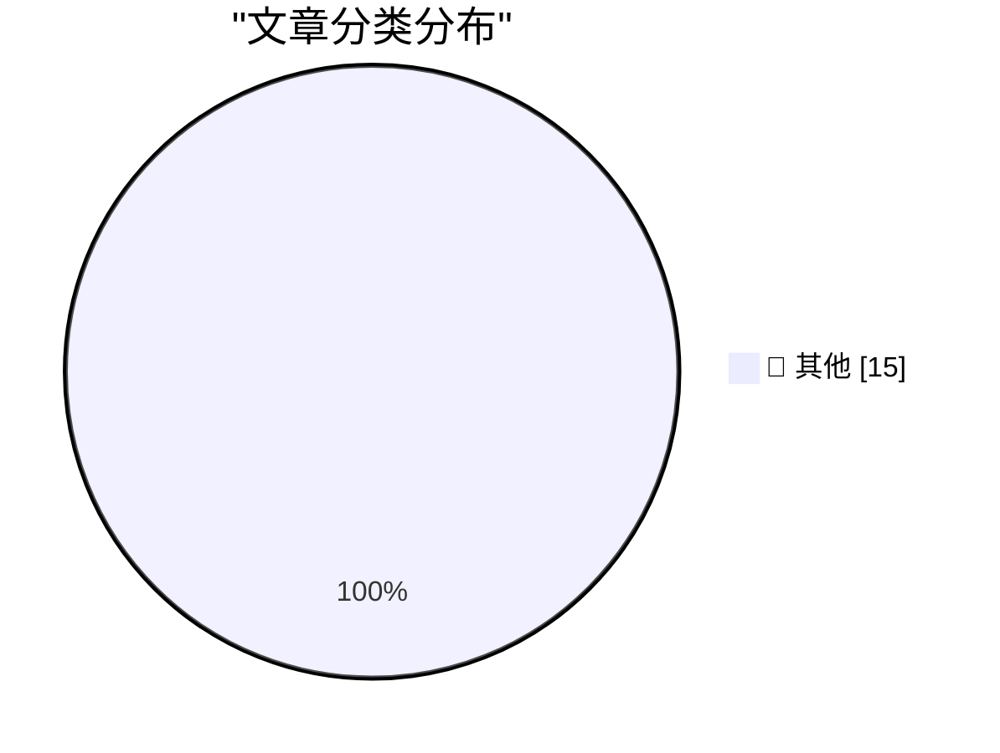

# 📰 AI 博客每日精选 — 2026-10-07

> 来自 Karpathy 推荐的 92 个顶级技术博客，AI 精选 Top 15

## 🏆 今日必读

🥇 **EmbeddingGemma 2**

[EmbeddingGemma 2](https://simonwillison.net/2026/Oct/6/hn-49983751/) — simonwillison.net · 15 分钟前 · 📝 其他

> EmbeddingGemma 2

🥈 **Introducing Mistral Large 4: Le chonk**

[Introducing Mistral Large 4: Le chonk](https://simonwillison.net/2026/Oct/6/le-chonk/) — simonwillison.net · 35 分钟前 · 📝 其他

> Introducing Mistral Large 4: Le chonk

🥉 **Using Parseable with Datasette for OpenTelemetry traces**

[Using Parseable with Datasette for OpenTelemetry traces](https://simonwillison.net/2026/Oct/6/datasette-parseable-opentelemetry/) — simonwillison.net · 1 小时前 · 📝 其他

> Using Parseable with Datasette for OpenTelemetry traces

---

## 📊 数据概览

| 扫描源 | 抓取文章 | 时间范围 | 精选 |
|:---:|:---:|:---:|:---:|
| 83/92 | 2345 篇 → 21 篇 | 24h | **15 篇** |

### 分类分布

---

## 📝 其他

### 1. EmbeddingGemma 2

[EmbeddingGemma 2](https://simonwillison.net/2026/Oct/6/hn-49983751/) — **simonwillison.net** · 15 分钟前 · ⭐ 15/30

> EmbeddingGemma 2

---

### 2. Introducing Mistral Large 4: Le chonk

[Introducing Mistral Large 4: Le chonk](https://simonwillison.net/2026/Oct/6/le-chonk/) — **simonwillison.net** · 35 分钟前 · ⭐ 15/30

> Introducing Mistral Large 4: Le chonk

---

### 3. Using Parseable with Datasette for OpenTelemetry traces

[Using Parseable with Datasette for OpenTelemetry traces](https://simonwillison.net/2026/Oct/6/datasette-parseable-opentelemetry/) — **simonwillison.net** · 1 小时前 · ⭐ 15/30

> Using Parseable with Datasette for OpenTelemetry traces

---

### 4. Mistral Large 4

[Mistral Large 4](https://simonwillison.net/2026/Oct/6/hn-49982139/) — **simonwillison.net** · 2 小时前 · ⭐ 15/30

> Mistral Large 4

---

### 5. Scrimshaw Jukebox

[Scrimshaw Jukebox](https://simonwillison.net/2026/Oct/6/scrimshaw-jukebox/) — **simonwillison.net** · 5 小时前 · ⭐ 15/30

> Scrimshaw Jukebox

---

### 6. Quoting Felix Rieseberg

[Quoting Felix Rieseberg](https://simonwillison.net/2026/Oct/5/felix-rieseberg/) — **simonwillison.net** · 20 小时前 · ⭐ 15/30

> Quoting Felix Rieseberg

---

### 7. Unofficial Command-Line Tool Removes Apple Intelligence From MacOS 27

[Unofficial Command-Line Tool Removes Apple Intelligence From MacOS 27](https://arstechnica.com/apple/2026/10/command-line-tool-quickly-removes-apple-intelligence-from-macos-27/) — **daringfireball.net** · 2 小时前 · ⭐ 15/30

> Unofficial Command-Line Tool Removes Apple Intelligence From MacOS 27

---

### 8. Steve Jobs, Walking Through a Mockup for Apple Park in 2010

[Steve Jobs, Walking Through a Mockup for Apple Park in 2010](https://book.stevejobsarchive.com/#photo-37) — **daringfireball.net** · 18 小时前 · ⭐ 15/30

> Steve Jobs, Walking Through a Mockup for Apple Park in 2010

---

### 9. [Sponsor] Sunnny

[[Sponsor] Sunnny](https://sunnny.com/) — **daringfireball.net** · 21 小时前 · ⭐ 15/30

> [Sponsor] Sunnny

---

### 10. OpenAI Announces Their Text Watermarking Plans

[OpenAI Announces Their Text Watermarking Plans](https://openai.com/index/eu-text-provenance/) — **daringfireball.net** · 21 小时前 · ⭐ 15/30

> OpenAI Announces Their Text Watermarking Plans

---

### 11. Pluralistic: Swapping money for expertise (06 Oct 2026)

[Pluralistic: Swapping money for expertise (06 Oct 2026)](https://pluralistic.net/2026/10/06/nonfungible/) — **pluralistic.net** · 7 小时前 · ⭐ 15/30

> Pluralistic: Swapping money for expertise (06 Oct 2026)

---

### 12. Una Watch - SDK and Writing Your First App

[Una Watch - SDK and Writing Your First App](https://shkspr.mobi/blog/2026/10/una-watch-sdk-and-writing-your-first-app/) — **shkspr.mobi** · 9 小时前 · ⭐ 15/30

> Una Watch - SDK and Writing Your First App

---

### 13. A Terminal Protocol for Program Status (OSC 7501)

[A Terminal Protocol for Program Status (OSC 7501)](https://mitchellh.com/writing/program-status-osc7501) — **mitchellh.com** · 20 小时前 · ⭐ 15/30

> A Terminal Protocol for Program Status (OSC 7501)

---

### 14. What is Codemode

[What is Codemode](https://lucumr.pocoo.org/2026/10/6/codemode/) — **lucumr.pocoo.org** · 20 小时前 · ⭐ 15/30

> What is Codemode

---

### 15. A topological model for provability logic

[A topological model for provability logic](https://www.johndcook.com/blog/2026/10/06/godel-lob/) — **johndcook.com** · 1 小时前 · ⭐ 15/30

> A topological model for provability logic

---

*生成于 2026-10-07 04:53 (Asia/Shanghai) | 扫描 83 源 → 获取 2345 篇 → 精选 15 篇*
*基于 [Hacker News Popularity Contest 2025](https://refactoringenglish.com/tools/hn-popularity/) RSS 源列表，由 [Andrej Karpathy](https://x.com/karpathy) 推荐*
*由「懂点儿AI」制作，欢迎关注同名微信公众号获取更多 AI 实用技巧 💡*
